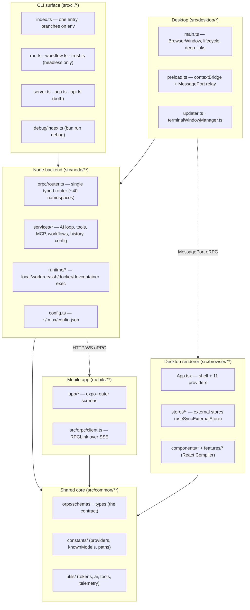
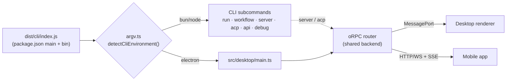
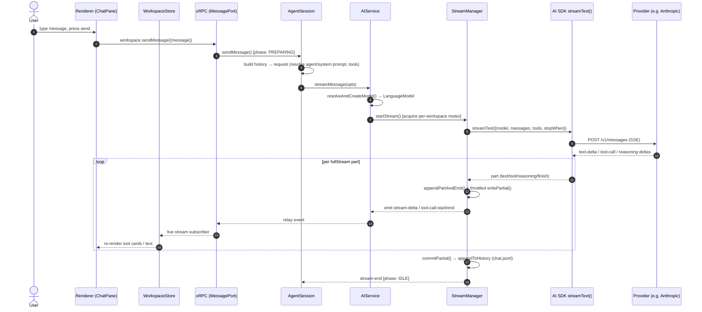
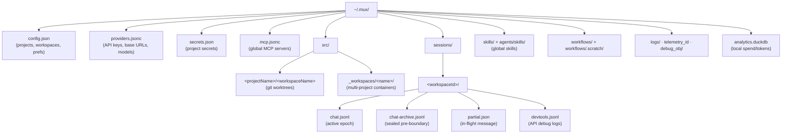

# 00 — System Overview

> **Analyzed at:** `main` @ `4bac642a8` · **App:** `mux` v0.27.0 · **Stack:** Electron 40 + React 18 + Vite 7 + TypeScript + bun

This is the index for the **Codebase Analysis** report suite. It explains how the whole product fits together and links to nine deep-dive reports — one per architectural facet. Each report is self-contained; start here if you want the lay of the land first.

## TL;DR

- **One compiled binary, three runtimes.** `dist/cli/index.js` is simultaneously the Electron main-process entry, the global `mux` CLI binary, and the headless HTTP/WebSocket server. `src/cli/index.ts` branches at startup on `process.versions.electron` + `process.defaultApp`.
- **One backend, two frontends.** A single oRPC router (`src/node/orpc/router.ts`, ~40 namespaces) is served over an in-process Electron `MessagePort`, a WebSocket, and HTTP. The desktop renderer and the React-Native mobile app both bind to the **same typed contract** (`AppRouter`) — only the transport differs.
- **The "runtime" is your code's execution environment, not the AI loop.** `src/node/runtime/` manages _where commands run_ (local / git-worktree / SSH / Docker / devcontainer / multi-project). The AI/LLM loop lives in `src/node/services/` (`agentSession` → `aiService` → `streamManager`).
- **Everything is durable and self-healing.** Chat is an append-only JSONL with partial-message staging; workflows are replayable event journals with leases; malformed history/devtools lines are filtered, never fatal.
- **Tools, MCP, and Skills compose at stream time.** Built-in tools + MCP server tools + skill metadata are merged per-workspace into the model's toolset right before each `streamText()` call.

---

## 1. Layered architecture

## 2. One binary, three runtimes

`package.json` declares **both** `"main": "dist/cli/index.js"` and `"bin": { "mux": "dist/cli/index.js" }`. The same file serves every launch mode; detection happens in `src/cli/argv.ts`:

| Launch                             | `isElectron` | `process.defaultApp` | Behavior                       |
| ---------------------------------- | ------------ | -------------------- | ------------------------------ |
| `bun mux` / `npx mux`              | false        | —                    | CLI help + subcommands         |
| `electron .` (dev)                 | true         | true                 | Loads `src/desktop/main.ts`    |
| Packaged `.app`/`.AppImage`/`.exe` | true         | —                    | Launches desktop automatically |

Subcommands are lazily `require()`-d so heavy modules (AI SDK, Electron) only load on the path actually needed. `run`/`workflow`/`trust` are bun/node-only; `desktop` is Electron-only; `server`/`acp`/`api` work in both.

## 3. End-to-end request lifecycle

The canonical path — a user sends a message in the desktop app and watches it stream back as text + tool cards:

> Details (turn construction, compaction, cost, retry, sub-agents) are in [03 — AI & Agent Runtime](analysis/03-ai-agent-runtime).

## 4. The `~/.mux` data directory

Almost all persistent state lives under one home directory (`getMuxHome()` → `$MUX_ROOT` or `~/.mux`, with a `-dev` suffix in development):

Persistence semantics (atomic writes, leases, self-healing) are covered in [05 — Workspace & Persistence](analysis/05-workspace-persistence).

## 5. Report index

| #   | Report                                                               | What it covers                                                                          |
| --- | -------------------------------------------------------------------- | --------------------------------------------------------------------------------------- |
| 01  | [Architecture & Build](analysis/01-architecture-build)               | Electron process model, security posture, the 5 build outputs, distribution/auto-update |
| 02  | [IPC & Configuration](analysis/02-ipc-config)                        | The oRPC router + transports, the schema-first contract, the `Config` system            |
| 03  | [AI & Agent Runtime](analysis/03-ai-agent-runtime)                   | Providers, model registry, the turn/stream loop, agents, ACP, tokens/cost/compaction    |
| 04  | [Tools, MCP & Skills](analysis/04-tools-mcp-skills)                  | Tool taxonomy, execution path, MCP merge, skills lifecycle, QuickJS sandbox             |
| 05  | [Workspace & Persistence](analysis/05-workspace-persistence)         | Worktrees, multi-project, SSH, history, partial messages, compaction                    |
| 06  | [Workflow Engine](analysis/06-workflow-engine)                       | The durable JS conductor, steps/patches, replay, crash recovery                         |
| 07  | [React Frontend](analysis/07-react-frontend)                         | App shell, external-store state, design system, terminal                                |
| 08  | [Mobile Application](analysis/08-mobile)                             | Expo/RN client and the shared-contract seam with desktop                                |
| 09  | [Testing, CI, Security & Telemetry](analysis/09-testing-ci-security) | Test matrix, CI pipeline, security controls, telemetry/observability                    |

## 6. Glossary

| Term           | Meaning                                                                                                 |
| -------------- | ------------------------------------------------------------------------------------------------------- |
| **oRPC**       | The typed-RPC framework (oRPC.dev) used everywhere instead of raw `ipcMain`/`ipcRenderer`.              |
| **Workspace**  | One running agent context = a git worktree (or SSH clone) + its session directory.                      |
| **Runtime**    | _Where shell commands execute_ (local / worktree / ssh / docker / devcontainer). Not the AI loop.       |
| **ACP**        | Agent Client Protocol — the stdio NDJSON protocol Mux speaks so editors (Neovim, VS Code) can drive it. |
| **Partial**    | The in-flight assistant message staged in `partial.json`, committed to `chat.jsonl` on stream end.      |
| **Compaction** | Summarizing history into a durable boundary when the context window fills.                              |
| **Skill**      | A discoverable `SKILL.md` instruction pack the agent loads on demand.                                   |
| **Workflow**   | A durable JavaScript conductor that orchestrates sub-agent tasks + host actions, replayable on crash.   |

---

_Reports in this suite describe the system as-of the analyzed commit and may drift as the codebase evolves._
