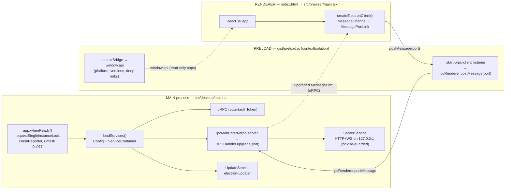
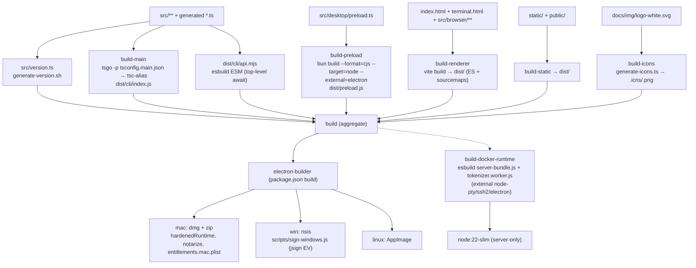
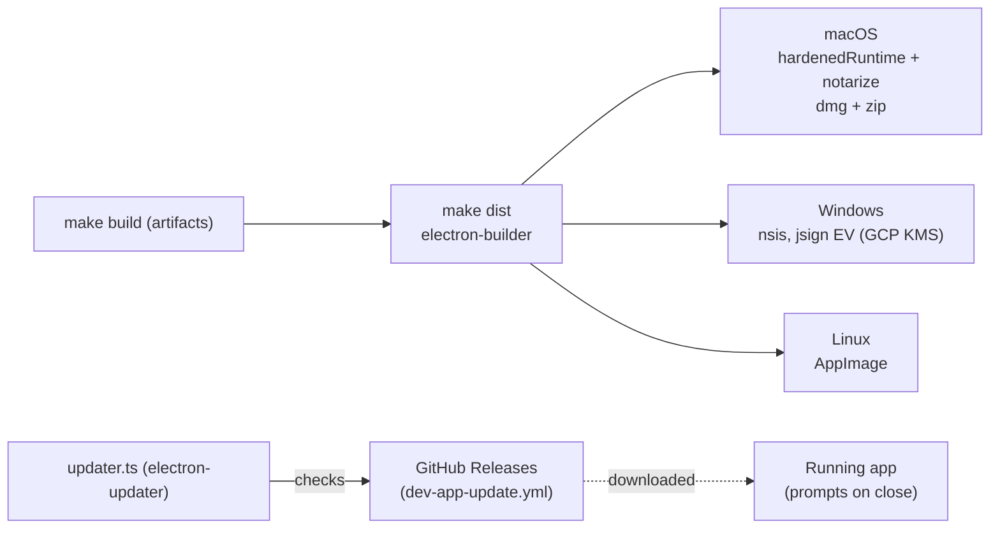

# 01 — Architecture, Build & Distribution

> **Analyzed at:** `main` @ `4bac642a8`

How `mux` is packaged into one artifact that runs as a desktop app, a CLI, and a headless server — the Electron process topology, the hardening applied to every window, the build graph, and the cross-platform distribution pipeline. For how the process model feeds into the IPC layer, see [02 — IPC & Configuration](analysis/02-ipc-config).

## TL;DR

- **Single entry, environment-disambiguated.** `dist/cli/index.js` is both `package.json` `main` _and_ the `mux` bin; `src/cli/argv.ts` picks CLI vs desktop by inspecting `process.versions.electron` / `process.defaultApp`, and lazily `require()`s subcommands.
- **Hardened Electron defaults.** Every `BrowserWindow` (main, splash, terminal) runs `nodeIntegration:false` + `contextIsolation:true`; navigation is deny-by-default; external links are opened after `normalizeAndValidateExternalUrl`.
- **Five distinct build outputs** from one `src/**` tree: the tsgo-compiled main/backend, the esbuild ESM API CLI, the `bun build` preload, the Vite renderer bundle, and the electron-builder installers (plus a Docker server bundle).
- **Makefile is the source of truth.** `package.json` scripts are thin proxies to `make` targets.
- **Auto-update over GitHub Releases** (`electron-updater`), Windows code-signed via GCP KMS EV signing.

---

## 1. Key files

| Concern                | Path                                                                                                       | Notes                                                                             |
| ---------------------- | ---------------------------------------------------------------------------------------------------------- | --------------------------------------------------------------------------------- |
| npm `main` + `bin.mux` | `dist/cli/index.js` (from `src/cli/index.ts`)                                                              | Shared entry for CLI + Electron                                                   |
| Electron main          | `src/desktop/main.ts`                                                                                      | Window creation, lifecycle, deep-links, server bootstrap                          |
| Preload bridge         | `src/desktop/preload.ts` → `dist/preload.js`                                                               | `contextBridge` + MessagePort relay                                               |
| Renderer entry         | `src/browser/main.tsx` (in `index.html`)                                                                   | React 18 root → `<AppLoader/>`                                                    |
| Terminal-window entry  | `src/browser/terminal-window.tsx` (in `terminal.html`)                                                     | Separate pop-out window                                                           |
| Version stamp          | `src/version.ts`                                                                                           | **Generated** by `scripts/generate-version.sh` at build (absent from source tree) |
| Splash                 | `static/splash.html` → `dist/splash.html`                                                                  | Static HTML, no React/IPC                                                         |
| CLI router             | `src/cli/index.ts` + `argv.ts`                                                                             | Env detection + lazy subcommand require                                           |
| CLI subcommands        | `src/cli/{run,workflow,trust,server,acp,api,debug}.*`                                                      | `run`/`workflow`/`trust` headless-only; `desktop` Electron-only                   |
| Build config           | `Makefile`, `fmt.mk`, `vite.config.ts`, `tsconfig.main.json`, `babel.config.js`                            | Source of truth for build                                                         |
| Packaging              | `package.json` `build` block (electron-builder), `build/entitlements.mac.plist`, `scripts/sign-windows.js` | Generated electron-builder config                                                 |
| Auto-update            | `dev-app-update.yml`, `src/desktop/updater.ts`                                                             | GitHub Releases provider                                                          |
| Alt packaging          | `Dockerfile`, `docker-compose.yml`, `flake.nix`, `.envrc`, `.tool-versions`                                | Server image / Nix / direnv                                                       |

## 2. Electron process topology & security



**Window creation** (in `src/desktop/main.ts`):

- **Splash** (`showSplashScreen`): `BrowserWindow` 400×300, `frame:false`, `alwaysOnTop`, loads `dist/splash.html`. Shown briefly while `loadServices()` runs.
- **Main window** (`createWindow`): persisted size via `windowStateKeeper` (~80% of screen); integrated titlebar via `getTitleBarOptions()`. Created in `app.whenReady()` **after** splash + services.
- **Terminal window** (`src/desktop/terminalWindowManager.ts`): separate pop-out for terminals, same webPreferences.

**Security posture (identical across all windows):**

- `nodeIntegration: false`, `contextIsolation: true`
- `preload: dist/preload.js` (main only)
- `spellcheck: false`
- `setWindowOpenHandler` returns `{action:"deny"}`; external URLs opened via `normalizeAndValidateExternalUrl`
- `will-navigate` blocks cross-origin navigation
- `process.umask(0o077)`, `crashReporter.start({uploadToServer:false})`
- `--max-old-space-size=8192` (the app can hold large histories)
- `requestSingleInstanceLock()` unless `CMUX_ALLOW_MULTIPLE_INSTANCES=1`

**The MessagePort bridge** (why there is almost no `ipcMain`/`ipcRenderer`):

1. Renderer creates `new MessageChannel()`, posts the _server_ port via `window.postMessage("start-orpc-client", "*", [serverPort])`, keeps the _client_ port.
2. Preload forwards the port to main via `ipcRenderer.postMessage("start-orpc-server", null, [port])`.
3. Main upgrades it: `orpcHandler.upgrade(serverPort, { context: { ...services, headers: { authorization: `Bearer ${authToken}` } } })`.

The same router + handler also serve HTTP/WS for CLI/browser (`ServerService.startServer`, started unless `MUX_NO_API_SERVER=1`), guarded by `serverLockfile.ts` (singleton).

**Dev vs packaged:** dev loads `http://127.0.0.1:5173` (Vite, with retry/backoff); packaged loads `../index.html`. React DevTools auto-installed when `!app.isPackaged`.

**Deep-links:** `mux://` registered via `app.setAsDefaultProtocolClient`; buffered until `did-finish-load`, then flushed. Preload also buffers links that arrive before the React app subscribes.

**Lifecycle:** `before-quit` disposes `ServiceContainer` (raced against a 5s timeout). Main-window `close` → `preventDefault()` + `hide()` (tray keeps the app alive); prompts to install if an update is `downloaded`. `window-all-closed` quits except on macOS.

## 3. The five build outputs



- **`build-main`** — TypeScript → CommonJS for main/backend (`tsconfig.main.json`). The backend, CLI, and Electron main all compile from here.
- **`build-preload`** — `bun build` CJS bundle, `external:electron`, target `node`. Kept minimal deliberately (stays sandbox-compatible).
- **`build-renderer`** — Vite (`rollupOptions.input`: `index.html` + `terminal.html`); ES modules + sourcemaps to `dist/`.
- **`dist/cli/api.mjs`** — esbuild ESM (the `api` CLI needs ESM + top-level await for `trpc-cli`).
- **Docker server bundle** — esbuild bundles `server-bundle.js` + `tokenizer.worker.js`, externalizing native deps (`node-pty`, `ssh2`) and `electron`. Produces a server-only image (`node:22-slim`) that has no GUI.

> `package.json`'s `build` block is the electron-builder config; it points at `build/entitlements.mac.plist`, `build/icon.icns/png`, and `scripts/sign-windows.js`.

## 4. `bun run` → Make proxying

Every `package.json` script is a thin proxy to Make (the source of truth):

```
"dev":        "make dev"
"build":      "make build"
"start":      "make start"
"typecheck":  "make typecheck"
"lint":       "make lint"
"dist":       "make dist"
```

Only `debug` runs `bun src/cli/debug/index.ts` directly, and `prebuild:main` runs `scripts/generate-version.sh`. The Makefile defaults to `-j` (parallel), uses `bash`, and includes `fmt.mk`.

## 5. Distribution & auto-update



- **macOS** — `hardenedRuntime`, notarization, `entitlements.mac.plist`; `dmg` + `zip`.
- **Windows** — NSIS installer, EV code-signed via `scripts/sign-windows.js` (jsign + GCP Cloud KMS, Workload Identity Federation in CI).
- **Linux** — `AppImage`.
- **Auto-update** — `electron-updater` against GitHub Releases (`dev-app-update.yml` in dev, real provider in packaged builds). On `downloaded`, the next window-close prompts the user to install.
- **Docker** — multi-stage `node:22-slim` image for a headless server (compose mounts `/root/.mux`, exposes a port).
- **Nix / direnv** — `flake.nix` pins `electron_40` on `nixos-unstable`; `.envrc` runs `use flake`; `.tool-versions` pins `bun 1.3.5`.

## 6. Extension points

| To…                         | Touch                                                                                                        |
| --------------------------- | ------------------------------------------------------------------------------------------------------------ |
| Add a CLI subcommand        | `src/cli/index.ts` (router) + a new `src/cli/<name>.ts` + a case in `argv.ts` if availability is constrained |
| Add an Electron window      | `src/desktop/main.ts` (webPreferences are shared — keep them hardened)                                       |
| Add a build output          | `Makefile` (add a target + wire into `build`)                                                                |
| Add a packaging target      | `package.json` `build` block + a `dist-*` Make target                                                        |
| Change dev-server host/port | `MUX_DEVSERVER_HOST` / `MUX_DEVSERVER_PORT` env vars                                                         |
| Handle a new deep-link      | `src/desktop/utils/muxProtocolRegistration.ts` + the renderer deep-link subscriber                           |

## 7. Risks & tech debt

- **One entry does a lot.** `src/cli/index.ts` branching logic is subtle; a wrong env read could boot the wrong runtime. Tests cover the happy paths.
- **`src/desktop/main.ts` is ~1255 lines** doing window creation, lifecycle, IPC upgrade, server bootstrap, and update wiring — a candidate for decomposition.
- **`sandbox` is not enabled** on windows (preload stays Node-free deliberately to remain hardened-compatible, but full sandboxing would be stricter).
- **Windows signing depends on GCP KMS + WIF** — a CI-only path; local Windows builds are unsigned.
- **Generated artifacts** (`src/version.ts`, electron-builder config) are not in the tree — a fresh checkout must run `prebuild:main` / `make build` before some tooling works.

## Related reports

- [00 — System Overview](analysis/00-system-overview)
- [02 — IPC & Configuration](analysis/02-ipc-config) — the oRPC layer this process model serves
- [09 — Testing, CI, Security & Telemetry](analysis/09-testing-ci-security) — the CI that builds & signs all of this
