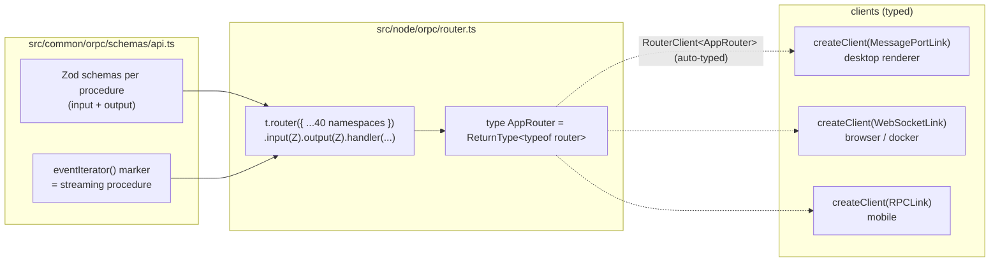
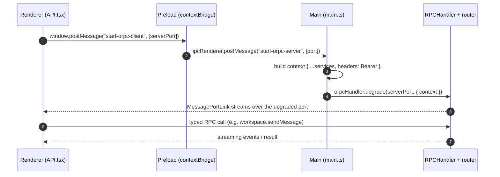
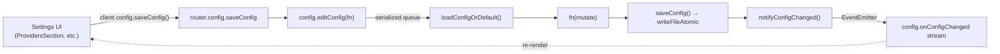

# 02 — IPC (oRPC) & Configuration

> **Analyzed at:** `main` @ `4bac642a8`

How the renderer talks to the backend, and how all persistent settings are modeled, validated, and kept in sync. `mux` does **not** use plain `ipcRenderer`/`ipcMain` for its app API — the entire backend surface is a single **oRPC** router. The contract is schema-first (Zod) and typed end-to-end.

## TL;DR

- **One router, three transports.** `router(authToken)` in `src/node/orpc/router.ts` is served over an Electron `MessagePort` (desktop), WebSocket (`/orpc/ws`), and HTTP + OpenAPI. Same handlers everywhere.
- **Schema-first contract.** Every procedure's input/output is a Zod schema in `src/common/orpc/schemas/api.ts`; `AppRouter = ReturnType<typeof router>` flows types to the renderer automatically.
- **The "bridge" is minimal.** The preload only forwards one `MessagePort` + exposes a few read-only flags via `contextBridge`. No raw `ipcRenderer` in the renderer.
- **`Config` is a hardened singleton.** `src/node/config.ts` reads `~/.mux/config.json` (plus `providers.jsonc`, `secrets.json`), never throws on load, writes atomically, and serializes all edits through `editConfig()` (a promise queue) so concurrent edits don't lose writes.
- **DI bag = oRPC context.** `ORPCContext` holds ~45 service instances + `config`; handlers read services from `context.<name>`.

---

## 1. Key files

| Concern            | Path                                                               | Notes                                                  |
| ------------------ | ------------------------------------------------------------------ | ------------------------------------------------------ |
| Router             | `src/node/orpc/router.ts` (6342L)                                  | `router(authToken)` — ~40 namespaces; `type AppRouter` |
| Server factory     | `src/node/orpc/server.ts`                                          | Express + WS + OpenAPI on one HTTP server              |
| WS paths           | `src/node/orpc/wsPaths.ts`                                         | `/orpc/ws`, `/desktop/ws`, `/browser/ws`               |
| Auth middleware    | `src/node/orpc/authMiddleware.ts`                                  | Bearer/cookie check, timing-safe compare               |
| Context (DI)       | `src/node/orpc/context.ts` + `serviceContainer.ts:toORPCContext()` | ~45 services                                           |
| Contract (schemas) | `src/common/orpc/schemas/api.ts` (2874L) + `schemas/*`             | Zod input/output per procedure                         |
| Derived types      | `src/common/orpc/types.ts`                                         | `z.infer` exports                                      |
| Renderer client    | `src/browser/contexts/API.tsx`                                     | `createElectronClient` / `createBrowserClient`         |
| Preload            | `src/desktop/preload.ts`                                           | MessagePort relay + `window.api`                       |
| Config class       | `src/node/config.ts` (2591L)                                       | `Config`, `editConfig`, atomic writes                  |
| Config schema      | `src/common/config/schemas/appConfigOnDisk.ts`                     | `AppConfigOnDiskSchema`                                |

## 2. Schema → router → client type flow

- Each procedure: `t.input(schemas.ns.proc.input).output(schemas.ns.proc.output).handler(async ({context, input, signal}) => ...)`.
- **Streaming procedures** use `async function*` generators (e.g. `onConfigChanged`, `subscribeLogs`, chat streams) — declared with the `eventIterator(...)` schema marker.
- **Result helper:** outputs often use `ResultSchema(data, error)` → `{success, data}` / `{success:false, error}` unions (see `schemas/result.ts`).
- Types: renderer and main both import derived types from `src/common/orpc/types.ts`; the renderer client is `RouterClient<AppRouter>` — fully typed and auto-validated.

## 3. The transports & the MessagePort bridge

**`src/browser/contexts/API.tsx`** selects transport at runtime (`connect`):

- **Electron** (`window.api` present) → `createElectronClient()`: `new MessageChannel()` → post the server port → `MessagePortLink({ port: clientPort })` → `createClient(link)`. Sets `window.__ORPC_CLIENT__`.
- **Browser / Docker** → `createBrowserClient()`: WebSocket to `${baseUrl}/orpc/ws?token=…` → `WebSocketLink`.

**Connection state machine** (`APIState`): `connecting | connected | degraded | reconnecting | auth_required | error`, with liveness pings (`LIVENESS_INTERVAL_MS` ~5s), exponential reconnect (`MAX_RECONNECT_ATTEMPTS=10`), and an auth probe (`/api/spec.json`) to distinguish 401 from network failure.

**The desktop also runs an HTTP/WS server** (`ServerService.startServer`, unless `MUX_NO_API_SERVER=1`) so the packaged CLI (`mux api`, `mux acp`) and mobile can talk to the same backend, guarded by `serverLockfile.ts`.

## 4. The ~40 router namespaces

| Category                                | Namespaces                                                                                                              |
| --------------------------------------- | ----------------------------------------------------------------------------------------------------------------------- |
| **Config / preferences / models**       | `config`, `providers`, `policy`, `muxGateway`                                                                           |
| **Auth / secrets / OAuth**              | `serverAuth`, `secrets`, `muxGatewayOauth`, `copilotOauth`, `muxGovernorOauth`, `codexOauth`, `onePassword`, `mcpOauth` |
| **Projects / workspaces / tasks**       | `projects`, `workspace` (largest, ~1.4K lines), `tasks`, `nameGeneration`                                               |
| **AI / chat / memory / agents**         | `agents`, `agentSkills`, `memory`, `coder`                                                                              |
| **Dev infra**                           | `terminal`, `desktop`, `browser`, `devtools`, `ssh`                                                                     |
| **MCP / workflows**                     | `mcp`, `workflows`                                                                                                      |
| **App / window / update / menu**        | `server`, `window`, `update`, `menu`, `voice`, `splashScreens`                                                          |
| **Telemetry / analytics / experiments** | `telemetry`, `analytics`, `experiments`, `debug`                                                                        |
| **Misc**                                | `tokenizer`, `uiLayouts`, `general` (ping/tick/logs/dir/restart/editor)                                                 |

## 5. The Config system

### On-disk layout

| File                     | Content                                                                                                                                     |
| ------------------------ | ------------------------------------------------------------------------------------------------------------------------------------------- |
| `~/.mux/config.json`     | projects + workspaces, `userPreferences`, `taskSettings`, model prefs, gateways, route priority/overrides, runtime settings, update channel |
| `~/.mux/providers.jsonc` | per-provider: `apiKey`/`apiKeyFile`/`apiKeyOpLabel`, `baseUrl`, `headers`, `enabled`, `models[]`, `modelParameters`                         |
| `~/.mux/secrets.json`    | global + per-project secrets                                                                                                                |

### `Config` class (`src/node/config.ts`)

- **Paths:** `rootDir = getMuxHome()`; `configFile`, `providersFile`, `secretsFile`, `sessionsDir`, `srcDir`.
- **`loadConfigOrDefault()`** — reads `config.json`, runs `normalizeConfigMigrations`, normalizes every field, applies one-time seed migrations (guarded by flags like `defaultModelFallbacksSeeded`). **Never throws** — on any error returns a safe default (resilient startup).
- **`saveConfig()`** — rebuilds the on-disk object field-by-field, then `writeFileAtomic` (temp-file + rename).
- **`editConfig(fn)`** — the canonical write entrypoint. Serialized on `editConfigQueue` (a promise chain) so concurrent edits (e.g. parallel task launches) can't read the same snapshot and lose writes: `load → fn(config) → saveConfig → notifyConfigChanged()`.
- **`onConfigChanged(cb)` / `notifyConfigChanged()`** — `EventEmitter` pub/sub; this is the push signal behind the renderer's streaming `config.onConfigChanged` subscription.
- **Providers:** `loadProvidersConfig()` (`jsonc.parse`); `watchProvidersFile()` detects external edits via a **sha256 fingerprint** (not mtime).
- **Secrets:** `loadSecretsConfig()`, `getGlobalSecrets/getProjectSecrets`, `updateGlobalSecrets/updateProjectSecrets`.

### Settings round-trip flow

### Zod schemas (`src/common/config/schemas/`)

- `AppConfigOnDiskSchema` (`.passthrough()`): projects (array of `[path, ProjectConfig]` tuples), `userPreferences`, `taskSettings`, gateway models, route priority/overrides, `minThinkingLevelByModel`, `modelFallbacks`, `defaultModel`, agent/sub-agent AI defaults, `runtimeEnablement`, governor/gateway URLs+tokens, server bind settings, etc.
- `AppConfigMigrationsSchema` = known boolean flags + `catchall(boolean)` (forwards-compat with future flags).

## 6. Extension points

| To…                         | Touch                                                                                                           |
| --------------------------- | --------------------------------------------------------------------------------------------------------------- |
| Add an IPC procedure        | `schemas/api.ts` (add to the namespace object) + `router.ts` (wire it with a handler using `context.<service>`) |
| Add a streaming procedure   | declare output `eventIterator(...)`, implement an `async function*` handler                                     |
| Add a config field          | `appConfigOnDisk.ts` (Zod) + `config.ts` (`loadConfigOrDefault` normalize + `saveConfig` serialize)             |
| Switch transport            | `API.tsx` (`connect`) — already picks MessagePort vs WebSocket at runtime                                       |
| Add a provider config field | `providersConfig.ts` schema + `config.ts` load/save                                                             |

## 7. Risks & tech debt

- **`router.ts` is 6342 lines** — one giant file with ~40 namespaces. Hard to navigate; a split-by-namespace refactor would help (the schema barrel is already split).
- **`config.ts` is 2591 lines** — loads, migrates, saves, watches, and exposes everything config-related. The migration logic + per-field normalize/serialize is the densest part.
- **`providers.jsonc` has no env-var defaults** by design (explicit config only) — but means first-run setup requires UI or manual editing.
- **Streaming procedures are pervasive** (`onConfigChanged`, `onChat`, `subscribeLogs`, …) — a connection drop mid-stream must be handled by the client's reconnect + re-subscribe logic in `API.tsx`.
- **`ResultSchema` union vs throwing** — handlers are inconsistent in style; prefer the `ResultSchema` pattern for user-facing operations.

## Related reports

- [00 — System Overview](analysis/00-system-overview)
- [01 — Architecture & Build](analysis/01-architecture-build) — the process model this IPC serves
- [03 — AI & Agent Runtime](analysis/03-ai-agent-runtime) — the `workspace`/`agents` namespaces in action
