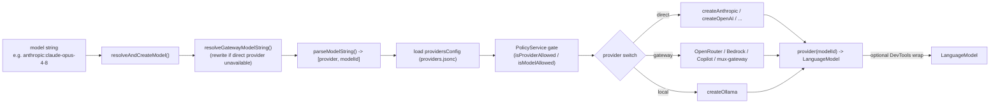
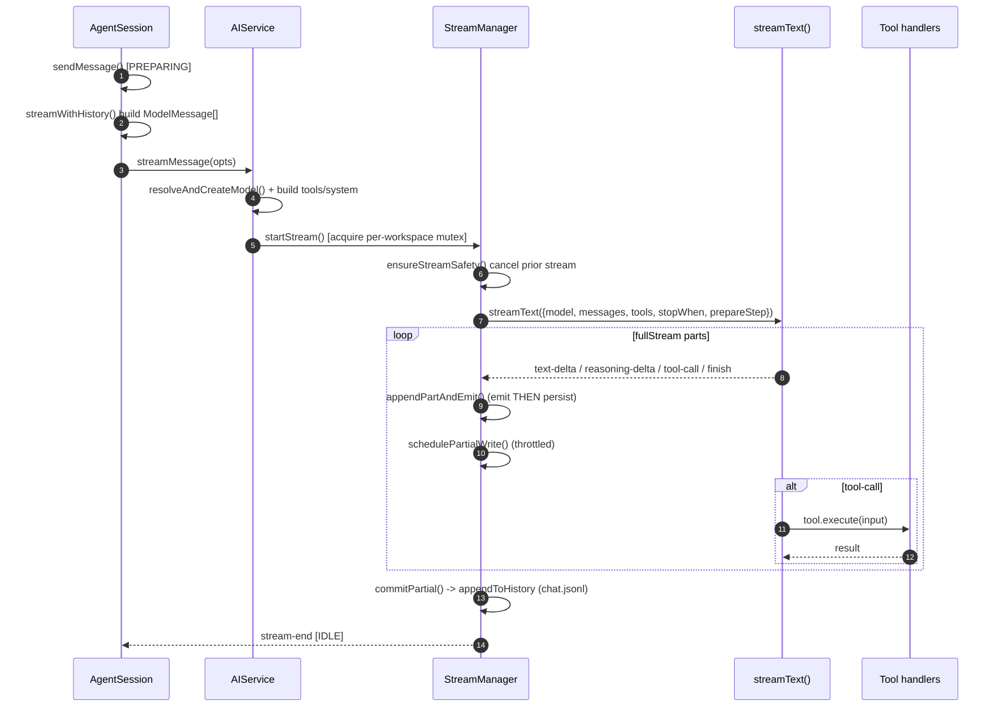
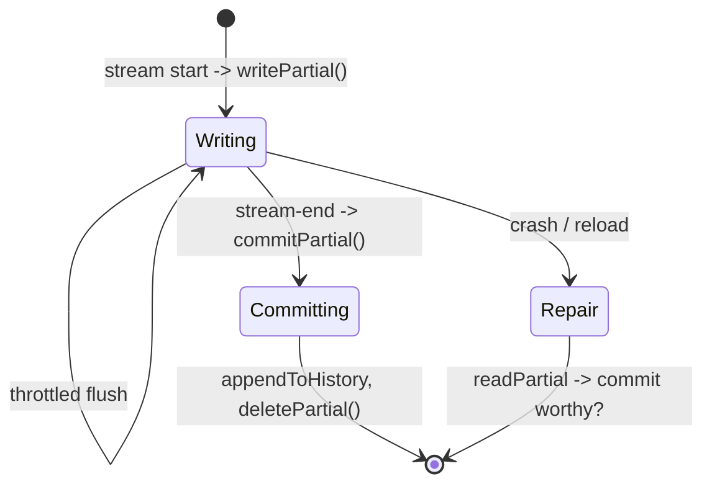
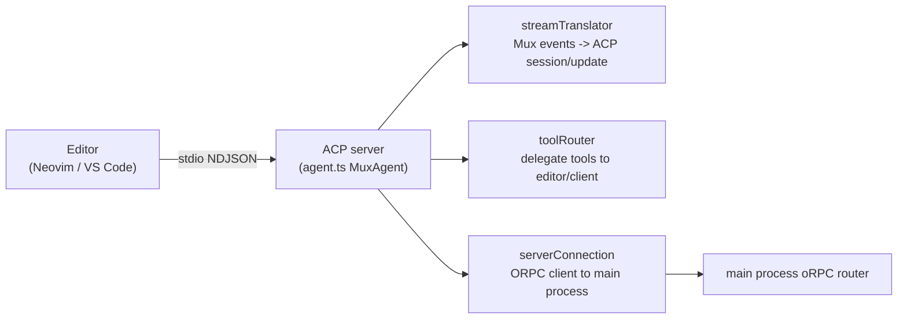

# 03 — AI Provider & Agent Runtime

> **Analyzed at:** `main` @ `4bac642a8`

> **Naming gotcha:** the AI/LLM runtime lives in **`src/node/services/`**, _not_ `src/node/runtime/`. The latter is the _execution-environment_ runtime (SSH/Docker/Local/Worktree process management — see [05](analysis/05-workspace-persistence)). All provider/turn/streaming code is under `services/`.

This report covers how LLM providers are integrated via the Vercel AI SDK, how the agentic turn/stream loop works, what an "agent" is, how Agent Client Protocol (ACP) enables editor integration, and how tokens, costs, and context compaction are handled.

## TL;DR

- **Provider registry is a single source of truth.** `PROVIDER_DEFINITIONS` (`src/common/constants/providers.ts`) declares each provider's SDK factory, kind (`direct`/`gateway`/`local`), and (for gateways) routing transforms. `ProviderModelFactory` turns a `provider:model` string into a callable `LanguageModel`.
- **Gateway routing is automatic.** If the direct provider isn't available (no key), `resolveGatewayModelString` rewrites the model to route through a configured gateway (mux-gateway / openrouter / bedrock / github-copilot).
- **The turn loop is a 4-stage pipeline.** `AgentSession` (per-workspace orchestrator) → `AIService.streamMessage` → `StreamManager.startStream` (per-workspace mutex) → `streamText()` → `fullStream` loop. Each part is emitted to the renderer _before_ being persisted.
- **Per-workspace mutex.** Only one stream runs at a time per workspace; `ensureStreamSafety` cancels any in-flight stream before starting a new one.
- **Two sub-agent mechanisms.** In-process child workspaces via the `task` tool/`TaskService` (same backend), and editor-driven sessions over **ACP** (Mux implements the Agent side, stdio NDJSON).

---

## 1. Key files

| Concern              | Path                                                                  | Notes                                                   |
| -------------------- | --------------------------------------------------------------------- | ------------------------------------------------------- |
| Provider registry    | `src/common/constants/providers.ts`                                   | `PROVIDER_DEFINITIONS`, kinds, routing                  |
| Model registry       | `src/common/constants/knownModels.ts`                                 | `MODEL_DEFINITIONS` → `KNOWN_MODELS`, aliases, defaults |
| Thinking levels      | `src/common/types/thinking.ts`                                        | levels, per-provider budgets/effort maps                |
| Factory              | `src/node/services/providerModelFactory.ts` (2167L)                   | `createModel`, `resolveAndCreateModel`                  |
| Session orchestrator | `src/node/services/agentSession.ts` (5830L)                           | `TurnPhase`, `sendMessage`, recovery                    |
| AI service           | `src/node/services/aiService.ts` (2967L)                              | `streamMessage`, event relay                            |
| Streaming core       | `src/node/services/streamManager.ts` (4174L)                          | mutex, `streamText`, partial writes                     |
| System prompt        | `src/node/services/systemMessage.ts` + `streamContextBuilder.ts`      | prompt assembly                                         |
| Compaction           | `compactionHandler.ts` (1199L) + `compactionMonitor.ts`               | boundary creation/trigger                               |
| Tokens/pricing       | `tokenizerService.ts`, `src/common/utils/tokens/*`                    | tokenizer + LiteLLM pricing                             |
| ACP                  | `src/node/acp/*` (`@agentclientprotocol/sdk`)                         | Agent side over stdio                                   |
| Sub-agents           | `src/node/services/tools/task.ts`, `src/node/services/taskService.ts` | in-process child workspaces                             |

## 2. Provider registry & model resolution

**Provider kinds:**

| Kind      | Providers                                        | Behavior                                                                                                  |
| --------- | ------------------------------------------------ | --------------------------------------------------------------------------------------------------------- |
| `direct`  | anthropic, openai, google, xai, deepseek         | `createX(config)` → `provider(modelId)`                                                                   |
| `gateway` | openrouter, github-copilot, bedrock, mux-gateway | route + transform model IDs (`toGatewayModelId`/`fromGatewayModelId`); mux-gateway is a passthrough proxy |
| `local`   | ollama                                           | local inference, no key                                                                                   |

**Provider-specific fetch wrapping** (where Mux injects its own logic): `wrapFetchWithAnthropicCacheControl` (cache_control breakpoints + Opus 4.7+ `xhigh` wire override), `wrapFetchWithMuxGatewayAutoLogout`, app attribution headers (`user-agent: mux/<version>`).

**Model registry** (`knownModels.ts`): `MODEL_DEFINITIONS` is the source; derived `KNOWN_MODELS`, `DEFAULT_MODEL` (`anthropic:claude-opus-4-8`), `DEFAULT_WARM_MODELS`, `MODEL_ABBREVIATIONS` (alias→id), `TOKENIZER_MODEL_OVERRIDES`. New models reuse the nearest published tokenizer until upstream releases one (e.g. all Claude 4.x reuse opus-4.5).

**Thinking levels** (`thinking.ts`): `["off","low","medium","high","xhigh","max"]`. Per-provider maps (`ANTHROPIC_THINKING_BUDGETS`, `OPENAI_REASONING_EFFORT`, `GEMINI_THINKING_BUDGETS`). Because `@ai-sdk/anthropic`'s Zod rejects `"xhigh"`, Mux sends `"max"` and rewrites `output_config.effort`→`"xhigh"` in the fetch wrapper for Opus 4.7+/Fable.

## 3. The streaming turn loop

### `AgentSession` (`src/node/services/agentSession.ts`, 5830L)

Per-workspace session orchestrator. Owns a `MessageQueue`, `compactionHandler`, `compactionMonitor`, `retryManager`, `fileChangeTracker`, an `EventEmitter`, and AI/init subscriptions.

- **`TurnPhase`**: `IDLE → PREPARING → STREAMING → COMPLETING → IDLE`.
- **`sendMessage`** — entry point (from IPC). Sets `PREPARING`, enqueues, builds the turn (history → request, resolves agent/system prompt + tools), then calls `aiService.streamMessage`. Handles edit-truncation, queued-message flush deferral, abort controllers.
- **`streamWithHistory`** — constructs `ModelMessage[]` from history with boundary/compaction awareness.
- **`runStartupRecovery`** — crash-resilient auto-retry on reload.

### `AIService` (`aiService.ts`, 2967L)

Owns one `StreamManager` and the `ProviderModelFactory`. It is an `EventEmitter` that **relays** StreamManager events to the renderer. `streamMessage(opts)`: resolve model → build system prompt + tools + messages → set up tool-call event handlers → `streamManager.startStream()`.

### `StreamManager` (`streamManager.ts`, 4174L)

The streaming core. Per-workspace state in `workspaceStreams: Map<WorkspaceId, WorkspaceStreamInfo>`; a per-workspace **mutex** (`streamLocks`/`AsyncMutex`) guarantees one stream at a time.

- **`startStream`** — acquire mutex → `ensureStreamSafety` → create stream-scoped temp dir → `createStreamAtomically` → return `StreamToken`.
- **`createStreamResult`** — the actual SDK call: `streamText({ model, messages, system, abortSignal, prepareStep, onChunk, tools, stopWhen, providerOptions, ... })`.
  - `stopWhen` = `createStopWhenCondition`: the agentic loop continues until a queued message interrupts or a required tool result lands.
  - `prepareStep` strips workflow-run records and extracts tool media into user messages per step.
- **Processing loop** — `for await (const part of streamResult.fullStream)`: `text-delta`→append+emit, reasoning deltas (Anthropic signature handling), tool-call/tool-result → events, finish/error.
- **`appendPartAndEmit`** — emits the part event to renderer **before** pushing to `parts` (avoids replay duplication), then schedules a throttled partial write.

## 4. Partial writes & compaction

- **Partial state** is staged in `partial.json` (throttled writes, see [05](analysis/05-workspace-persistence)).
- **`commitPartial`** is idempotent: strips transient error metadata, checks `hasCommitWorthyParts` (incomplete tool-only partials are _dropped_ to avoid bricking future requests), handles refusals, then commits via `appendToHistory`/`updateHistory` and deletes `partial.json`.
- **Compaction** (`compactionHandler.ts`): when the context window fills (`compactionMonitor`), a summary is appended as a durable boundary (`compacted`, `compactionBoundary: true`, `compactionEpoch`). History is then read from the latest boundary onward. Heartbeat resets create a synthetic `compacted: "heartbeat"` boundary.

## 5. Agents

An **agent** is a named bundle of system-prompt instructions + tool defaults + model/thinking settings. Sources:

- **Built-in agents:** `src/node/builtinAgents/*.md` (markdown instruction files) + definitions in `src/node/services/agentDefinitions/`.
- **User agents:** discovered from config (`agents` namespace).
- **Types** (`src/common/types/agentDefinition.ts`): explore, the default coder agent, etc.

**System-prompt assembly** (`systemMessage.ts` `buildSystemMessage` + `streamContextBuilder.ts`): merges the agent instructions, runtime/tool catalog, skills, MCP server list, and context. **AI-settings inheritance** (`resolveAgentAiSettings.ts` + `taskService.ts:resolveTaskAISettings`): sub-agents inherit the parent's model/thinking unless overridden.

UI: `AgentModePicker`, `AgentListItem`, `WorkspaceModeAISync` (keeps a workspace's agent in sync with its AI settings).

## 6. ACP — editor integration

Mux implements the **Agent** side of ACP (`@agentclientprotocol/sdk`): an editor talks to `mux acp` over stdio NDJSON; `MuxAgent` (`agent.ts`) translates between ACP session/update events and Mux's streaming events (`streamTranslator.ts`), and routes tools (`toolRouter.ts`). This is how editors get a first-class, streaming coding agent without the GUI.

## 7. Sub-agents (two mechanisms)

| Mechanism                   | Where                                     | Workspace model                           | Use case                                |
| --------------------------- | ----------------------------------------- | ----------------------------------------- | --------------------------------------- |
| `task` tool / `TaskService` | `tools/task.ts`, `taskService.ts` (7251L) | in-process child workspace `AgentSession` | best-of-n, variants, explore sub-agents |
| ACP                         | `src/node/acp/*`                          | editor-owned session                      | editor-driven coding                    |

Child tasks produce a git-format-patch artifact that a parent can apply (see [06 — Workflow Engine](analysis/06-workflow-engine)).

## 8. Tokens, cost & compaction

- **Tokenizer:** `tokenizerService.ts` + `src/node/utils/main/tokenizer` (ai-tokenizer); `MUX_APPROX_TOKENIZER=1` uses a fast approximation (used in tests to skip WASM cold start).
- **Pricing:** `src/common/utils/tokens/models.json` (LiteLLM) + `models-extra.ts` + `modelStats.ts` (`getModelStats`).
- **Cost:** `displayUsage.ts` (`calculateUsageCosts`) + `usageAggregator.ts`.
- **Session usage:** `sessionUsageService.ts` aggregates per-workspace spend (also feeds the local DuckDB analytics — see [09](analysis/09-testing-ci-security)).

## 9. Extension points

| To…                               | Touch                                                                                                         |
| --------------------------------- | ------------------------------------------------------------------------------------------------------------- |
| Add a provider                    | `constants/providers.ts` (`PROVIDER_DEFINITIONS` entry) + a branch in `providerModelFactory._createModelCore` |
| Add a model                       | `constants/knownModels.ts` (`MODEL_DEFINITIONS`) + tokenizer override                                         |
| Add a thinking level              | `types/thinking.ts` + per-provider budget/effort map                                                          |
| Add a built-in agent              | `builtinAgents/<name>.md` + `agentDefinitions/`                                                               |
| Change the agentic stop condition | `streamManager.createStopWhenCondition`                                                                       |

## 10. Risks & tech debt

- **`agentSession.ts` (5830L), `streamManager.ts` (4174L), `taskService.ts` (7251L)** are very large — the streaming/turn/retry logic is concentrated and hard to unit-test in isolation.
- **`xhigh` thinking requires a fetch-wrapper rewrite** for some Anthropic models — a fragile per-model exception tied to SDK schema limits.
- **Gateway routing is implicit** — a model can silently route through a different provider than the user expects if the direct provider lacks a key.
- **Tokenizer overrides** for brand-new models approximate costs until upstream tokenizers ship.

## Related reports

- [00 — System Overview](analysis/00-system-overview) — end-to-end request lifecycle
- [04 — Tools, MCP & Skills](analysis/04-tools-mcp-skills) — the tools this loop executes
- [05 — Workspace & Persistence](analysis/05-workspace-persistence) — partial writes & compaction storage
- [06 — Workflow Engine](analysis/06-workflow-engine) — sub-agent tasks & patches
