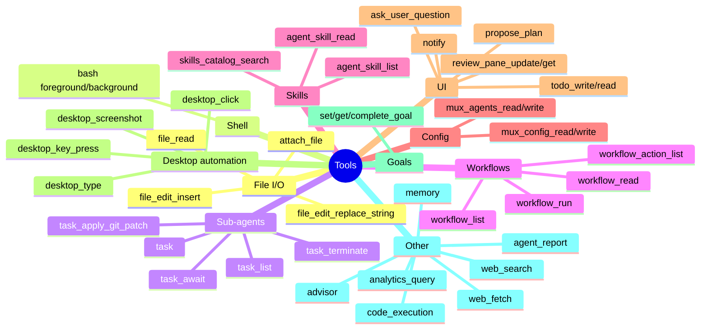
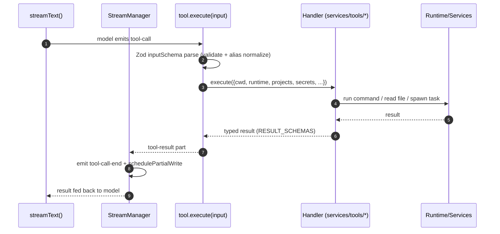
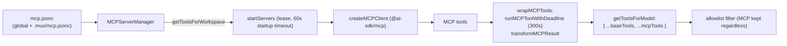
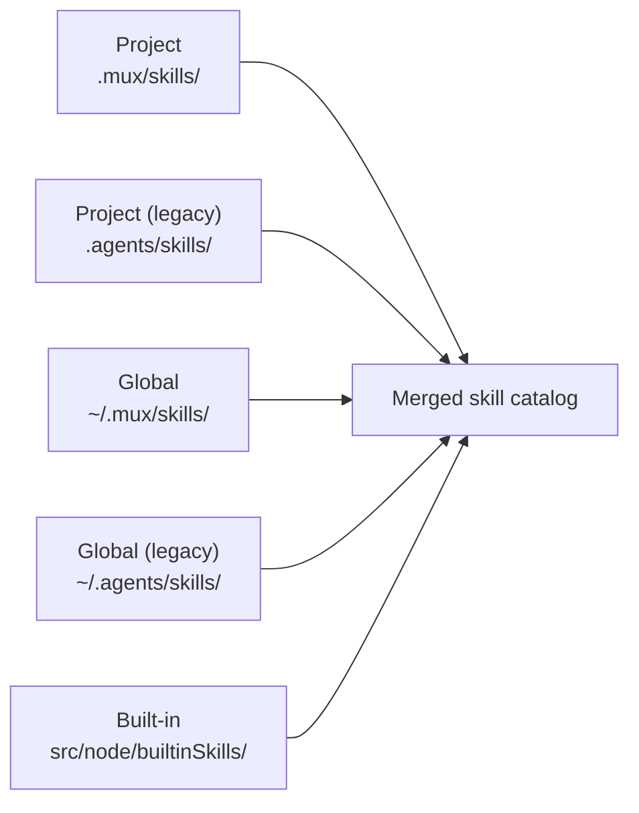

# 04 — Tool System, MCP & Skills

> **Analyzed at:** `main` @ `4bac642a8`

The set of capabilities the agent can invoke (file edits, shell, sub-agents, workflows, desktop automation…), how Model Context Protocol servers plug their own tools in, how "Skills" deliver on-demand instructions, and where the QuickJS sandbox runs untrusted code.

## TL;DR

- **One schema source of truth.** `TOOL_DEFINITIONS` (`src/common/utils/tools/toolDefinitions.ts`, 2839L) holds every tool's description + Zod input schema. `getAvailableTools(modelString)` filters the set per model/provider + feature flags.
- **The `.nullish()` rule.** Optional tool **input** params use `.nullish()` (=`.optional().nullable()`), never `.optional()` alone — so OpenAI's strict-mode (which marks all fields required and expects `null`) is satisfied. Handlers consume with `!= null`.
- **Tools compose at stream time.** `getToolsForModel()` builds runtime tools + non-runtime tools + desktop tools, then **spreads MCP tools** into the set, then adds provider-native tools (Anthropic `web_search`, Gemini `google_search`/`url_context`), then filters to the allowlist.
- **MCP is per-workspace & leased.** `MCPServerManager` starts/stops servers with a workspace-scoped lease (10-min idle timeout); each MCP tool is wrapped with a deadline (300s) + result transform.
- **Skills are SKILL.md packs.** Discovered from built-in < global < project scopes; `advertise:false` hides them from the catalog but they remain invocable via `/skill` or `agent_skill_read`.

---

## 1. Key files

| Concern          | Path                                                  | Notes                                                     |
| ---------------- | ----------------------------------------------------- | --------------------------------------------------------- |
| Definitions      | `src/common/utils/tools/toolDefinitions.ts`           | `TOOL_DEFINITIONS`, `getAvailableTools`, `RESULT_SCHEMAS` |
| Wiring           | `src/common/utils/tools/tools.ts`                     | `getToolsForModel`, `ToolConfiguration`, hooks            |
| Handlers         | `src/node/services/tools/<name>.ts` (~60 files)       | per-tool execute()                                        |
| MCP manager      | `src/node/services/mcpServerManager.ts` (2022L)       | lifecycle, leasing, wrapping                              |
| MCP config       | `src/node/services/mcpConfigService.ts`               | reads `.mux/mcp.jsonc` + global                           |
| MCP transform    | `src/node/services/mcpResultTransform.ts`             | CallToolResult → AI SDK                                   |
| MCP naming       | `src/common/utils/tools/mcpToolName.ts`               | `server_tool`-style names (lowercased `[a-z0-9_]+`)       |
| Schema sanitizer | `src/common/utils/tools/schemaSanitizer.ts`           | OpenAI strict-mode strip                                  |
| Skills service   | `src/node/services/agentSkills/agentSkillsService.ts` | discovery + caching                                       |
| Skill schema     | `src/common/orpc/schemas/agentSkill.ts`               | frontmatter + scope                                       |
| QuickJS stdlib   | `src/node/workflowRuntime/workflowRuntimeStdlib.js`   | sandbox globals                                           |

## 2. Tool taxonomy

Provider-specific tools are added by `getToolsForModel`: Anthropic `web_search` (+ `web_fetch` override for Claude ≥4.6); OpenAI `web_search` for gpt-4/5; Gemini 3+ `google_search`/`url_context`. `propose_name`/`propose_status` are `internal:true` — not in the default toolset, created inline by the title/status generators.

## 3. Tool execution path

- Each handler factory: `createXxxTool: ToolFactory = (config: ToolConfiguration) => tool({ description, inputSchema, execute })`. They import `TOOL_DEFINITIONS.xxx.description`/`.schema` to stay in sync.
- **`ToolConfiguration`** carries `cwd`, `runtime` (the execution-env abstraction), `projects`, `secrets`, `muxEnv`, `runtimeTempDir`, plus service handles (`backgroundProcessManager`, `taskService`, `memoryService`, `goalService`, `workflowService`, `advisorRuntime`, `analyticsService`, `workspaceHeartbeatService`, `availableSkills`, `experiments`).
- **Hooks:** `wrapToolsWithHooks` runs `.mux/tool_pre`/`tool_post`; `withSequentialExecution` prevents parallel execution when needed; `wrapToolsWithModelOnlyNotifications` attaches model-only fields.
- **Runtime tools** are wrapped with `wrapWithInitWait()` (wait for workspace init) before use.

## 4. MCP integration

- **Config (`mcpConfigService.ts`):** two locations — global `~/.mux/mcp.jsonc` and project `<projectPath>/.mux/mcp.jsonc`. A string entry = stdio command; an object with `command` = stdio; an object with `url` = http/sse/auto. Supports `disabled`, `toolAllowlist`, `headers` (with `{ secret: key }` resolution from project secrets).
- **Leasing:** `acquireLease`/`releaseLease` per workspace; idle timeout 10 min; client recycling on closed-client errors (`isClosedClientError`).
- **Result transform (`mcpResultTransform.ts`):** converts MCP `CallToolResult` (text/image/resource) to AI SDK format; images >8MB dropped with a replacement notice.
- **Naming (`mcpToolName.ts`):** `${serverName}_${toolName}`, lowercased `[a-z0-9_]+`, ≤64 chars, hash suffix on collision.
- **Sanitizer (`schemaSanitizer.ts`):** `sanitizeMCPToolsForOpenAI()` strips unsupported JSON Schema props for OpenAI strict mode.
- **UI:** `WorkspaceMCPModal` (per-workspace enable/disable + tool allowlist), `ProjectMCPOverview` (read-only), `MCPHeadersEditor` (header editor with secret refs).

## 5. Skills framework

**Schema (`schemas/agentSkill.ts`):** `AgentSkillScopeSchema` = `project | global | built-in`; `SkillNameSchema` kebab-case 1–64 chars; `AgentSkillFrontmatterSchema` = `name`, `description` (≤1024), optional `license`, `compatibility`, `metadata`, **`advertise`**. `advertise:false` hides from the catalog but the skill is still invocable.

**Discovery (`agentSkillsService.ts` `buildScanOrder()`) — precedence high → low:**

The catalog is injected into the system prompt (when advertised) so the model knows what to ask for. Tools: `agent_skill_read`, `agent_skill_read_file`, `agent_skill_list`, `agent_skill_write`, `agent_skill_delete`, `skills_catalog_search`, `skills_catalog_read`.

## 6. QuickJS sandbox

A QuickJS WebAssembly sandbox (`@jitl/quickjs-wasmfile-release-asyncify`) runs **untrusted/semi-trusted JS** in isolation from the Node process:

- **`code_execution` tool** — the model's JavaScript tool runs in a QuickJS sandbox with the `mux.*` API (the same one you see in this agent's tool set).
- **Workflow conductor** — workflow JS (`workflowRuntimeStdlib.js`) runs in QuickJS with a frozen `mux` global (`schema`, `patch`, `utils`, `parallelMap`) plus host-bridge functions; workflow _actions_ run in a separate real-Node child process (`workflowActionChild.js`) because they need real I/O (see [06](analysis/06-workflow-engine)).

## 7. Extension points

| To…                       | Touch                                                                                                                                 |
| ------------------------- | ------------------------------------------------------------------------------------------------------------------------------------- |
| Add a tool                | `toolDefinitions.ts` (description + schema) + `tools/<name>.ts` (handler) + `getToolsForModel` wiring + `getAvailableTools` allowlist |
| Gate a tool behind a flag | `getAvailableTools` options (`enableMemory`, `enableDynamicWorkflows`, …)                                                             |
| Add an MCP server         | `.mux/mcp.jsonc` (or UI)                                                                                                              |
| Add a skill               | `.mux/skills/<name>/SKILL.md` (or `~/.mux/skills/` for global)                                                                        |
| Hide a skill              | `advertise: false` in frontmatter                                                                                                     |

## 8. Risks & tech debt

- **`toolDefinitions.ts` (2839L) + `tools.ts`** are large; the schema-vs-handler sync is manual (handlers import the same keys, so a rename must touch both).
- **MCP tool names are lossy** — hashing/case-folding can collide or obscure provenance; the allowlist UI must map back.
- **The `.nullish()` convention is easy to forget** — an optional field written as `.optional()` breaks OpenAI strict-mode silently.
- **QuickJS + real-Node action child** is a two-runtime split — debugging workflow errors requires knowing which sandbox raised them.
- **MCP 300s deadline** is generous; a hung MCP server can hold a stream for 5 minutes.

## Related reports

- [00 — System Overview](analysis/00-system-overview)
- [03 — AI & Agent Runtime](analysis/03-ai-agent-runtime) — where tools are executed in the loop
- [06 — Workflow Engine](analysis/06-workflow-engine) — the QuickJS conductor + action child
