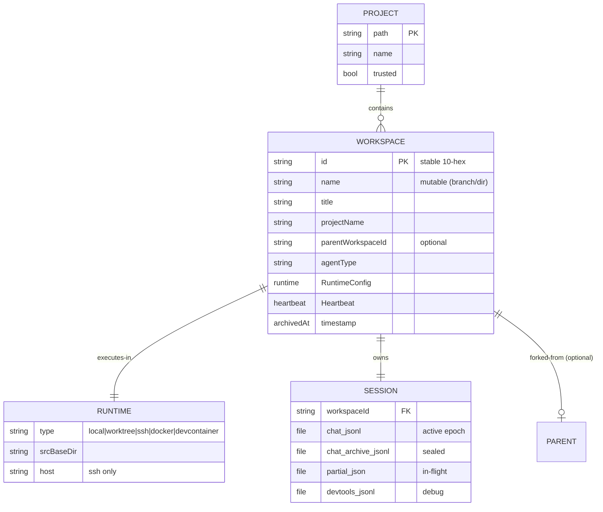
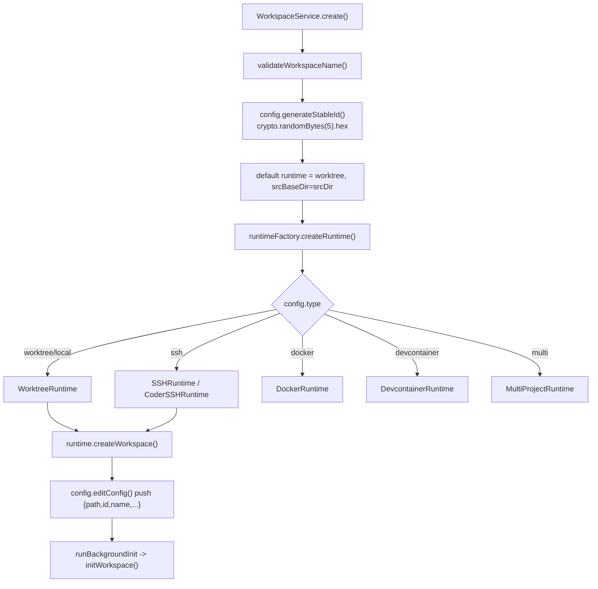
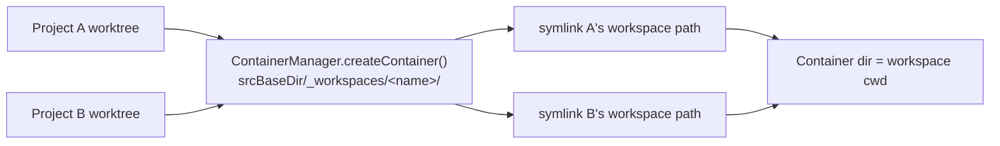

# 05 — Workspace, Worktree & Persistence

> **Analyzed at:** `main` @ `4bac642a8`

How a "workspace" is born, isolated, executed, and persisted. A workspace is one running agent context — a git worktree (or SSH clone) plus its session directory under `~/.mux`. This report covers the workspace data model, the runtime hierarchy, multi-project containers, and the durable, self-healing history/partial/compaction storage.

## TL;DR

- **Workspace = worktree/clone + session dir.** Stable 10-hex `id` (never synthesized by the frontend), mutable `name`. Runtime decides _where_ commands run.
- **Runtime hierarchy.** `LocalBaseRuntime` → `WorktreeRuntime` (git worktree) / `LocalRuntime` (project dir); `RemoteRuntime` → `SSHRuntime` / `CoderSSHRuntime`; plus `DockerRuntime`, `DevcontainerRuntime`, `MultiProjectRuntime`.
- **Stable IDs are backend-generated.** `Config.generateStableId()` = `crypto.randomBytes(5).toString("hex")`. The frontend always consumes a backend-returned ID.
- **History is append-only JSONL with boundaries.** `chat.jsonl` holds the active epoch; `chat-archive.jsonl` holds sealed pre-boundary history. Compaction creates a durable boundary.
- **Partial messages self-heal.** `partial.json` stages the in-flight assistant message; `commitPartial` drops tool-only partials and refuses stale sequences, so a crash never bricks a workspace.

---

## 1. Key files

| Concern           | Path                                                                                 | Notes                                                            |
| ----------------- | ------------------------------------------------------------------------------------ | ---------------------------------------------------------------- |
| Workspace schema  | `src/common/orpc/schemas/workspace.ts`                                               | `WorkspaceMetadataSchema`, `FrontendWorkspaceMetadataSchema`     |
| Runtime schema    | `src/common/orpc/schemas/runtime.ts`                                                 | `RuntimeModeSchema`, `RuntimeConfigSchema` (discriminated union) |
| Workspace service | `src/node/services/workspaceService.ts` (9209L)                                      | create/rename/fork/remove/archive                                |
| Runtime factory   | `src/node/runtime/runtimeFactory.ts`                                                 | `createRuntime()` switch                                         |
| Worktree          | `src/node/worktree/WorktreeManager.ts` (953L)                                        | `createWorkspace`, `forkWorkspace`, muxignore sync               |
| Multi-project     | `src/node/multiProject/containerManager.ts`, `gitRootDiscovery.ts`                   | symlink container                                                |
| SSH               | `src/node/runtime/RemoteRuntime.ts`, `SSHRuntime` (~3793L), `remoteProjectLayout.ts` | git-bundle sync, prompts                                         |
| History           | `src/node/services/historyService.ts` (2051L)                                        | append/read/partial/commit                                       |
| Compaction        | `compactionHandler.ts` (1199L) + `compactionMonitor.ts`                              | boundaries, epochs                                               |
| Config/paths      | `src/common/constants/paths.ts`, `src/node/config.ts`                                | `getMuxHome`, `getSessionDir`                                    |

## 2. Workspace data model



**ID vs name:** `id` is stable, generated once; `name` is mutable (the branch/directory name used for path computation). Legacy workspaces had `id===name`; new ones have a random hex id + a branch-name name.

**Runtime modes:** `local` (with `srcBaseDir` = legacy worktree; without = project dir, no isolation), `worktree` (explicit), `ssh` (host/srcBaseDir/identityFile/port/coder fields), `docker`, `devcontainer`.

## 3. Workspace creation & runtime hierarchy



- **`WorktreeManager.createWorkspace`** — cleans stale lock, fetches origin trunk (best-effort), checks fast-forward-ability, runs `git worktree add [-b branchName] workspacePath [base]`, syncs `.muxignore` files, syncs submodules, persists branch mapping; **rollback on failure** (`rollbackFailedWorkspaceCreation`).
- **`forkWorkspace`** — detects source branch, delegates to `createWorkspace` with the source branch as trunk.
- **Branch↔workspace mapping** persisted in `<project>/.git/mux-workspace-branches.json` (handles worktree gitdir refs).
- **`muxignore.ts`** — `syncMuxignoreFiles()` copies gitignored files (matched by `!`-patterns) into the worktree after `git worktree add`. Best-effort, never throws.

## 4. Multi-project workspaces



`MultiProjectRuntime` wraps N project runtimes; `createWorkspace()` creates per-project worktrees then builds the container (primary runtime = first project). `gitRootDiscovery.discoverGitRoots()` finds child dirs with `.git` for multi-project (or the workspace path itself for single). Gated by the multi-project experiment flag and Project Trust on all projects.

## 5. SSH / remote workspaces

`RemoteRuntime` (abstract) → `SSHRuntime` (~3793L) / `CoderSSHRuntime`. Remote project layout (`remoteProjectLayout.ts`): `projectId = {slug}-{sha256hash[:12]}`; `projectRoot = srcBaseDir/{projectId}`, `baseRepoPath = projectRoot/.mux-base.git`, workspace path = `projectRoot/{workspaceName}`. State is transferred to the remote host via **git bundles** (`gitBundleSync.ts`).

**SSH prompt flow:** `SshPromptService` (EventEmitter) blocks until the user responds or a timeout (`HOST_KEY_APPROVAL_TIMEOUT_MS`); supports host-key and credential prompts, dedups by host. `SshPromptDialog` (renderer) subscribes to `api.ssh.prompt`, queues FIFO. Connection status surfaces in `ConnectionStatusToast` / `ConcurrentLocalWarning`.

## 6. Persistence & history lifecycle

```mermaid
stateDiagram-v2
    [*] --> Writing: stream start -> writePartial()
    Writing --> Writing: throttled flush (PARTIAL_WRITE_THROTTLE)
    Writing --> Committing: stream-end -> commitPartial()
    Committing --> Boundary: durable boundary message
    Committing --> [*]: appendToHistory, deletePartial()
    Boundary --> Archived: rotateSealedHistory<br/>(chat.jsonl prefix -> archive)
    Archived --> [*]: read from latest boundary
    Writing --> Repair: crash / reload
    Repair --> [*]: readPartial; commit-worthy? commit : drop
```

### HistoryService (`src/node/services/historyService.ts`, 2051L)

Single dependency: `Pick<Config, "getSessionDir">` (per AGENTS.md, always use the real instance via `createTestHistoryService()`).

- **`appendToHistory`** — acquires a workspace file lock, assigns a monotonic `historySequence` (cached in `sequenceCounters`, initialized from persisted max), appends a JSONL row. If the message is a durable boundary, triggers `rotateAfterBoundaryWriteUnlocked()`.
- **`_appendToHistoryUnlocked`** — refuses stale `historySequence` (regression guard).
- **`getHistoryFromLatestBoundary`** — lazy migration (`ensureSealedHistoryRotated`), reads `chat.jsonl` from the boundary offset, falls back to archive + active for older boundaries.
- **`getLastMessages`** — tail read.
- **`getNextHistorySequence`** — scans for max sequence (not tail) to prevent stale-partial regressions.

### Partial lifecycle (self-healing)

- **`readPartial`** — reads `partial.json`; ENOENT/errors → `null` (never throws).
- **`writePartial`** — atomic write; sets `metadata.partial = true`; under lock.
- **`deletePartial`** — `fs.unlink`; ENOENT → OK.
- **`deletePartialIfMessageIdMatches`** — guards against deleting a partial belonging to a different/newer message.
- **`commitPartial`** — idempotent: reads partial, strips transient error metadata, checks `hasCommitWorthyParts` (text/reasoning with content, completed tool calls; incomplete tool-only partials are **dropped**), handles refusal metadata, commits via `appendToHistory`/`updateHistory`, then deletes `partial.json`.
- **`rotateSealedHistoryUnlocked`** — moves sealed prefix of `chat.jsonl` to archive; crash-safe (archive fsynced before `chat.jsonl` rewrite).

### Compaction (`compactionHandler.ts`)

`CompactionHandler` appends compacted summaries as durable boundaries (`compacted`, `compactionBoundary: true`, `compactionEpoch`). `appendHeartbeatContextResetBoundary` deletes the partial, reads history, creates a synthetic assistant message with `compacted: "heartbeat"`, persists it. `getNextCompactionEpoch` derives the next epoch from existing boundary messages (self-healing). `compactionMonitor` decides when to trigger.

## 7. Extension points

| To…                            | Touch                                                                                                  |
| ------------------------------ | ------------------------------------------------------------------------------------------------------ |
| Add a runtime mode             | `schemas/runtime.ts` (new discriminated member) + `runtimeFactory.createRuntime` + a new `*Runtime.ts` |
| Change worktree creation       | `WorktreeManager.createWorkspace`                                                                      |
| Add a session file             | `historyService` (read/write methods) + ensure request-building paths tolerate absence                 |
| Change boundary semantics      | `compactionHandler` + `historyService.getHistoryFromLatestBoundary`                                    |
| Add a multi-project capability | `MultiProjectRuntime` + `containerManager`                                                             |

## 8. Risks & tech debt

- **`workspaceService.ts` (9209L)** and **`SSHRuntime` (~3793L)** are huge; create/fork/remove/archive paths are intertwined.
- **Frontend must never synthesize IDs** — a frontend-computed ID would desync from on-disk state; this is an enforced architectural rule (no test, just discipline).
- **Partial-message repair is subtle** — the "drop tool-only partials" rule exists precisely because committing them would brick future provider requests; changes here are high-risk.
- **Boundary rotation must be crash-safe** (archive fsync before rewrite) — a regression here can lose sealed history.
- **SSH bundle sync** is a heavyweight transfer; large repos make `initWorkspace` slow.

## Related reports

- [00 — System Overview](analysis/00-system-overview) — `~/.mux` data-directory tree
- [03 — AI & Agent Runtime](analysis/03-ai-agent-runtime) — partial writes & compaction from the stream loop's perspective
- [08 — Mobile Application](analysis/08-mobile) — workspaces viewed from mobile
