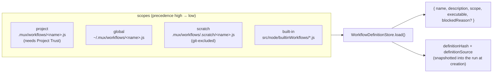
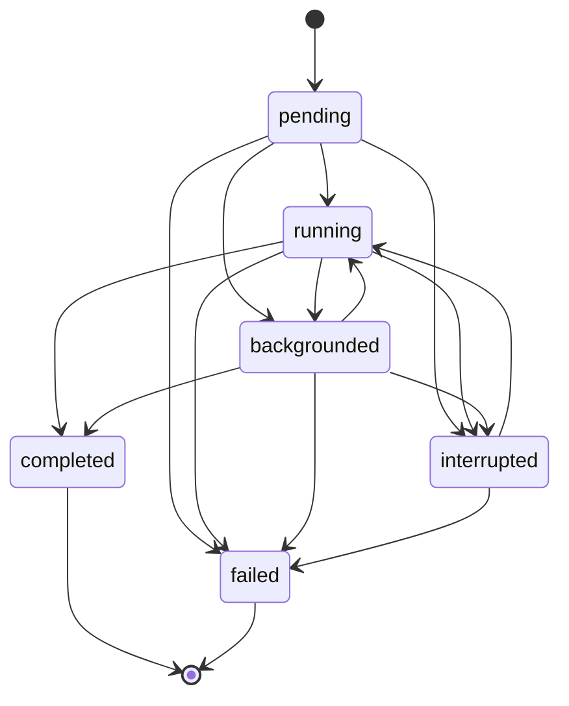
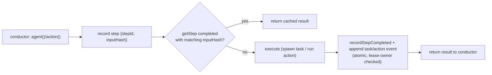
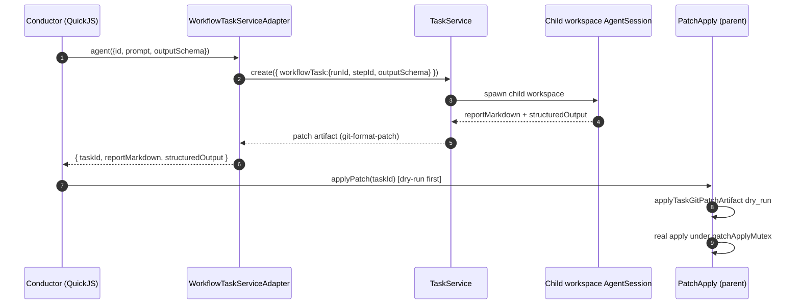

# 06 — Workflow Engine

> **Analyzed at:** `main` @ `4bac642a8`

A workflow is a **durable JavaScript conductor** that runs inside a sandboxed JS runtime (QuickJS), coordinates sub-agent tasks and host actions, validates structured reports, and persists every state transition to an append-only event journal — so runs can be **interrupted, replayed, and resumed** without re-executing completed work.

## TL;DR

- **Two layers of JS.** The conductor runs in **QuickJS** (`workflowRuntimeStdlib.js` — frozen `mux` global); workflow _actions_ run in a real **Node child process** (`workflowActionChild.js`) because they need real I/O (git/github/user actions).
- **Replay key = `stepId + inputHash`.** A completed step with a matching `inputHash` is never re-executed; changing the prompt/schema/input/action-args changes the hash → fresh work.
- **Leases + append-only journal.** Each run is a single JSON file written atomically; events are strictly sequenced; a lease guarantees single-owner execution and a renewal heartbeat aborts the runtime if lost.
- **Sub-agent patches are dry-run-first.** Child tasks produce a git-format-patch artifact; the conductor never sees raw patch text — `applyPatch` dry-runs first, then applies under a mutex.
- **Strict structured output (recent hardening).** An `outputSchema` is required before task creation; `structuredOutput` is validated before a child is marked reported.

---

## 1. Key files

| Concern                  | Path                                                                              | Notes                                                |
| ------------------------ | --------------------------------------------------------------------------------- | ---------------------------------------------------- |
| State machine + run loop | `src/node/services/workflows/WorkflowRunner.ts` (2992L)                           | host-bridges, steps, replay, lease, abort            |
| Entry / choreography     | `src/node/services/workflows/WorkflowService.ts` (1292L)                          | start/resume/retry, foreground/background, interrupt |
| Persistence              | `src/node/services/workflows/WorkflowRunStore.ts` (1161L)                         | atomic JSON, journal, lease lock, mutation lock      |
| Task bridge              | `src/node/services/workflows/WorkflowTaskServiceAdapter.ts`                       | conductor → real sub-agent tasks + patches           |
| Action exec              | `src/node/services/workflows/WorkflowActionRunner.ts` (751L)                      | spawns Node child, in-process actions                |
| Definitions              | `src/node/services/workflows/WorkflowDefinitionStore.ts` (1016L)                  | loads from all scopes                                |
| Scheduler                | `src/node/services/workflows/WorkflowSchedulerService.ts` (787L)                  | wall-clock dispatch                                  |
| Sandbox stdlib           | `src/node/workflowRuntime/workflowRuntimeStdlib.js`                               | frozen `mux` global                                  |
| Action child             | `src/node/workflowRuntime/workflowActionChild.js`                                 | real-Node action process                             |
| Built-in workflows       | `src/node/builtinWorkflows/{deep-research,deep-review-workflow,security-scan}.js` |                                                      |
| Built-in actions         | `src/node/builtinWorkflowActions/{git,github}/*.js`                               |                                                      |
| Authoring skill          | `src/node/builtinSkills/workflow-authoring.md`                                    |                                                      |
| Schema                   | `src/common/orpc/schemas/workflow.ts`                                             | definitions, runs, steps, events                     |
| Agent tools              | `src/node/services/tools/{workflow_run,workflow_resume,workflow_definitions}.ts`  |                                                      |

## 2. Definition model & scopes

A workflow JS module exports `metadata` + a default function. `compileWorkflowSource()` (`WorkflowRunner.ts`) **lexically rewrites** the source before sandbox eval: strips `export ` keywords (named/default exports become `__muxWorkflow`), appends the stdlib + the action-proxy factory, and the trailing invocation passing `{ args, phase, log, agent, action, parallelAgents, parallelActions, parallelWorkflows, applyPatch }`. (Gotcha in the skill: a template-literal line starting with `export ` is silently rewritten.)

The run record (`WorkflowRunRecordSchema`): `{ id (wfr_…), workspaceId, definition, definitionSource, definitionHash, args, agentOutputSchemaRequired?, status, events[], steps[] }`. `definitionHash`/`definitionSource` are snapshotted at creation, so resuming an old run uses the definition **as it was when started**.

## 3. Run lifecycle state machine

Terminal = `{completed, failed, interrupted}`; Active = `{pending, running, backgrounded}`. Legal transitions are declared in `WorkflowRunStatusTransitions` (`schemas/workflow.ts`).

**The run loop** (`WorkflowRunner.runWithLease`):

1. **Acquire lease** (`runStore.acquireLease`) — single-owner guard. A renewal `setInterval` heartbeat calls `renewLease`; lost renewal → `markLeaseLost` → abort the QuickJS runtime.
2. **Resume guard** — `completed` returns cached `result`; `interrupted` requires `allowResumeFromInterrupted`; `failed` requires `allowRetryFromFailedCheckpoint`. Resuming an interrupted run sets `ignoreStartedTaskIds`.
3. Append a `status: "running"` event.
4. Create the QuickJS runtime, register the host-bridge functions, set the runtime timeout.
5. `compileWorkflowSource` → `runtime.eval` → on success: normalize result → `result` event → `status: "completed"`. On failure: `error` + `status: "failed"`.
6. `finally`: release lease.

**Foreground vs background:** `runForegroundWithAbortInterrupt` wires the caller's `AbortSignal` to `interruptRunOnAbort`. `runInBackground` resolves once the lease is acquired and the runner continues detached.

## 4. Steps & the event journal

Each durable unit of work is a **step** keyed by `stepId + inputHash` (`hashWorkflowStepInput(stepId, normalizedSpec)` — the **replay key**). `getStep(runId, stepId, inputHash)` looks up prior results; a `completed` step with matching `inputHash` returns the cached result and is **never re-executed**.

### Event types (append-only, strictly sequenced)

| type         | meaning                              | key fields                                          |
| ------------ | ------------------------------------ | --------------------------------------------------- | --------- | -------- | ------- | --------------------- |
| `status`     | run lifecycle transition             | `status`                                            |
| `phase`      | major workflow transition (run card) | `name`, `details?`                                  |
| `log`        | lightweight detail                   | `message`, `data?`                                  |
| `task`       | sub-agent task lifecycle             | `stepId`, `taskId`, `status`                        |
| `workflow`   | nested child workflow                | `stepId`, `runId`, `name`, `status`                 |
| `patch`      | git patch application                | `stepId`, `sourceTaskId`, `status: started          | applied   | conflict | failed` |
| `action`     | host action lifecycle                | `stepId`, `name`, `status: started                  | completed | failed   | cached  | reconciled`, `effect` |
| `validation` | schema validation result             | `success`, `message?`                               |
| `result`     | final result                         | `WorkflowResult{reportMarkdown, structuredOutput?}` |
| `error`      | failure message                      | `message`                                           |

`recordTaskEventIfMissing`/`recordPatchTerminalEventIfMissing` reconcile the journal against the live task system on resume (idempotent), guarded by a `taskEventMutex`.

## 5. Sub-agents & patches

- `agent()`/`parallelAgents()` → `runAgentStep`/`runAgentStepsInParallel` → `WorkflowTaskServiceAdapter.runAgent`/`createAgentTasks` → `taskService.create({workflowTask:{runId, stepId, outputSchema}})`.
- **Strict structured output** (commit #3599): `outputSchema` is required before task creation; `structuredOutput` is validated via `StructuredTaskOutputSchema.parse` + `validateJsonSchemaSubset` before the child is marked reported; legacy text fallback is disabled for schema-bearing children.
- **Patches:** the conductor never sees raw patch text. `applyPatch` dry-runs first (`applyTaskGitPatchArtifact dry_run:true`) then applies under `patchApplyMutex` (avoids concurrent applies to the same parent).
- **Nested workflows:** `nestedWorkflowRuns.ts` derives child run IDs deterministically + enforces a depth cap (8).

## 6. Extension points

| To…                       | Touch                                                                                          |
| ------------------------- | ---------------------------------------------------------------------------------------------- |
| Author a workflow         | `.mux/workflows/<name>.js` (default export) — read `builtinSkills/workflow-authoring.md` first |
| Add a host action         | `builtinWorkflowActions/<ns>/<name>.js` (or project) + `workflow_action_list` discovers it     |
| Add a workflow event type | `schemas/workflow.ts` (union) + the runner's emit + journal reconcile logic                    |
| Change replay semantics   | `hashWorkflowStepInput` (changes the replay key) + `getStep`                                   |
| Change resume policy      | `WorkflowService` (allowResume/allowRetry flags) + `WorkflowRunner.runWithLease`               |

## 7. Risks & tech debt

- **Two JS runtimes** (QuickJS conductor + Node action child) complicate debugging — a workflow error can originate in either.
- **`compileWorkflowSource` lexical rewrite** is fragile (the `export ` gotcha; source must be parseable).
- **Lease renewal is a liveness dependency** — a stalled heartbeat aborts the runtime even if the work is fine.
- **Strict structured output** increased coupling between workflow definitions and child task schemas; schema mismatches now fail the child.
- **Depth cap (8)** and child-run-ID determinism are subtle invariants — breaking them can orphan child runs.

## Related reports

- [00 — System Overview](analysis/00-system-overview)
- [03 — AI & Agent Runtime](analysis/03-ai-agent-runtime) — the sub-agent tasks a workflow orchestrates
- [04 — Tools, MCP & Skills](analysis/04-tools-mcp-skills) — the QuickJS sandbox & the workflow tools
