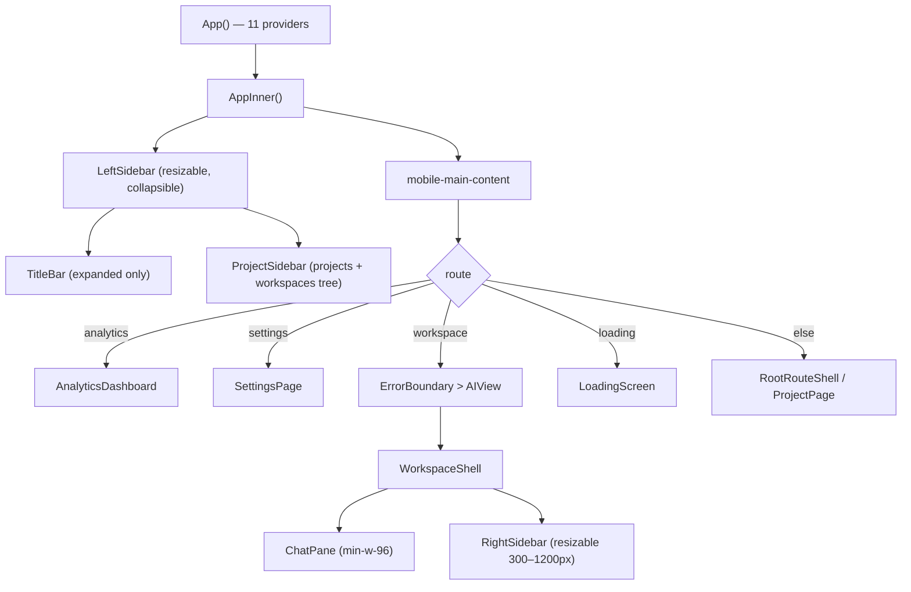
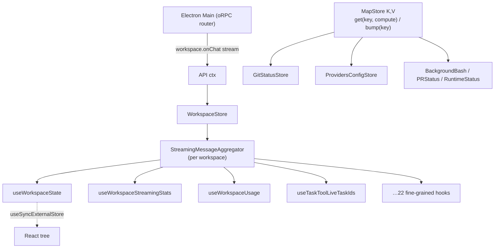
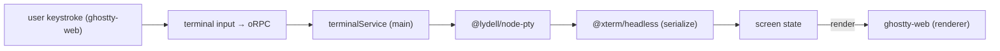

# 07 — React Frontend & Design System

> **Analyzed at:** `main` @ `4bac642a8`

The Electron renderer: how the app shell is laid out, how state is managed (spoiler: no Redux/Zustand), the component taxonomy, the embedded terminal, and the design system.

## TL;DR

- **Stack:** React 18.3 + **React Compiler** (no manual `React.memo`/`useMemo`/`useCallback`) · Tailwind CSS v4 (`@theme` tokens) · Radix UI (shadcn-style) · `cmdk` palette · `ghostty-web` terminal renderer · oRPC client → Electron main.
- **No Redux/Zustand.** State is a custom **external-store** pattern on `useSyncExternalStore`: `MapStore` (versioned cache + reactive subs) → `WorkspaceStore` (per-workspace aggregators + ~22 fine-grained hooks).
- **Single-active-workspace, not a tiling grid.** The sidebar lists all workspaces; the main pane renders exactly one `<AIView>` at a time. Tiling is _inside_ one workspace (`WorkspaceShell`: ChatPane + resizable right sidebar).
- **Fine-grained streaming subscriptions.** Live values (costs, timers, token counts) are subscribed to at the leaf to avoid cascading re-renders through expensive subtrees.
- **Terminal is real PTY → headless xterm → screen state → `ghostty-web`.** Syntax highlighting (Shiki) runs in a Web Worker.

---

## 1. Key files

| Concern          | Path                                                                 | Notes                             |
| ---------------- | -------------------------------------------------------------------- | --------------------------------- |
| App shell        | `src/browser/App.tsx` (1290L)                                        | 11-provider stack + route cascade |
| App entry        | `src/browser/main.tsx`                                               | React 18 root → `<AppLoader/>`    |
| Foundation store | `src/browser/stores/MapStore.ts` (199L)                              | versioned cache + reactive subs   |
| Core store       | `src/browser/stores/WorkspaceStore.ts` (4866L)                       | aggregators + 22 hooks            |
| Sidebar          | `src/browser/components/ProjectSidebar/ProjectSidebar.tsx` (3118L)   | projects + workspaces tree        |
| Workspace shell  | `src/browser/components/WorkspaceShell/WorkspaceShell.tsx`           | ChatPane + right sidebar          |
| Chat             | `src/browser/components/ChatPane/`, `src/browser/features/Messages/` | transcript + markdown             |
| Tools            | `src/browser/features/Tools/` (~40 cards)                            | one card per tool                 |
| API client       | `src/browser/contexts/API.tsx`                                       | oRPC client + connection state    |
| Design tokens    | `src/browser/styles/globals.css`                                     | `@theme` CSS variables            |
| Shiki worker     | `src/browser/workers/highlightWorker.ts`                             | off-main-thread highlight         |
| Mermaid          | `src/browser/features/Messages/Mermaid.tsx` (469L)                   | sanitized SVG render              |

## 2. App shell & layout

**Provider stack (outer → inner):** `ExperimentsProvider → UILayoutsProvider → TooltipProvider → SettingsProvider → AboutDialogProvider → ProviderOptionsProvider → SplashScreenProvider → TutorialProvider → CommandRegistryProvider → PowerModeProvider → ConfirmDialogProvider → <AppInner/>`.

**The route cascade** is mutually exclusive: analytics → settings → selected workspace (`<AIView>`) → loading → root/project. `AIView` wraps `WorkspaceShell` in agent/thinking/background-bash providers. `WorkspaceShell` is the 2-pane tiling unit: `ChatPane` (left, kept mounted across switches to avoid "vertical tear") + `RightSidebar` (right, `key={workspaceId}`, resizable, clamped so ChatPane never starves).

## 3. State architecture

### External stores (`src/browser/stores/`)

- **`MapStore<K,V>`** — foundation. Versioned cache + reactive subs. `get(key, compute)` is pure/render-safe/lazy-memo'd by `"{key}:{version}"`; `bump(key)` invalidates + notifies (**must be called outside render**; has a DEV guard detecting bump-during-render).
- **`WorkspaceStore`** — the core. Per-workspace `StreamingMessageAggregator` + state (messages, todos, skills, streaming lifecycle, usage/costs, agent status). Owns the single live `onChat` stream (`ipcUnsubscribers.size <= 1`) — only the active workspace streams live; background ones use backend snapshots. ~22 hooks: `useWorkspaceState`, `useWorkspaceStreamingStats`, `useWorkspaceUsage`, `useTaskToolLiveTaskIds`, `useWorkflowToolLiveRun`, `useBashToolLiveOutput`, etc.
- **`WorkspaceConsumerManager`** — ref-counts workspace consumers to start/stop backend subscriptions.
- Plus `GitStatusStore`, `BackgroundBashStore`, `ProvidersConfigStore`, `PRStatusStore`, `RuntimeStatusStore` (all MapStore-backed).

### React Context (21 in `src/browser/contexts/`)

Cross-cutting singletons: `API` (client + connection status), `WorkspaceContext` (selection/routing/metadata), `ProjectContext`, `RouterContext` (react-router-dom v7), `AgentContext`, `ThinkingContext`, `ThemeContext`, `SettingsContext`, `ProviderOptionsContext`, `CommandRegistryContext`, `ConfirmDialogContext`, `PolicyContext`, `ExperimentsContext`, `PowerModeContext`, `UILayoutsContext`, `TutorialContext`, `BackgroundBashContext`, `ChatHostContext`, `AboutDialogContext`, `UserPreferencesContext`, `WorkspaceTitleEditContext`.

### React Compiler & persisted state

- **React Compiler enabled** — auto-memoization. AGENTS.md bans manual `React.memo`/`useMemo`/`useCallback`; effort goes to fixing unstable object references (e.g. `new Set()` in setters, inline object-literal props) the compiler can't optimize.
- **Persisted state:** always via `usePersistedState`/`readPersistedState`/`updatePersistedState` (never direct `localStorage`). For cross-component sync, use identical keys + `{ listener: true }`.

## 4. Component map (grouped)

| Group                      | Examples                                                                                                                                                                                                                                                                  |
| -------------------------- | ------------------------------------------------------------------------------------------------------------------------------------------------------------------------------------------------------------------------------------------------------------------------- |
| **Layout/shell**           | `LeftSidebar`, `TitleBar`, `AIView`, `WorkspaceShell`, `WorkspaceMenuBar`, `AppLoader`, `ErrorBoundary`                                                                                                                                                                   |
| **Chat/transcript**        | `ChatPane`, `MessageRenderer`, `MessageWindow`, `AssistantMessage`, `UserMessage`, `ToolMessage`, `ReasoningMessage`, `MarkdownRenderer`, `Mermaid`, `CompactionBoundaryMessage`                                                                                          |
| **Tools (~40 cards)**      | `BashToolCall`, `FileEditToolCall`, `FileReadToolCall`, `CodeExecutionToolCall`, `TaskToolCall`, `TodoToolCall`, `WorkflowRunToolCall`, `AskUserQuestionToolCall`, `WebFetch`, `AdvisorToolCall`, `Generic` (fallback). Shared headers via `ToolPrimitives` (`ToolIcon`). |
| **Right sidebar/tabs**     | `Stats`, `Review` (CodeReview/ReviewPanel), `Goal`, `Memory`, `Browser`, `DevTools` tabs + Terminal tabs. `CostsTab`, `TokenMeter`, `ContextUsageBar`.                                                                                                                    |
| **Chat input**             | `ChatInput`, `CreationControls`, `CommandSuggestions`, `AttachFileButton`, `VoiceInputButton`, `symbolShortcuts`.                                                                                                                                                         |
| **Project/workspace mgmt** | `ProjectSidebar`, `ProjectPage`, `ProjectCreateModal`, `MultiProjectWorkspaceCreateModal`, `BranchSelector`, `WorkspaceActionsMenuContent`, `WorkspaceMCPModal`, `ArchivedWorkspaces`.                                                                                    |
| **Selection/pickers**      | `ModelSelector`, `AgentModePicker`, `ToolSelector`, `ProviderIcon`, `RuntimeBadge`, `GitStatusIndicator`.                                                                                                                                                                 |
| **Banners/toasts**         | `ConnectionStatusToast`, `ConcurrentLocalWarning`, `CompactionWarning`, `ReviewsBanner`, `RosettaBanner`, `PolicyBlockedScreen`.                                                                                                                                          |
| **Primitives/icons**       | `Button`, `Dialog`, `Tooltip`, `SelectPrimitive`, `ScrollArea`; icons mostly `lucide-react` + 7 custom SVG components (`EmojiIcon`, `GatewayIcon`, `SkillIcon`, …).                                                                                                       |

## 5. Terminal data flow

- Backend owns the real PTY (`@lydell/node-pty`) + a headless `@xterm/headless` to serialize state; the renderer uses `ghostty-web` to render. (Not xterm.js in the renderer.)
- Terminals can pop out into a separate window (`terminalWindowManager.ts` + `terminal-window.tsx`).

## 6. Design system

- **Tailwind v4** with `@theme` tokens in `src/browser/styles/globals.css`. Colors referenced via CSS variables (e.g. `var(--color-plan-mode)`) — **never hardcode hex**.
- **Shared primitives:** Radix-based (shadcn-style) `Button`, `Dialog`, `Tooltip`, `Select`/`SelectPrimitive`, `Popover`, `HoverCard`, `Checkbox`, `Switch`, `ToggleGroup`.
- **Tooltips:** shared `Tooltip`/`TooltipIfPresent` only — never native `title=` (eslint-enforced; native titles can't be z-indexed).
- **Icons:** `lucide-react`; emoji strings rendered via `EmojiIcon` (maps to SVG), never as raw glyphs.
- **Numeric typography:** `counter-nums`/`counter-nums-mono` for incrementing values (costs, timers, token counts) to prevent width jitter.
- **Command palette:** `cmdk` + `CommandRegistryContext` (`Cmd+Shift+P` / `Ctrl+Shift+P` / `F4`).

## 7. Extension points

| To…                           | Touch                                                           |
| ----------------------------- | --------------------------------------------------------------- |
| Add a top-level route         | `App.tsx` route cascade + a context if cross-cutting            |
| Add a workspace tab           | `features/RightSidebar/Tabs/tabRegistry.tsx`                    |
| Add a tool card               | `features/Tools/<Name>ToolCall` + register in the tool-card map |
| Add a persisted UI pref       | `usePersistedState` (never `localStorage`)                      |
| Add a streaming-derived value | a `WorkspaceStore` hook subscribed at the leaf                  |
| Add a theme color             | `styles/globals.css` `@theme` block + CSS var                   |

## 8. Risks & tech debt

- **`WorkspaceStore.ts` (4866L)** and **`ProjectSidebar.tsx` (3118L)** are very large; the streaming aggregator + 22 hooks are the hardest area to reason about.
- **React Compiler discipline** is easy to violate (manual memo) — the eslint rule + AGENTS.md guard it, but new contributors must learn the unstable-reference patterns.
- **Single-active-workspace streaming** means background workspaces aren't live until selected — a UX tradeoff for performance.
- **Radix Popover portals don't work in happy-dom** — components needing `tests/ui` coverage use conditional rendering instead (a testability constraint that shapes component design).
- **Terminal renderer (`ghostty-web`)** is a specialized dependency; renderer/PTY protocol changes must stay in sync.

## Related reports

- [00 — System Overview](analysis/00-system-overview)
- [02 — IPC & Configuration](analysis/02-ipc-config) — the oRPC client + connection state
- [08 — Mobile Application](analysis/08-mobile) — the other frontend on the same contract
- [09 — Testing, CI, Security & Telemetry](analysis/09-testing-ci-security) — Storybook/Chromatic/happy-dom constraints
