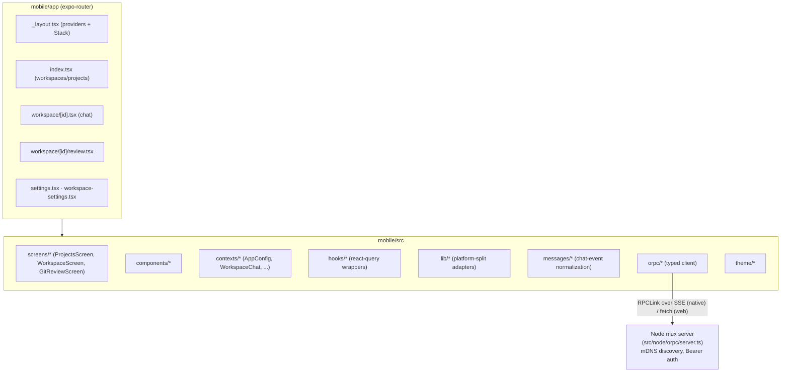
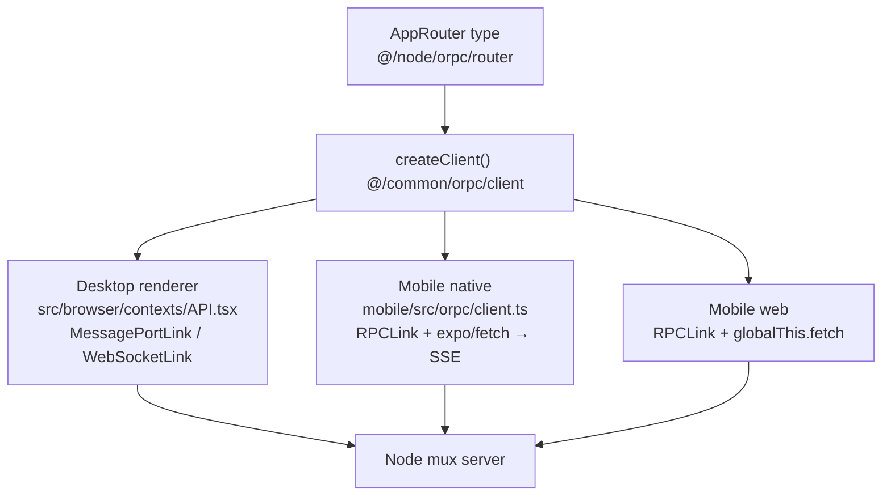

# 08 — Mobile Application

> **Analyzed at:** `main` @ `4bac642a8`

The mobile app (`mobile/`) is a standalone React Native + Expo package that lives inside the monorepo and imports shared TypeScript directly from the desktop `src/` tree. The key architectural insight: **mobile and desktop share the exact same typed API contract; only the transport link differs.**

## TL;DR

- **Stack:** React Native + Expo (New Architecture / Hermes), bun-managed, `expo-router` file-based routing, `@tanstack/react-query` for server state.
- **Same contract, different transport.** Both frontends bind to `AppRouter` (a type-only import from `@/node/orpc/router`) via the shared `createClient` factory. Desktop uses MessagePort/WebSocket; mobile native uses `RPCLink` + `expo/fetch` (SSE streaming); mobile web uses `RPCLink` + `globalThis.fetch`.
- **The backend is the same Node `mux server`.** Mobile discovers it over the LAN via mDNS; auth is a Bearer token.
- **Shared layer is `src/common` + a curated slice of `src/browser/utils`.** `mobile/tsconfig.json` whitelists those includes and excludes desktop-only layers.
- **Thin parity.** Mobile supports chat streaming, send/edit/interrupt, workspaces, secrets, and git review — but no tools/MCP/skills/workflows surfaces, and native tooling (ADB/simulator) is absent from CI.

---

## 1. Key files

| Concern            | Path                                                                                                                                                   | Notes                                                        |
| ------------------ | ------------------------------------------------------------------------------------------------------------------------------------------------------ | ------------------------------------------------------------ |
| Manifest           | `mobile/app.json`, `mobile/app.config.js`                                                                                                              | Expo SDK 54, RN 0.81.5, React 19.1, `newArchEnabled`, Hermes |
| Routes             | `mobile/app/_layout.tsx`, `app/index.tsx`, `app/workspace/[id].tsx`, `app/workspace/[id]/review.tsx`, `app/settings.tsx`, `app/workspace-settings.tsx` | expo-router                                                  |
| API client         | `mobile/src/orpc/client.ts`, `mobile/src/orpc/react.tsx`                                                                                               | typed client + context                                       |
| Platform adapters  | `mobile/src/lib/{fetchFn,storage}.{native,ts}`                                                                                                         | expo/fetch (SSE) + SecureStore vs browser fetch/localStorage |
| TS config          | `mobile/tsconfig.json`                                                                                                                                 | `@/* → ../src/*`; whitelists common + browser utils          |
| Bundler            | `mobile/metro.config.js`, `mobile/babel.config.js`                                                                                                     | monorepo node_modules; web shim for `backendBaseUrl`         |
| Build/distribution | `mobile/eas.json`                                                                                                                                      | development / preview / production EAS profiles              |

## 2. Architecture

**Navigation** = `expo-router` `<Stack>` in `app/_layout.tsx`: `index` → `workspace/[id]` → `workspace/[id]/review`; plus `settings`. Three screens carry the logic: `ProjectsScreen`, `WorkspaceScreen`, `GitReviewScreen` (`src/screens/`). `chatTimelineReducer.ts` is a pure reducer folding chat events into a timeline.

**State** = React Context providers nested in `RootLayout`: `QueryClientProvider → SafeAreaProvider → ThemeProvider → AppConfigProvider → ORPCProvider → WorkspaceChatProvider → LiveBashOutputProvider`. `AppConfigContext` holds `resolvedBaseUrl` + `resolvedAuthToken` (reads Expo `constants.extra.mux` defaults + SecureStore/localStorage); **web keeps tokens memory-only** (security). `WorkspaceChatContext` caches a `ChatEventExpander` per workspace so streaming state survives navigation.

**Platform adapters (`.native`/`.ts` split):** `fetchFn.native.ts` → `expo/fetch` (SSE on native, which RN's built-in fetch lacks); `fetchFn.ts` → browser `globalThis.fetch`. `storage.native.ts` → `expo-secure-store` (encrypted); `storage.ts` → `localStorage`.

## 3. The shared-contract seam (the key insight)

The mobile client (`mobile/src/orpc/client.ts`) builds `RPCLink` from `@orpc/client/fetch` at `${baseUrl}/orpc`, injects `Authorization: Bearer <authToken>`, and consumes async-generator procedures (e.g. `onChat`) as SSE via `for await`. The same router that serves the desktop MessagePort also serves HTTP/WS + SSE (`src/node/orpc/server.ts`).

**How mobile streams chat** (`WorkspaceScreen.tsx`): subscribes to `client.workspace.onChat({workspaceId, mode})` with an `AbortController`; sends via `client.workspace.sendMessage`; interrupts via `client.workspace.interruptStream`; detects `stream-end`/`stream-abort` (`@/common/types/stream.ts`) to record usage and flip `isStreaming`.

**Mobile's oRPC surface:** `workspace.{onChat,onMetadata,sendMessage,interruptStream,getInfo,create,list,remove,rename,fork,truncateHistory,replaceChatHistory,getFullReplay,getPlanContent,activity,executeBash,answerAskUserQuestion}` · `projects.{list,listBranches,secrets,idleCompaction}` · `config.getConfig` · `tokenizer.calculateStats` · `nameGeneration.generate`.

## 4. Shared-code boundaries

Path alias `@/ → repo src/`. Mobile imports from **`src/common`** (the canonical shared layer) **and a curated slice of `src/browser/utils`** (browser-agnostic helpers whitelisted in `mobile/tsconfig.json`):

- **oRPC contract:** `@/common/orpc/client` (`createClient`), `@/node/orpc/router` (`AppRouter` — type-only), `@/common/orpc/types` (`WorkspaceChatMessage`, `isMuxMessage`, `isStreamEnd`).
- **Types:** `@/common/types/{message,tools,toolParts,thinking,runtime,stream,chatStats,workspace}`.
- **Domain logic:** `@/common/utils/{ai/models,ai/modelDisplay,thinking/policy,tokens/usageAggregator,...}`.
- **Excluded** (desktop-only): `../src/{desktop,browser,node,cli}/**`, `src/main.ts`, `src/preload.ts`.

> **Clarification:** `MuxGatewaySessionExpiredDialog` is **desktop-only** and concerns the `mux-gateway` AI-provider (a coupon/voucher LLM proxy) balance session expiring — _not_ the mobile↔backend connection. There is no separate gateway backend for mobile.

## 5. Feature parity vs desktop

| Area                       | Desktop        | Mobile                                 | Notes                            |
| -------------------------- | -------------- | -------------------------------------- | -------------------------------- |
| Chat streaming             | full           | full                                   | send / edit / interrupt / replay |
| Workspaces                 | full           | list / create / rename / fork / remove |                                  |
| Providers                  | full config UI | read-only (use configured)             | model + thinking per-workspace   |
| Git review                 | full           | read-only review screen                | shared diff parsers              |
| Bash                       | terminal pane  | execute + live output (limited)        | no full terminal                 |
| Tools/MCP/Skills/Workflows | full           | not surfaced                           | agent-side only                  |
| Secrets                    | full           | projects.secrets                       |                                  |
| Settings                   | full           | baseUrl + authToken                    |                                  |

## 6. Extension points

| To…                            | Touch                                                                                           |
| ------------------------------ | ----------------------------------------------------------------------------------------------- |
| Add a mobile route             | `mobile/app/<route>.tsx` (expo-router)                                                          |
| Add a backend call             | ensure it's in `AppRouter` (shared) + call via `useORPC()`                                      |
| Add a platform behavior        | `mobile/src/lib/<name>.{native,ts}` split                                                       |
| Share new logic desktop↔mobile | put it in `src/common` (or whitelisted `browser/utils`); add to `mobile/tsconfig.json` includes |

## 7. Risks & tech debt

- **`mobile/README.md` is stale** — it references `POST /ipc/<channel>`, `WebSocket /ws?token=`, and a non-existent `src/api/client.ts`. The real transport is oRPC over `/orpc` (SSE streaming).
- **No native mobile tooling in CI** (no ADB/iOS simulator) — mobile is validated only by the 7 `bun test` unit files + manual runs.
- **Web target keeps tokens memory-only** — a refresh loses auth; intentional security tradeoff.
- **Shared-code boundary is a curated allowlist** — accidental imports of desktop-only modules are caught by `tsconfig` excludes + the eslint `local/no-cross-boundary-imports` rule, not by tests.
- **Expo SDK 54 / RN 0.81** is on the New Architecture — native module churn is a maintenance risk.

## Related reports

- [00 — System Overview](analysis/00-system-overview)
- [02 — IPC & Configuration](analysis/02-ipc-config) — the shared contract & transports
- [07 — React Frontend](analysis/07-react-frontend) — the desktop frontend on the same contract
- [09 — Testing, CI, Security & Telemetry](analysis/09-testing-ci-security) — mobile testing surface
