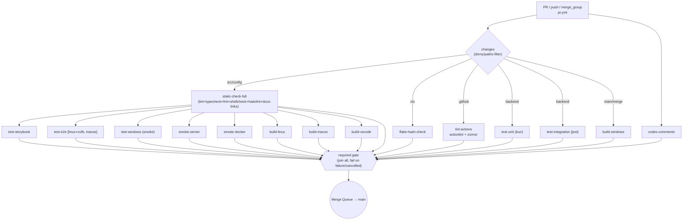
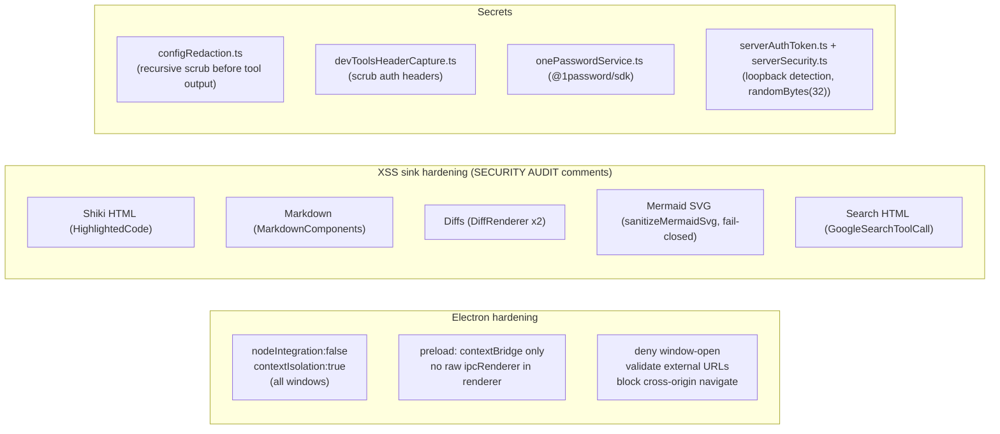

# 09 — Testing, CI, Security & Telemetry

> **Analyzed at:** `main` @ `4bac642a8`

How quality is enforced, how changes ship, how the app is hardened, and what (if anything) is observed. This report also covers the documentation site.

## TL;DR

- **Dual test runners.** `bun test` for unit (faster); Jest (`jest.config.js` + `babel.config.js`) for integration/UI; Playwright for Electron E2E; Storybook + Chromatic for visuals; `bun test` for mobile; Python for Terminal-Bench benchmarks.
- **One gate, ~16 jobs.** `pr.yml` is the branch-protection gate; `required` joins all jobs and fails on any `failure`/`cancelled`. Coverage is **informational-only** (never blocks).
- **Hardened everywhere.** Context isolation on, node integration off; every `dangerouslySetInnerHTML` sink carries a `SECURITY AUDIT` comment; Mermaid SVGs are fail-closed-sanitized; secret redaction in tool output + devtools capture.
- **Two distinct "analytics" systems.** (1) **Product telemetry** (PostHog, remote, opt-out via `MUX_DISABLE_TELEMETRY`, no PII, base-2 rounding) and (2) **local DuckDB analytics** (on-disk spend/token dashboard, never leaves the machine). Do not conflate them.
- **A custom ESLint plugin** enforces architecture: folder boundaries, disposable child processes, no sync fs, no native tooltips, no dynamic `import()`, no Shiki outside the worker.

---

## 1. Testing matrix

| Layer                  | Framework / Config          | Where                              | #               | Command                             |
| ---------------------- | --------------------------- | ---------------------------------- | --------------- | ----------------------------------- |
| Unit (backend/common)  | `bun test` (CI)             | `src/**/*.test.ts`                 | ~661 co-located | `make test-unit`                    |
| Integration (IPC/orpc) | Jest, `TEST_INTEGRATION=1`  | `tests/ipc/**`, `tests/runtime/**` | ~45             | `make test-integration`             |
| UI / component         | Jest (happy-dom) + harness  | `tests/ui/**`                      | ~60             | via `test-integration`              |
| E2E (real Electron)    | Playwright                  | `tests/e2e/scenarios/*.spec.ts`    | ~29             | `make test-e2e` (xvfb on linux)     |
| Perf                   | Playwright perf.\*          | `tests/e2e/scenarios/perf.*`       | 7               | `make test-e2e-perf`                |
| Visual / interaction   | Storybook + Chromatic       | `src/**/*.stories.tsx`             | 74              | `make test-storybook` / `chromatic` |
| Mobile (RN)            | `bun test`                  | `mobile/src/**/*.test.ts`          | 7               | `make test-mobile`                  |
| Benchmarks             | Python (Terminal-Bench 2.0) | `benchmarks/terminal_bench/*.py`   | 13              | `make benchmark-terminal`           |

**Key mechanics:**

- `jest.config.js` is the integration/UI runner only; cgroup-aware `maxWorkers` (≈1.5 GB/worker); `tests/setup.ts` preloads the AI SDK + tokenizer to kill ~10 s cold start; sets `MUX_APPROX_TOKENIZER=1`. Excludes `tests/ui/storybook/` (run via bun).
- `babel.config.js` ships a custom plugin `transformImportMetaForJest` rewriting `import.meta.env`→`process.env` for Jest's CommonJS target.
- **HistoryService testing contract** (AGENTS.md): always use the real instance via `createTestHistoryService()` (`src/node/services/testHistoryService.ts`) — never mock; seed with `appendToHistory()`; inject failures with `spyOn(...).mockRejectedValueOnce(...)`.
- **E2E:** `playwright.config.ts` — `fullyParallel:false` (Electron is heavy), `retries:1`, `trace:on-first-retry`; macOS E2E scopes to `windowLifecycle.spec.ts`.
- **Storybook Vite hardening:** forced polling, `optimizeDeps.include: [shiki]` to prevent mid-run prebundling flakes.
- **Coverage** (`codecov.yml`): `informational: true`, 5% threshold, comments disabled — informs, never gates.

## 2. CI/CD pipeline

- **`pr.yml`** is the main gate (~16 jobs). Concurrency cancels in-progress PR runs. `persist-credentials: false` on every checkout; job-level `permissions: contents: read`. `required` `needs:` all jobs; skipped (via `changes`) counts as success.
- **No CodeQL** — Actions security uses `actionlint` + `zizmor` instead (pinned-SHA 3rd-party actions).
- **Release:** `release.yml` → `_desktop-release` (mac/linux/linux-arm64/windows, GCP WIF Windows signing) + `_docker-release` (GHCR via Depot OIDC) + `build-vscode-extension`. npm is a separate OIDC trusted-publisher flow (`publish-npm.yml`).
- **Recurring:** `nightly.yml`, `nightly-terminal-bench.yml`/`terminal-bench.yml`, `perf-profiles.yml` (cron), `auto-cleanup.yml`/`auto-cleanup-fixup.yml`.

## 3. Lint & format

| Tool                | Config                     | Target                              |
| ------------------- | -------------------------- | ----------------------------------- |
| ESLint (flat)       | `eslint.config.mjs` (849L) | TS/TSX                              |
| Prettier            | `.prettierrc`, `fmt.mk`    | src, mobile, tests, `docs/**/*.mdx` |
| shfmt / shellcheck  | `-i 2 -ci -bn`             | `scripts/`                          |
| hadolint            | `.hadolint.yaml`           | `Dockerfile`                        |
| ruff (Python)       | via `uvx`                  | `benchmarks/`                       |
| nix fmt             | `flake.nix`                | Nix                                 |
| actionlint + zizmor | —                          | `.github/workflows/*`               |

**`static-check`** = lint + typecheck + fmt-check + check-eager-imports + check-code-docs-links + lint-shellcheck + lint-hadolint. **`static-check-full`** adds check-bench-agent + `check-docs-links` (`mintlify broken-links`).

**Custom `local` ESLint rules** (enforced as `error`): `no-unsafe-child-process` (bans `promisify(exec)`, mandates `DisposableExec` + `using`), `no-sync-fs-methods` (bans `fs.*Sync`), `no-cross-boundary-imports` (enforces `src/{browser,node,desktop,cli,common}` boundaries), `no-native-interactive-tooltips` (bans `title=`). Plus `no-explicit-any`, `no-floating-promises`, dynamic `import()` banned (allowlisted exceptions), Shiki only in `highlightWorker.ts`, renderer can't touch `process`.

## 4. Security controls

| Domain                  | Control                                           | Files                                                   |
| ----------------------- | ------------------------------------------------- | ------------------------------------------------------- |
| Electron sandbox        | context isolation on, node off                    | `main.ts`, `terminalWindowManager.ts`                   |
| Mermaid SVG             | fail-closed strict XML sanitizer                  | `Mermaid.tsx` (`sanitizeMermaidSvg`)                    |
| Shiki isolation         | off-main-thread worker only                       | eslint rule + `highlightWorker.ts`                      |
| Secret redaction        | recursive scrubbing of tool output                | `configRedaction.ts`                                    |
| API debug redaction     | scrub auth headers in capture                     | `devToolsHeaderCapture.ts`                              |
| 1Password               | `@1password/sdk` resolves `op://` refs            | `onePasswordService.ts`                                 |
| CLI server auth         | ephemeral token if none given; loopback detection | `serverAuthToken.ts`, `serverSecurity.ts`               |
| Tool-input sanitization | strip control chars / NUL / caps                  | `sanitizeToolInput.ts`, `providerOutputSanitization.ts` |

## 5. Telemetry & analytics (two systems)

**A. Product telemetry (PostHog)** — renderer fires typed `track*` → ORPC → `telemetryService.ts` (`posthog-node`) batches/flushes. Two-tier to evade ad-blockers + centralize the kill switch.

- **Opt-out:** `MUX_DISABLE_TELEMETRY=1` (backend gate); no-op in test/CI/E2E/dev.
- **No PII:** random IDs sent verbatim; display names/project names/paths **never** sent (even hashed). Numeric metrics `roundToBase2()` (`_b2` suffix).
- **Events:** `app_started`, `workspace_created`, `workspace_switched`, `message_sent`, `stream_completed`, `stats_tab_opened`, `provider_configured`, `command_used`, `voice_transcription`, `error_occurred`, `experiment_overridden`, `mcp_context_injected`. Base props: version/platform/electron/node/bun.
- **Transparency:** all payloads declared in `src/common/telemetry/payload.ts`; user doc `docs/reference/telemetry.mdx`.

**B. Local analytics (DuckDB)** — `src/node/services/analytics/*`; ETL in a `Worker`; on-device spend/token/spend dashboard (queries: `getSummary`, `getSpendOverTime`, `getSpendByModel`, `getCacheHitRatioByProvider`, …). **Never leaves the machine** — not telemetry.

## 6. Observability

- **`log` helper** (`src/node/services/log.ts`): error/warn/info/debug; `MUX_LOG_LEVEL`/`MUX_DEBUG`; caller file:line; EPIPE-safe; writes `~/.mux/logs/`; ring buffer (`logBuffer.ts`); `debug_obj()` dumps to `~/.mux/debug_obj/`.
- **Debug CLI** (`src/cli/debug/index.ts`): `list-workspaces`, `costs <ws>`, `send-message <ws> [--edit --message]`, `consolidate-memory <ws> [--dry-run]`.
- **API debug logs** (`devtools.jsonl`): `devToolsService.ts` captures per-step raw request/response; **tolerant of corrupted lines** (`log.warn` + skip) — self-healing; `devToolsHeaderCapture.ts` redacts sensitive headers.
- **Self-healing** (AGENTS.md mandate): malformed `chat.jsonl` lines defensively filtered in request-building paths (never brick a workspace); startup init wrapped to never crash.

## 7. Docs

**Mintlify** site (`docs/docs.json`, single `Documentation` tab). Nav groups: Getting Started · Workspaces (fork, muxignore, Compaction, Runtimes, Hooks) · Agents (instruction-files, skills, plan-mode, system-prompt, best-of-n) · Configuration (mcp, policy, secrets, keybinds, server-access, vim-mode) · Guides · Integrations (vscode, acp) · Reference (debugging, telemetry, storybook, benchmarking, ADRs). ADRs in `docs/adr/`; human RFCs in `rfc/` (not in nav). Link checking via `make check-docs-links` (`mintlify broken-links`).

## 8. Extension points

| To…                   | Touch                                                    |
| --------------------- | -------------------------------------------------------- |
| Add a unit test       | co-locate `*.test.ts` (real instance for HistoryService) |
| Add a CI job          | `.github/workflows/pr.yml` + add to `required` needs     |
| Add an eslint rule    | `eslint.config.mjs` `local` plugin                       |
| Add a telemetry event | `src/common/telemetry/payload.ts` + a `track*` fn        |
| Add a doc page        | `docs/<group>/<page>.mdx` + `docs/docs.json` nav         |

## 9. Risks & tech debt

- **No CodeQL/SAST** — relies on `zizmor` + eslint `local` rules; acceptable but notable.
- **Coverage is non-blocking** — guards regression detection, not enforcement; a low-coverage area can merge.
- **Dual test runners** (`bun test` vs Jest) — config drift risk; some suites only run under one runner.
- **`eslint.config.mjs` (849L)** is large and central; a broken rule can stall all CI.
- **Telemetry privacy is load-bearing** — `payload.ts` discipline must hold; a leaky event is a privacy incident.

## Related reports

- [00 — System Overview](analysis/00-system-overview)
- [01 — Architecture & Build](analysis/01-architecture-build) — the build the CI produces
- [07 — React Frontend](analysis/07-react-frontend) — Storybook/happy-dom constraints
- [08 — Mobile Application](analysis/08-mobile) — mobile test surface
