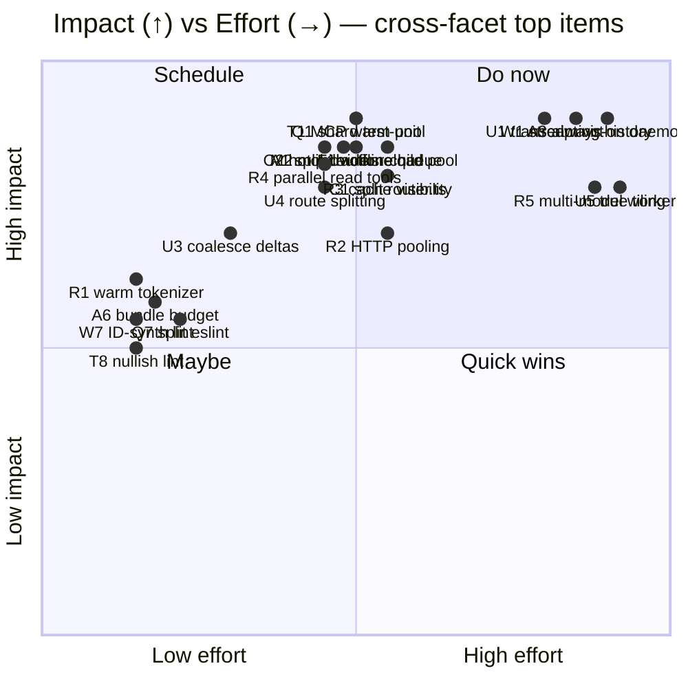
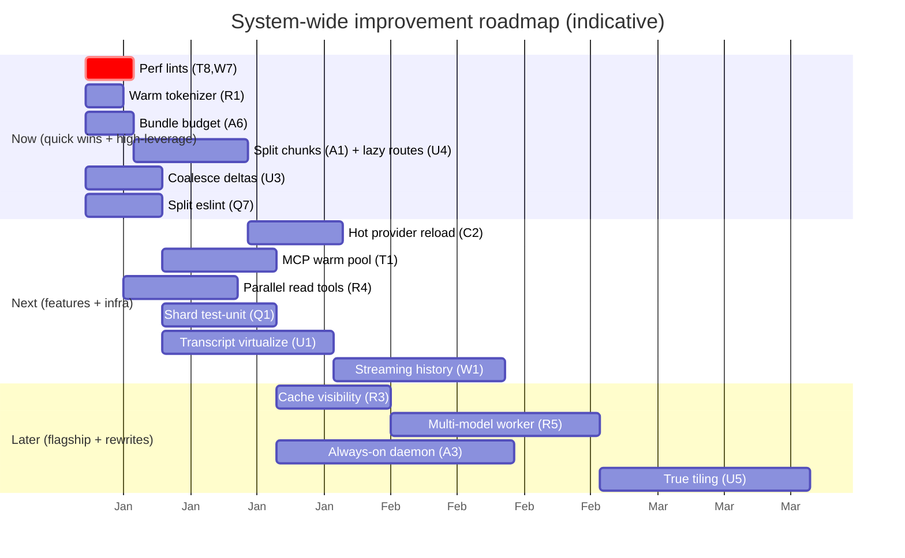

# 00 — Improvements: System-wide Roadmap

> **As-of:** `main` @ `4bac642a8`

This is the index for the **Improvement** report suite. It rolls up the highest-leverage proposals from [01–09](#improvement-reports) into one prioritized plan, plus the cross-cutting themes that span facets. Every proposal is **performance- or feature-first**; DX/reliability/security follow. Each is sized S/M/L and traceable to its facet report.

## How to read this

- **[Master prioritization](#master-prioritization)** — the top ~20 items across all facets on one impact×effort chart.
- **[Phased roadmap](#phased-roadmap)** — Now / Next / Later across the whole product.
- **[Cross-cutting themes](#cross-cutting-themes)** — work that doesn't live in one facet.
- **[KPI scorecard](#kpi-scorecard)** — how we'll know it worked.
- **[Improvement reports](#improvement-reports)** — links to 01–09.

## TL;DR

- **Performance first, everywhere.** Warm the tokenizer, pool MCP servers + provider HTTP connections, shard CI, virtualize the transcript, split the bundle. Several are S/M.
- **Features that define the product.** Always-on backend, true multi-workspace tiling, multi-model orchestrator+worker, mobile push/offline, workflow gallery.
- **Engineering health.** Decompose the handful of giant files (router, config, agentSession/streamManager/taskService, WorkspaceStore, workspaceService, eslint config), adopt coverage gating + SAST.

---

## Master prioritization

The top proposals across all facets. Labels are `<facet>-<id>`; see each report for detail.

## Phased roadmap

## Cross-cutting themes

These don't sit in one facet; they're product-wide bets.

### Theme 1 — Latency budget across the stack

The single user-felt metric is **time-to-first-token** and **time-to-interactive**. It's a chain: warm tokenizer (R1) → pooled provider HTTP (R2) → MCP warm pool (T1) → parallel read tools (R4) → coalesced deltas (U3) → virtualized transcript (U1). Land them in that order; measure each link in `devtools.jsonl` + perf profiles.

### Theme 2 — Live, parallel multi-workspace (the "multiplexer" promise)

Today only the active workspace streams. The flagship path is: backend allows concurrent workspace streams → a shared worker multiplexes them (U2) → a true tiling shell renders several `AIView`s (U5), optionally each on its own model (R5). This is the product's reason to exist.

### Theme 3 — Reliability & self-healing as an SLO

The partial/boundary/lease machinery is excellent but under-observed. Add: partial-repair telemetry (W5), workflow error attribution (F6), perf-regression dashboards (Q8), and keep the "never brick a workspace" invariant tested.

### Theme 4 — Plugin / extension ecosystem

Tools, MCP, Skills, and Workflows are all extensible today but siloed. Converge on one registry story: MCP marketplace (T6) + workflow gallery (F5) + skill versioning (T7), with checksum/allowlist trust.

### Theme 5 — CI as a product

Faster CI is a feature for the team. Shard tests (Q1), remote-cache builds (Q2), faster E2E (Q6), single runner (Q3), bundle/perf budgets (A6/Q8) — make "green in minutes" the default.

## KPI scorecard

| Area        | KPI                          | Target             | Source         |
| ----------- | ---------------------------- | ------------------ | -------------- |
| Startup     | Warm-start TTI               | < 700 ms           | perf profile   |
| Startup     | Repeat-launch ready (daemon) | < 200 ms           | A3             |
| Latency     | Time-to-first-token (warm)   | −15–25%            | devtools.jsonl |
| Latency     | MCP first-call (warm pool)   | < 300 ms           | trace          |
| Cost        | Anthropic cache-hit ratio    | ≥40% long sessions | R3             |
| Cost        | Cost/task (worker model)     | lower vs single    | DuckDB         |
| Render      | Transcript 60 fps @ 10k msgs | sustained          | U1             |
| Render      | Initial gzip JS              | −30–50%            | A1/A6          |
| CI          | `test-unit` wall-time        | −50% (sharded)     | Q1             |
| CI          | E2E PR subset                | < 5 min            | Q6             |
| Mobile      | Send reliability (flaky net) | 0 lost             | M2             |
| Reliability | Stale-partial incidents      | 0 (surfaced)       | W5             |

## Improvement reports

| #   | Report                                                                    | Focus                                                |
| --- | ------------------------------------------------------------------------- | ---------------------------------------------------- |
| 01  | [Architecture, Build & Distribution](improvement/01-architecture-build)   | cold-start, bundle, sandbox, daemon                  |
| 02  | [IPC (oRPC) & Configuration](improvement/02-ipc-config)                   | split router, hot reload, profiles                   |
| 03  | [AI Provider & Agent Runtime](improvement/03-ai-agent-runtime)            | keepalive, cache, parallel tools, multi-model        |
| 04  | [Tool System, MCP & Skills](improvement/04-tools-mcp-skills)              | MCP pool, codegen, parallel MCP, versioning          |
| 05  | [Workspace, Worktree & Persistence](improvement/05-workspace-persistence) | streaming history, incremental compaction, templates |
| 06  | [Workflow Engine](improvement/06-workflow-engine)                         | action-child pool, patches, source maps, gallery     |
| 07  | [React Frontend & Design System](improvement/07-react-frontend)           | virtualization, multi-stream, tiling                 |
| 08  | [Mobile Application](improvement/08-mobile)                               | push, offline queue, parity                          |
| 09  | [Testing, CI, Security & Telemetry](improvement/09-testing-ci-security)   | sharded CI, cache, coverage gating, SAST             |

> Each proposal above is **indicative** — scoped to real files and sized, but not committed. Validate against the current code before starting; line counts drift as the codebase evolves.

## Related

- [analysis/00 — System Overview](analysis/00-system-overview) (the current-state baseline these build on)
- [ADR 0003 — context boundaries for compaction](adr/0003-context-boundaries-for-compaction-and-reset) (an architectural decision of record)
