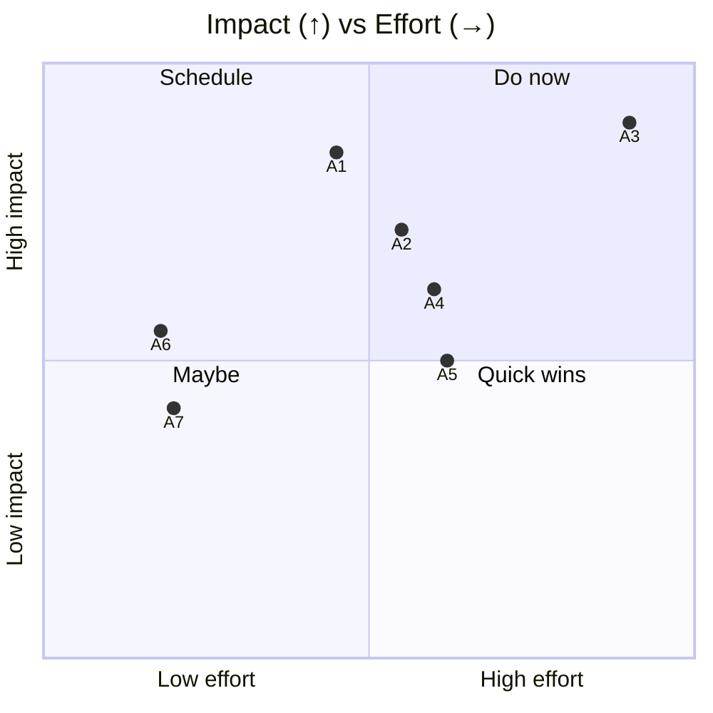
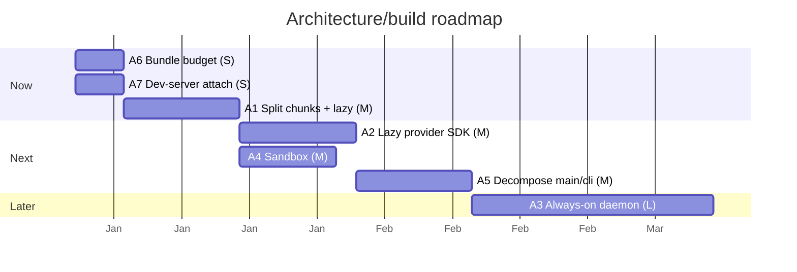

# 01 — Improvements: Architecture, Build & Distribution

> **As-of:** `main` @ `4bac642a8` · **Companion to:** [analysis/01 — Architecture, Build](analysis/01-architecture-build) · **Roadmap:** [improvement/00](improvement/00-system-wide-roadmap)

Forward-looking, actionable proposals for the Electron process model, build pipeline, and distribution. Every card leads with **performance** or **features**; DX/reliability/security follow. Each card is tagged, scoped to real files, and sized S/M/L.

## North-star themes

1. **Cut time-to-interactive (TTI).** The app boots a full backend + React + terminal; the user should see a ready chat pane in well under a second on a warm start.
2. **One binary, always ready.** A long-lived `mux serve` so the AI backend never cold-starts when the window reopens.
3. **A smaller, lazier renderer.** Ship only the code the first screen needs; defer Shiki/Mermaid/provider SDKs.

---

## Improvement backlog

### A1 — 🚀 Extend `manualChunks` to split heavy vendor + lazy feature routes

- **Problem:** `vite.config.ts` already has `manualChunks`, but it only carves out `ai-tokenizer` chunks. Heavy vendors (Shiki, Mermaid, the AI-SDK bundles, Radix) and feature routes (Settings, Analytics, terminal window) land in one large entry; `chunkSizeWarningLimit` is already raised to 2000 KB.
- **Proposal:** In `vite.config.ts:manualChunks`, add buckets for `shiki`, `mermaid`, `@ai-sdk/*`, `radix-ui`, and lazy-load the Settings/Analytics/terminal routes with `React.lazy` + dynamic import (already supported — `inlineDynamicImports:false`).
- **Impact:** First-screen JS could drop materially (target: initial chunk −30–50%); routes load on demand.
- **Effort:** **M** · touches: `vite.config.ts`, `src/browser/App.tsx` route cascade, lazy boundaries.
- **Risks:** Lazy routes add a fallback flash; guard with skeletons. Verify `tests/ui` happy-dom still resolves dynamic imports.

### A2 — 🚀 Lazy-load provider SDK modules in the main process

- **Problem:** The main process eager-imports the provider registry; `PROVIDER_DEFINITIONS` declares lazy `import()` per provider, but the AI service + factory wiring can still pull graph weight early. A headless user who only uses Anthropic still pays for OpenAI/Bedrock/etc. module init.
- **Proposal:** Audit `src/desktop/main.ts` `loadServices()` + `serviceContainer` to ensure provider factories are imported only on first use (the `no-restricted-syntax: ImportExpression` eslint ban has a small allowlist — confirm provider dynamic imports are in it). Gate native deps (`node-pty`, `ssh2`, `@duckdb/node-api`) behind first use too.
- **Impact:** Faster headless startup; lower main-process RSS for single-provider users.
- **Effort:** **M** · touches: `providerModelFactory.ts`, `serviceContainer.ts`, eslint allowlist.
- **Risks:** First-message latency shifts to the first stream instead of boot — acceptable and user-perceived as "warming up".

### A3 — ✨ Always-on `mux serve` daemon + "resume where you left off"

- **Problem:** Every window reopen re-runs `loadServices()`, re-reads config, re-inits services. The desktop already runs an HTTP/WS server (guarded by `serverLockfile.ts`) for CLI/mobile, but it's tied to the window lifecycle.
- **Proposal:** Promote a detached, long-lived backend process (`mux serve` / auto-started helper) that owns `Config` + `ServiceContainer`; the Electron window becomes a thin client that connects to it over the existing oRPC WS. On launch, hydrate the last-open workspace and scroll position.
- **Impact:** Cold-start disappears for repeat launches; background workspaces keep streaming while the window is closed.
- **Effort:** **L** · touches: `src/desktop/main.ts`, `src/cli/server.ts`, `serverLockfile.ts`, an installer-level launch agent.
- **Risks:** Lifecycle/signal handling across two processes; needs a clear "quit daemon" affordance and single-instance semantics.

### A4 — 🛡 Enable Electron `sandbox` on all windows

- **Problem:** `sandbox` is deliberately **not** set; the preload avoids Node builtins to stay hardened-compatible, but full sandboxing (a separate process per renderer) is stricter.
- **Proposal:** Set `sandbox: true` in the shared `webPreferences`; ensure the preload needs zero Node APIs (move any `ipcRenderer.invoke` probes to fully-context-isolated helpers). Verify the terminal pop-out window too.
- **Impact:** Defense-in-depth — a renderer compromise can't reach the OS even via the preload.
- **Effort:** **M** · touches: `src/desktop/main.ts`, `src/desktop/terminalWindowManager.ts`, `src/desktop/preload.ts`.
- **Risks:** Some Electron APIs are unavailable under sandbox; needs an E2E pass.

### A5 — 🔧 Decompose `src/desktop/main.ts` (~1255L) + `src/cli/index.ts` dispatcher

- **Problem:** `main.ts` does window creation, lifecycle, the oRPC upgrade, server bootstrap, deep-link handling, and update wiring in one file; `cli/index.ts` env-detection branching is subtle.
- **Proposal:** Split `main.ts` into focused modules (`windowLifecycle.ts`, `deepLinks.ts`, `serverBootstrap.ts`, `updaterWiring.ts`); extract the CLI dispatch in `argv.ts` into a table-driven router with explicit availability predicates.
- **Impact:** Faster review/iteration; clearer test surface for the env-detection matrix.
- **Effort:** **M** · touches: `src/desktop/*`, `src/cli/{index,argv}.ts`.
- **Risks:** Pure refactor — must preserve behavior; lean on the E2E suite (`windowLifecycle.spec.ts`).

### A6 — 🚀 Bundle-size budget enforced in CI

- **Problem:** No gate prevents the renderer bundle from silently growing (`chunkSizeWarningLimit` was already raised once).
- **Proposal:** Add a `scripts/check-bundle-size.ts` that asserts the gzipped initial-chunk size stays under a budget, wired into `pr.yml` `build-linux` (or a dedicated `bundle-budget` job). Fail the PR on regression beyond a baseline.
- **Impact:** Bounded TTI forever; catch perf regressions at PR time.
- **Effort:** **S** · touches: `scripts/`, `.github/workflows/pr.yml`, `Makefile`.
- **Risks:** Set the budget from a measured baseline so it doesn't block unrelated PRs.

### A7 — ✨ Faster, retry-resilient dev-server attach

- **Problem:** Dev uses `scheduleDevServerReload` with retry/backoff against Vite; cold Vite starts can delay the window.
- **Proposal:** Keep Vite's optimized deps warm across runs (persistent cache), and have the main process **not** create the window until the dev server responds `/` (eliminating reload churn). Surface a richer splash state (compiling/ready).
- **Impact:** Smoother `make dev`; fewer "blank then reload" moments.
- **Effort:** **S** · touches: `src/desktop/main.ts` dev branch, `vite.config.ts` cache config.
- **Risks:** Low; dev-only.

## Prioritization

## Proposed sequencing

## Success metrics / KPIs

| Metric                                     | Target              | Measure                                                |
| ------------------------------------------ | ------------------- | ------------------------------------------------------ |
| Warm-start TTI (renderer ready)            | < 700 ms            | Playwright perf profile (`tests/e2e/scenarios/perf.*`) |
| Initial gzip JS chunk                      | −30–50% vs baseline | `check-bundle-size.ts`                                 |
| Main-process startup RSS (single provider) | −15%                | smoke-server timing                                    |
| Repeat-launch "ready" latency              | < 200 ms (daemon)   | end-to-end timer                                       |

## Related

- [analysis/01 — Architecture, Build](analysis/01-architecture-build) (current state)
- [improvement/00 — System-wide roadmap](improvement/00-system-wide-roadmap)
- [improvement/07 — React Frontend](improvement/07-react-frontend) (lazy routes partner)
- [improvement/09 — CI/Security](improvement/09-testing-ci-security) (bundle-budget job)
