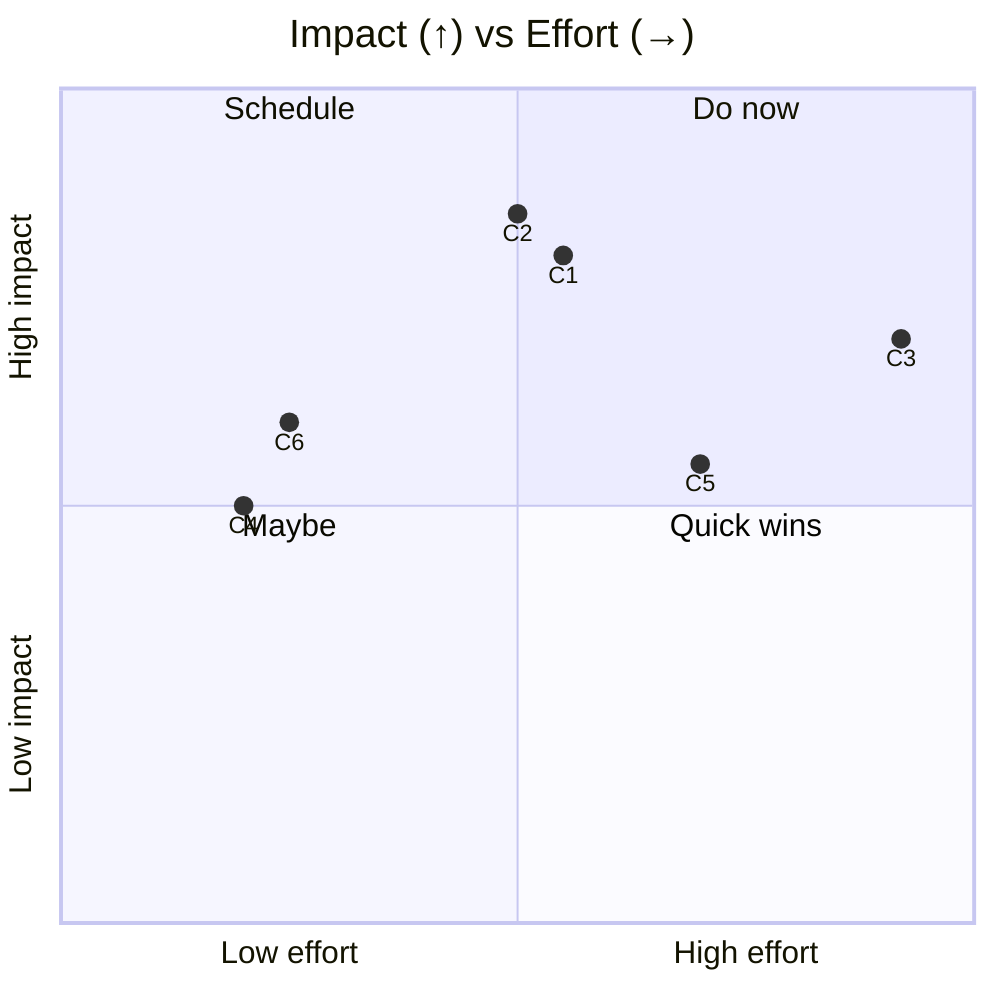
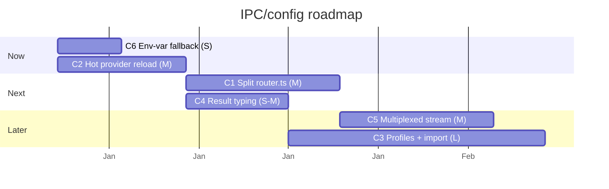

# 02 — Improvements: IPC (oRPC) & Configuration

> **As-of:** `main` @ `4bac642a8` · **Companion to:** [analysis/02 — IPC & Configuration](analysis/02-ipc-config) · **Roadmap:** [improvement/00](improvement/00-system-wide-roadmap)

Proposals for the oRPC router, the transports, and the `Config` system. Focus: faster typecheck/lint (router split), fewer restarts (hot reload), and richer settings UX (profiles).

## North-star themes

1. **Typecheck in seconds, not minutes.** `router.ts` at 6342 lines is the single biggest drag on `make typecheck`/lint; splitting it unblocks the editor and CI.
2. **Change providers without a restart.** Editing `providers.jsonc` should take effect on the next message, no reload.
3. **Config that travels with the user.** Profiles (work/personal) + export/import.

---

## Improvement backlog

### C1 — 🚀 Split `router.ts` (6342L) by namespace

- **Problem:** One file holds ~40 namespaces; every IPC edit re-parses/re-typechecks the whole thing and defeats incremental caching.
- **Proposal:** Move each namespace into `src/node/orpc/routers/<ns>.ts` exporting an `osRouter` builder, composed in a slim `router.ts`. Keep `src/common/orpc/schemas/api.ts` split as it is (or split it the same way). The schema barrel + `AppRouter` type are unchanged, so the contract is stable.
- **Impact:** Faster incremental typecheck/lint (often 5–10× on touched files); better blame/review.
- **Effort:** **M** · touches: `src/node/orpc/router.ts` → many `routers/*.ts`, `schemas/api.ts`.
- **Risks:** Mechanical; preserve the `t.router({...})` composition and context wiring. Verify with the integration tests (`tests/ipc`).

### C2 — ✨ Hot provider/model reload (no app restart)

- **Problem:** `watchProvidersFile()` already detects external edits to `providers.jsonc` via a sha256 fingerprint, but changes typically still require a workspace reload to take effect in the AI runtime.
- **Proposal:** On fingerprint change, invalidate the `ProviderModelFactory`'s cached provider instances and emit a `config.onConfigChanged` event the live `AgentSession` honors, so the next stream picks up new keys/models/baseUrls immediately.
- **Impact:** Edit-once, everywhere-updates; removes a class of "why isn't my new key working?" confusion.
- **Effort:** **M** · touches: `providerModelFactory.ts`, `config.ts` (`watchProvidersFile`), `agentSession.ts` (react to change).
- **Risks:** In-flight streams keep their resolved model (correct); only new streams adopt. Race between reload and a concurrent stream — guard with the existing mutex.

### C3 — ✨ Config profiles + export/import

- **Problem:** `providers.jsonc`/`secrets.json` are single-context; sharing a setup across machines or switching work↔personal means manual file surgery.
- **Proposal:** Add a `profiles` concept (named overlays on providers/preferences) + an oRPC `config.exportProfile`/`importProfile` that emits a redacted bundle (secrets optional, with a clear warning). Settings UI gets a Profiles section.
- **Impact:** Onboarding in minutes; safe machine-to-machine sync.
- **Effort:** **L** · touches: `config.ts`, `schemas/appConfigOnDisk.ts`, a new `profiles` router namespace, Settings UI.
- **Risks:** Secret export is a footgun — gate behind explicit confirmation and omit by default; reuse `configRedaction.ts`.

### C4 — 🔧 Consistent `ResultSchema` typing across handlers

- **Problem:** Some procedures return `ResultSchema(data, error)` (`{success,data}`/`{success,error}`), others throw; the renderer has to handle both.
- **Proposal:** Adopt `ResultSchema` as the convention for user-facing mutations; document the rule in the schema module and add an eslint hint (or a `schemas/result.ts` helper used everywhere).
- **Impact:** Predictable error handling in the renderer; fewer uncaught rejections surfaced as generic errors.
- **Effort:** **S–M** · touches: `schemas/result.ts`, handlers over time.
- **Risks:** Behavioral — only convert handlers where the union is meaningful; keep streaming procedures as generators.

### C5 — 🚀 Batch subscriptions / multiplexed streaming channel

- **Problem:** The renderer opens several streaming procedures (`onChat`, `onConfigChanged`, `subscribeLogs`, git/runtime status). Each is a separate stream over the MessagePort/WS.
- **Proposal:** Add an optional multiplexed "subscribe-batch" procedure that fans multiple async generators over one stream with typed envelopes, reducing per-stream handshake/keepalive cost.
- **Impact:** Fewer concurrent streams for chatty UIs; lower overhead on the WS keepalive (30s pings).
- **Effort:** **M** · touches: `src/node/orpc/server.ts`, a new procedure, `src/browser/contexts/API.tsx` consumer.
- **Risks:** Adds a multiplexing layer; only adopt where profiling shows real overhead. Keep single-stream as the default.

### C6 — 🔧 Opt-in env-var fallback for first-run providers

- **Problem:** `providers.jsonc` has no env-var defaults by design (explicit config only), so first-run requires UI/manual setup even when `ANTHROPIC_API_KEY` is already exported.
- **Proposal:** An opt-in setting (`providers.allowEnvFallback`, off by default) that lets the factory fall back to well-known env vars when a provider entry is absent. Surface it clearly in Settings.
- **Impact:** Faster first-run for CLI/dev users; preserves the explicit-config default for reproducibility.
- **Effort:** **S** · touches: `providerModelFactory.ts`, `providersConfig.ts` schema, Settings UI.
- **Risks:** Must stay opt-in to avoid surprising "which key is it using?" ambiguity.

## Prioritization

## Proposed sequencing

## Success metrics / KPIs

| Metric                               | Target                  | Measure                       |
| ------------------------------------ | ----------------------- | ----------------------------- |
| Incremental typecheck (router touch) | < 8 s                   | local `make typecheck` timing |
| Provider-key change → effective      | next message, no reload | integration test              |
| Concurrent streams per workspace     | ≤ 3 typical             | renderer instrumentation      |
| First-run to first message           | ≤ 30 s with env key     | smoke flow                    |

## Related

- [analysis/02 — IPC & Configuration](analysis/02-ipc-config) (current state)
- [improvement/00 — System-wide roadmap](improvement/00-system-wide-roadmap)
- [improvement/03 — AI Runtime](improvement/03-ai-agent-runtime) (hot-reload consumer)
- [improvement/09 — CI/Security](improvement/09-testing-ci-security) (router-split typecheck win)
