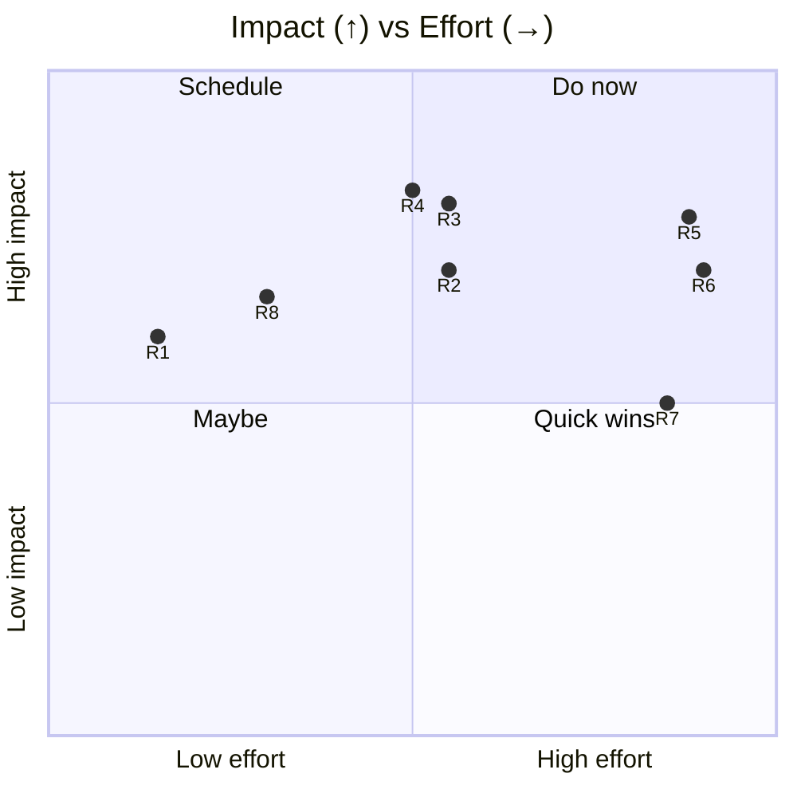
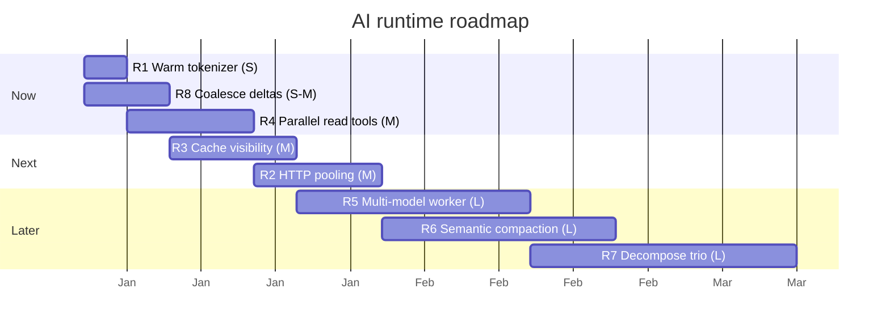

# 03 — Improvements: AI Provider & Agent Runtime

> **As-of:** `main` @ `4bac642a8` · **Companion to:** [analysis/03 — AI & Agent Runtime](analysis/03-ai-agent-runtime) · **Roadmap:** [improvement/00](improvement/00-system-wide-roadmap)

Proposals for the provider/model layer, the streaming turn loop, and context management. This facet is where latency, cost, and capability all live — so performance and features dominate.

## North-star themes

1. **Lower latency, lower cost.** Reuse connections, surface prompt-cache savings, and warm the tokenizer.
2. **More parallelism, safely.** Let independent read-only tools run concurrently instead of serializing every step.
3. **Richer agent capability.** Multi-model orchestration (cheap worker + strong planner) and smarter compaction.

---

## Improvement backlog

### R1 — 🚀 Prewarm the tokenizer for `DEFAULT_WARM_MODELS` at startup

- **Problem:** `getTokenizerForModel` is fetched **lazily** at stream time (`aiService.ts`, `streamContextBuilder.ts`); the worker_thread tokenizer has a measurable cold start (tests explicitly "warm up" it). The first message of every session pays it.
- **Proposal:** In `loadServices()`, kick off `getTokenizerForModel` for each `DEFAULT_WARM_MODELS` id (the Claude/OpenAI/Codex family already flagged warm in `knownModels.ts`) so the encoding is resident before the first send.
- **Impact:** Removes first-message tokenizer latency; more accurate pre-send token counts sooner.
- **Effort:** **S** · touches: `serviceContainer.ts`/`tokenizerService.ts`, `loadServices` startup.
- **Risks:** Negligible — idempotent warm; guard against unbounded model lists.

### R2 — 🚀 Provider HTTP keepalive/pooling + HTTP/2

- **Problem:** Each provider SDK builds its own fetch; Mux wraps fetch (`getProviderFetch`, `defaultFetchWithUnlimitedTimeout`) but connection reuse depends on the SDK/agent default. TLS handshakes on every request add latency and cost.
- **Proposal:** Inject a shared `undici` `Agent`/`Pool` with keep-alive (and HTTP/2 where supported) into provider fetch wrappers; expose a small metrics counter (pooled vs new).
- **Impact:** Lower time-to-first-token on repeat requests; fewer TLS round-trips (cost + latency).
- **Effort:** **M** · touches: `providerModelFactory.ts` fetch wrappers, `src/node/utils`.
- **Risks:** Connection pools need careful abort/timeout handling; some proxies forbid HTTP/2.

### R3 — ✨ Prompt-cache visibility & control (Anthropic `cache_control`)

- **Problem:** `wrapFetchWithAnthropicCacheControl` already injects/normalizes cache breakpoints, but cache hit/miss and savings aren't surfaced to the user, and cache TTL is opaque.
- **Proposal:** Parse cache-read/cache-write token usage from provider responses, surface a cache-hit ratio in the Stats tab (and the local DuckDB analytics), and add a setting to tune cache breakpoints (off/conservative/aggressive).
- **Impact:** Users see real savings; tuning lowers cost. Reuses the existing local analytics pipeline.
- **Effort:** **M** · touches: `streamManager.ts` usage handling, `usageAggregator.ts`, `displayUsage.ts`, Stats UI.
- **Risks:** Cache semantics differ per provider — generalize carefully; don't claim savings you can't measure.

### R4 — 🚀 Opt-in parallel execution for read-only tools

- **Problem:** `streamManager.ts:1446` wraps tools in `withSequentialExecution(finalTools)`, serializing **all** sibling tool calls in a step. That's safe but slow when the model emits several independent read-only tools (multiple `file_read`, `agent_skill_read`, `web_fetch`).
- **Proposal:** A per-tool `readOnly`/`parallelizable` flag in `toolDefinitions.ts`; when a step's emitted tools are all read-only, skip the serialization mutex; keep serialization for stateful tools (bash, file edits, task).
- **Impact:** Faster agentic turns when the model fans out independent reads.
- **Effort:** **M** · touches: `withSequentialExecution.ts`, `toolDefinitions.ts`, `tools.ts`.
- **Risks:** Correctness — must never parallelize tools with shared mutable state or ordering semantics. Conservative allowlist first.

### R5 — ✨ Multi-model orchestrator + worker in one workspace

- **Problem:** A workspace resolves a single model per turn; there's no first-class "strong planner + cheap worker" split for large tasks.
- **Proposal:** An agent-level option to run sub-tasks (`task` tool children) on a different (cheaper/faster) model than the orchestrator, reusing `resolveTaskAISettings` + the agent AI-defaults inheritance. Surface as "worker model" in workspace settings.
- **Impact:** Cost optimization for bulk work (explore/brainstorm on cheap model, execute on strong model).
- **Effort:** **L** · touches: `agentSession.ts`, `taskService.ts`, `resolveAgentAiSettings.ts`, UI.
- **Risks:** Coherence across model tiers; need clear UI so users know which model ran which step.

### R6 — ✨ Smarter / semantic compaction

- **Problem:** `compactionHandler` summarizes history into a durable boundary when the window fills; the policy is age/size-driven, which can drop the wrong context.
- **Proposal:** Token-budget-aware compaction that preserves recent verbatim turns + tool results, summarizes older ones, and lets the user pin messages/turns to keep. Optionally use a cheap model for the summary.
- **Impact:** Fewer "lost context" regressions after compaction; better long-session quality.
- **Effort:** **L** · touches: `compactionHandler.ts`, `compactionMonitor.ts`, history read path, UI pin affordance.
- **Risks:** Summary quality varies; keep the boundary-rotation crash-safety intact.

### R7 — 🔧 Decompose the runtime trio (`agentSession` 5830L / `streamManager` 4174L / `taskService` 7251L)

- **Problem:** The turn/stream/retry/sub-agent logic is concentrated in three very large files — hard to unit-test and change safely.
- **Proposal:** Extract pure helpers (history→request builder, tool-event reducer, retry policy) into tested modules; keep the orchestrators thin.
- **Impact:** Lower change risk on the hottest path; more unit tests around branching.
- **Effort:** **L** · touches: the three files + new `services/runtime/*` modules.
- **Risks:** Refactor on the critical path — do behind tests, incrementally.

### R8 — 🚀 Stream deltas: coalesce/batch at the transport edge

- **Problem:** Every `text-delta` / `tool-call-delta` is emitted and rendered individually; very fast providers can flood the renderer with thousands of micro-updates.
- **Proposal:** Coalesce deltas into frames (e.g. 16ms / rAF-batched) at the `WorkspaceStore` aggregation edge; keep the underlying journal write throttled as today.
- **Impact:** Smoother scrolling, lower renderer CPU on long/fast streams.
- **Effort:** **S–M** · touches: `WorkspaceStore` aggregator, `useSmoothStreamingText`.
- **Risks:** Must not drop ordering or lose the last delta on stream end.

## Prioritization

## Proposed sequencing

## Success metrics / KPIs

| Metric                             | Target                          | Measure                           |
| ---------------------------------- | ------------------------------- | --------------------------------- |
| Time-to-first-token (warm)         | −15–25%                         | provider timing in devtools.jsonl |
| Cache-hit ratio (Anthropic)        | surfaced, ≥40% on long sessions | usage aggregator                  |
| Parallel-read step latency         | −30–50% for N read fan-out      | trace timing                      |
| Renderer frames during fast stream | 60 fps sustained                | perf profile                      |
| Cost per task (worker model)       | −X% vs single-model             | DuckDB analytics                  |

## Related

- [analysis/03 — AI & Agent Runtime](analysis/03-ai-agent-runtime) (current state)
- [improvement/00 — System-wide roadmap](improvement/00-system-wide-roadmap)
- [improvement/02 — IPC/Config](improvement/02-ipc-config) (hot provider reload feeds R2/R3)
- [improvement/04 — Tools/MCP/Skills](improvement/04-tools-mcp-skills) (R4 partner)
- [improvement/07 — React Frontend](improvement/07-react-frontend) (R8 partner)
