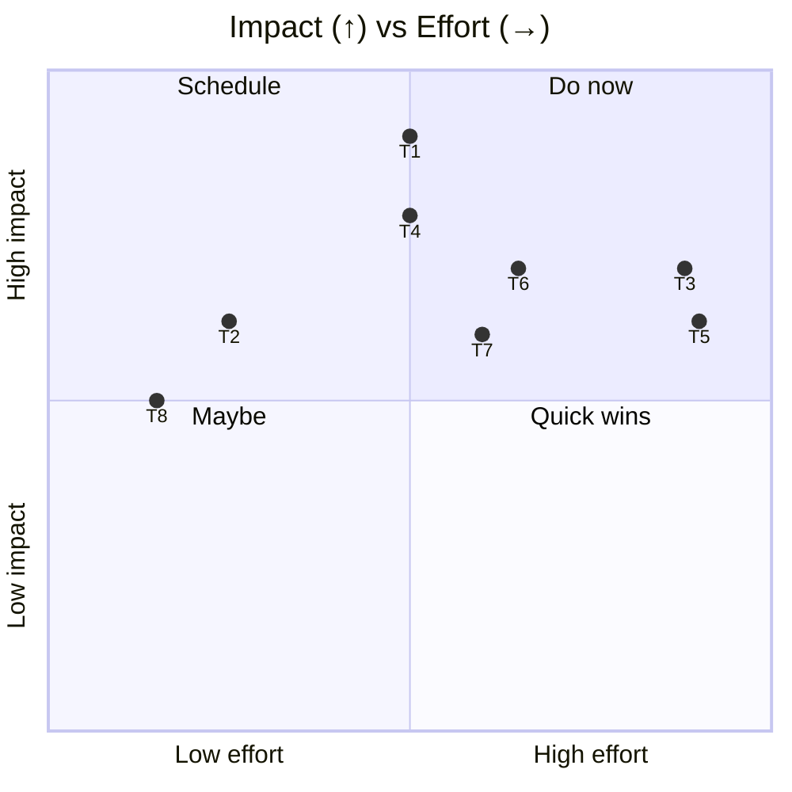
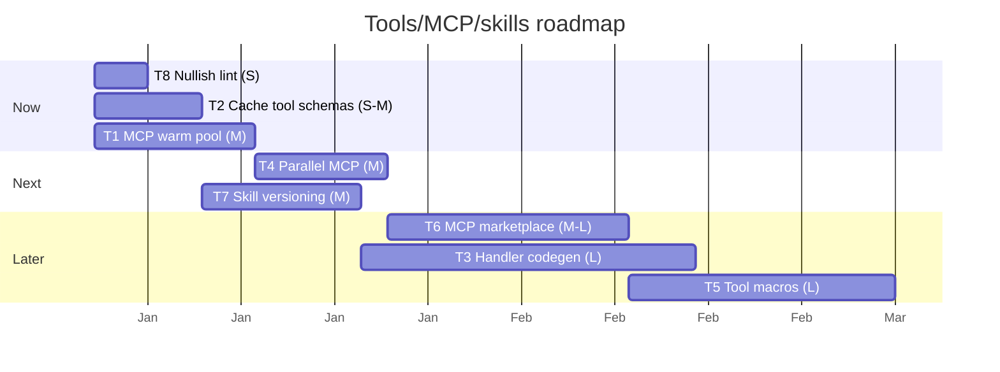

# 04 — Improvements: Tool System, MCP & Skills

> **As-of:** `main` @ `4bac642a8` · **Companion to:** [analysis/04 — Tools, MCP & Skills](analysis/04-tools-mcp-skills) · **Roadmap:** [improvement/00](improvement/00-system-wide-roadmap)

Proposals for the tools the agent invokes, MCP server integration, and the Skills framework. Focus: kill cold MCP startups, remove manual schema↔handler sync, and make the toolset composable.

## North-star themes

1. **MCP without the wait.** MCP server startup (60s timeout, stdio spawn) is the biggest tool-path latency; a cross-workspace warm pool removes it.
2. **One source of truth.** A tool's Zod schema should generate its handler signature + JSON-Schema + result type — no manual sync to drift.
3. **Composable, discoverable capability.** Tool aliases/chaining, MCP marketplace, and versioned skills.

---

## Improvement backlog

### T1 — 🚀 MCP server warm pool (cross-workspace reuse)

- **Problem:** `MCPServerManager` leases servers per-workspace with a 10-min idle timeout; the same global MCP server gets re-spawned across workspaces, paying the 60s `MCP_STARTUP_TIMEOUT_MS` budget and the stdio handshake repeatedly.
- **Proposal:** A shared warm pool keyed by server config (command+args+env+url), reference-counted across workspaces, so a known-good client is reused unless config changes. Keep per-workspace tool allowlists as a filter layer on top.
- **Impact:** Near-zero MCP tool latency on warm pools; fewer orphaned stdio processes.
- **Effort:** **M** · touches: `mcpServerManager.ts` (lease → pool), `mcpConfigService.ts`.
- **Risks:** Tool-result isolation across workspaces; config-fingerprint invalidation must be exact.

### T2 — 🚀 Cache `getToolSchemas` JSON-Schema conversion

- **Problem:** `getToolSchemas()` converts every tool's Zod schema to JSON-Schema (`zodToJsonSchema`) for token counting on each request; for a large toolset + MCP tools this is repeated work.
- **Proposal:** Memoize the JSON-Schema output keyed by tool definition version (hash of the Zod schema), invalidate only when `TOOL_DEFINITIONS` or an MCP tool list changes.
- **Impact:** Lower per-stream CPU; faster first-step setup.
- **Effort:** **S–M** · touches: `toolDefinitions.ts` (`getToolSchemas`), `tools.ts`.
- **Risks:** Must invalidate on MCP tool-list changes; hash the schema, not the object identity.

### T3 — 🔧 Codegen tool handlers from the schema (kill manual sync)

- **Problem:** Handler factories import `TOOL_DEFINITIONS.xxx.description`/`.schema` manually (`tools.ts`); a renamed field must be touched in two places, and result types drift from `RESULT_SCHEMAS`.
- **Proposal:** A small codegen step (build-time script) that, given a tool entry, emits a typed `createXxxTool` factory skeleton + a `BridgeableToolName` result type, so handlers conform to a generated contract. Start with a generator for new tools; migrate incrementally.
- **Impact:** Eliminates a class of "tool works but result is mistyped" bugs; faster tool authoring.
- **Effort:** **L** · touches: new `scripts/codegen-tools.ts`, `toolDefinitions.ts`, `tools.ts`, Makefile target.
- **Risks:** Big migration; gate behind the existing `RESULT_SCHEMAS` and do new tools first.

### T4 — 🚀 Parallel MCP tool calls

- **Problem:** MCP tools go through the same `withSequentialExecution` serialization as built-ins; a workflow that fans out several MCP reads pays serial latency.
- **Proposal:** Tag MCP tools with the read-only/parallelizable flag from R4 (improvement/03); let safe MCP reads run concurrently. Honor each MCP tool's own `runMCPToolWithDeadline` (300s) and abort handling.
- **Impact:** Faster multi-MCP steps; better throughput for retrieval-heavy agents.
- **Effort:** **M** · touches: `mcpServerManager.ts` (`wrapMCPTools`), `withSequentialExecution.ts`.
- **Risks:** An MCP server may not be concurrency-safe — default to serial unless the server advertises it.

### T5 — ✨ Tool aliases & composition

- **Problem:** Tools are flat; there's no way to define "run these 3 tools in sequence" as one capability (e.g. "search code then summarize").
- **Proposal:** A lightweight tool-macro layer (project-level `.mux/tool-macros`) that expands to an ordered tool sequence the runner executes; surfaced to the model as one tool.
- **Impact:** Fewer round-trips for common multi-step ops; better agent steering.
- **Effort:** **L** · touches: `tools.ts`, a macro registry, macro UI.
- **Risks:** Macros must validate arg compatibility; avoid encouraging overly long macros (defeats agentic planning).

### T6 — ✨ MCP discovery / marketplace + provenance UI

- **Problem:** MCP servers are configured by hand (`.mux/mcp.jsonc`); names are lossy (`server_tool` hashed) and provenance isn't clear in the allowlist UI.
- **Proposal:** A catalog of known MCP servers (install-by-name) and an allowlist UI that shows the source server + original tool name + a "last result" preview.
- **Impact:** Lower friction to add capability; trust/auditability for which tool did what.
- **Effort:** **M–L** · touches: `WorkspaceMCPModal`, `mcpToolName.ts` (keep a provenance map), a registry source.
- **Risks:** Marketplace trust/safety — curate or gate installs.

### T7 — ✨ Skill versioning & update flow

- **Problem:** Skills are discovered by name from `.mux/skills/` etc.; a breaking change to a skill silently affects agents that depend on it.
- **Proposal:** Optional `version`/`compatibility` in `AgentSkillFrontmatterSchema`; consumers can pin a range; surface updates in the UI.
- **Impact:** Safer skill evolution; clearer dependency story.
- **Effort:** **M** · touches: `schemas/agentSkill.ts`, `agentSkillsService.ts`, UI.
- **Risks:** Adds resolution complexity; keep versioning optional to preserve the simple case.

### T8 — 🛡 Lint-enforce the `.nullish()` convention

- **Problem:** Optional tool **input** params must use `.nullish()` (not `.optional()`) for OpenAI strict-mode; today this is a comment convention only — easy to forget.
- **Proposal:** Add an eslint rule (the custom `local` plugin) that flags `.optional()` on tool input schemas unless explicitly `.nullish()`.
- **Impact:** Catches a silent OpenAI-strict-mode break at PR time.
- **Effort:** **S** · touches: `eslint.config.mjs` `local` plugin.
- **Risks:** Scope the rule to `toolDefinitions.ts` to avoid false positives elsewhere.

## Prioritization

## Proposed sequencing

## Success metrics / KPIs

| Metric                             | Target                            | Measure          |
| ---------------------------------- | --------------------------------- | ---------------- |
| MCP tool first-call latency (warm) | < 300 ms                          | trace timing     |
| `getToolSchemas` per stream        | cached (0 recompute on no-change) | instrumentation  |
| MCP stdio processes per session    | −50% via pool                     | process count    |
| New-tool authoring steps           | −1 manual sync (codegen)          | review checklist |

## Related

- [analysis/04 — Tools, MCP & Skills](analysis/04-tools-mcp-skills) (current state)
- [improvement/00 — System-wide roadmap](improvement/00-system-wide-roadmap)
- [improvement/03 — AI Runtime](improvement/03-ai-agent-runtime) (R4 parallel-tools partner)
- [improvement/06 — Workflow Engine](improvement/06-workflow-engine) (action-child pool sibling)
