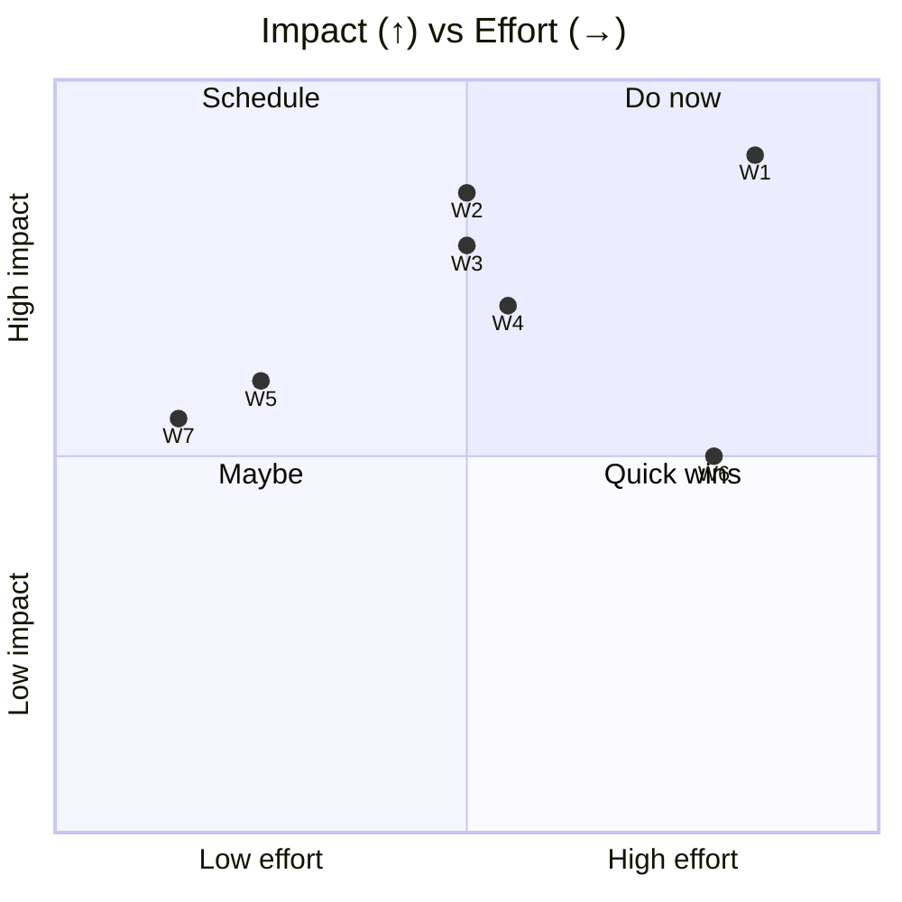
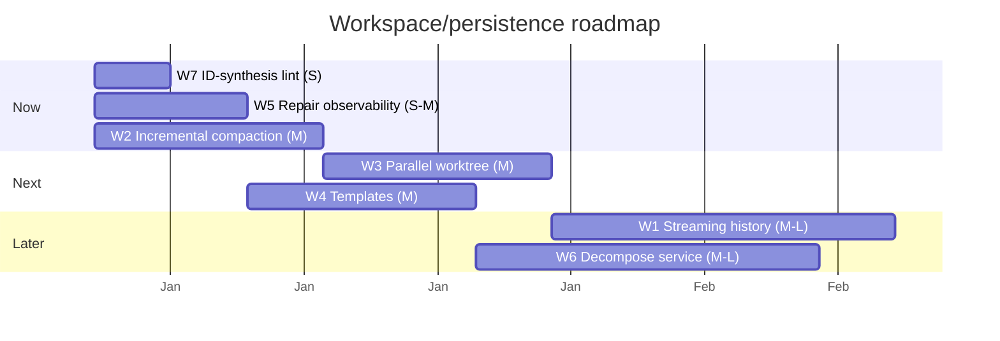

# 05 — Improvements: Workspace, Worktree & Persistence

> **As-of:** `main` @ `4bac642a8` · **Companion to:** [analysis/05 — Workspace & Persistence](analysis/05-workspace-persistence) · **Roadmap:** [improvement/00](improvement/00-system-wide-roadmap)

Proposals for workspace lifecycle, the runtime hierarchy, and the history/partial/compaction persistence layer. Focus: make large/old workspaces cheap to open, and worktree creation fast.

## North-star themes

1. **Open any workspace instantly.** A 6-month-old workspace with a huge `chat.jsonl` should load as fast as a fresh one.
2. **Compaction without the freeze.** Summarize incrementally off the hot path, never blocking a send.
3. **Worktree creation in parallel.** Multi-project and batch creation shouldn't serialize.

---

## Improvement backlog

### W1 — 🚀 Streaming / line-indexed history read

- **Problem:** `getHistoryFromLatestBoundary` reads the active epoch of `chat.jsonl`; for long sessions the whole active range is materialized before the UI can render, causing open lag on big workspaces.
- **Proposal:** Keep a line-offset index per `chat.jsonl` (written alongside appends) so reads can stream messages in chunks and the renderer can virtualize (see improvement/07). Boundary offset already exists — extend it to per-message offsets.
- **Impact:** Near-constant open time regardless of history size; lower memory.
- **Effort:** **M–L** · touches: `historyService.ts` (append + read), index file format, `streamWithHistory`.
- **Risks:** Index must stay crash-consistent with the JSONL; rebuild on demand if missing.

### W2 — 🚀 Incremental, non-blocking compaction

- **Problem:** `compactionHandler`/`compactionMonitor` summarize when the window fills; the summary generation + boundary rotation can land on the hot path and delay the next send.
- **Proposal:** Trigger compaction _earlier_ (at e.g. 70% window) and run the summary off the stream mutex; write the boundary atomically only when ready. Pre-warm the summary using a cheap model (ties to R6 in improvement/03).
- **Impact:** No send latency spike at the compaction threshold; smoother long sessions.
- **Effort:** **M** · touches: `compactionMonitor.ts`, `compactionHandler.ts`, the boundary-rotation sequence.
- **Risks:** Ordering between an in-flight stream and a boundary write — the existing lock + sequence guard handles it; test thoroughly.

### W3 — 🚀 Shallow + parallel worktree creation

- **Problem:** `WorktreeManager.createWorkspace` fetches origin trunk, checks fast-forward-ability, runs `git worktree add`, syncs `.muxignore` + submodules — serially. Multi-project (`MultiProjectRuntime`) does N of these in sequence.
- **Proposal:** Create per-project worktrees **in parallel** (independent git ops); consider shallow/partial clones (`--depth`/`--filter=blob:none`) for the base repo to cut fetch time. `forkWorkspace` reuses the source branch — keep that fast path.
- **Impact:** Faster workspace creation, especially multi-project and large repos.
- **Effort:** **M** · touches: `WorktreeManager.ts`, `MultiProjectRuntime`, `runtimeFactory.ts`.
- **Risks:** Parallel `git worktree add` into the same project needs locking (there's a stale-lock cleanup already); shallow clones may miss objects some hooks need.

### W4 — ✨ Workspace templates & snapshots

- **Problem:** Every workspace starts from the project trunk; there's no "start from this branch + these skills + this agent + this MCP set" preset.
- **Proposal:** A workspace template (saved config: base ref, agent, skills, MCP overrides, runtime) that `WorkspaceService.create` can take; one-click "new from template".
- **Impact:** Faster, consistent setup for repeated task types (e.g. "bug-fix workspace").
- **Effort:** **M** · touches: `workspaceService.ts`, `schemas/workspace.ts`, ProjectSidebar UI.
- **Risks:** Template drift vs config schema changes — version the template payload.

### W5 — 🛡 Self-healing hardening: partial-repair observability

- **Problem:** The partial lifecycle (`commitPartial` dropping tool-only partials, stale-sequence refusal) is critical but silent; a regression here could brick future requests with no signal.
- **Proposal:** Emit structured log/telemetry when a partial is dropped or a stale sequence is refused (already logged?); add a health check to the debug CLI that reports partial/boundary state per workspace.
- **Impact:** Faster diagnosis of "why did my turn vanish"; confidence in the self-healing guarantee.
- **Effort:** **S–M** · touches: `historyService.ts`, `src/cli/debug`, telemetry.
- **Risks:** Low; observability only.

### W6 — 🔧 Decompose `workspaceService.ts` (9209L)

- **Problem:** create/rename/fork/remove/archive/multi-project are all in one massive file.
- **Proposal:** Split into `workspaceCrud`, `workspaceFork`, `workspaceArchive`, `workspaceMultiProject` modules behind one service facade.
- **Impact:** Lower change risk; clearer ownership.
- **Effort:** **M–L** · touches: `workspaceService.ts` + new modules.
- **Risks:** Pure refactor; preserve the stable-ID contract and config.editConfig usage.

### W7 — 🛡 Lint guard against frontend ID synthesis

- **Problem:** "Frontend must never synthesize workspace IDs" is an architectural rule with no mechanical enforcement (it relies on discipline).
- **Proposal:** An eslint rule (or a simple grep CI check) that flags any `generateStableId`/`crypto.randomBytes` import under `src/browser`, ensuring ID generation stays in `src/node`.
- **Impact:** Prevents a class of ID-desync bugs at PR time.
- **Effort:** **S** · touches: `eslint.config.mjs` `local` plugin.
- **Risks:** Narrow the rule to avoid false positives; allow type-only references.

## Prioritization

## Proposed sequencing

## Success metrics / KPIs

| Metric                                 | Target              | Measure          |
| -------------------------------------- | ------------------- | ---------------- |
| Workspace open time (100k-msg history) | < 500 ms            | debug CLI / perf |
| Send latency at compaction threshold   | no spike            | trace timing     |
| Multi-project create (3 projects)      | −40% serial         | timing           |
| Stale-partial incidents                | 0 (surfaced if any) | telemetry        |

## Related

- [analysis/05 — Workspace & Persistence](analysis/05-workspace-persistence) (current state)
- [improvement/00 — System-wide roadmap](improvement/00-system-wide-roadmap)
- [improvement/03 — AI Runtime](improvement/03-ai-agent-runtime) (compaction partner)
- [improvement/07 — React Frontend](improvement/07-react-frontend) (transcript virtualization partner)
