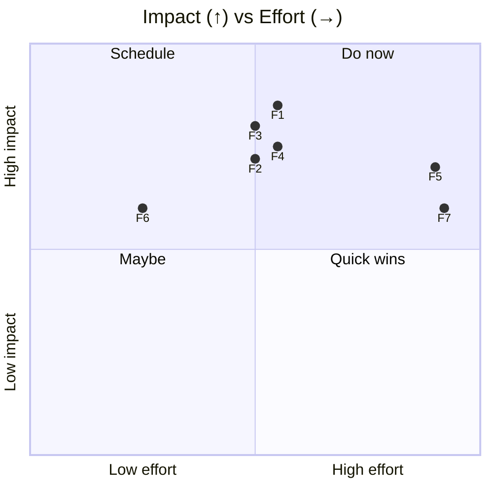
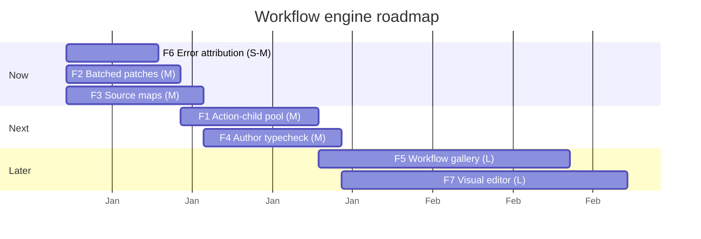

# 06 — Improvements: Workflow Engine

> **As-of:** `main` @ `4bac642a8` · **Companion to:** [analysis/06 — Workflow Engine](analysis/06-workflow-engine) · **Roadmap:** [improvement/00](improvement/00-system-wide-roadmap)

Proposals for the durable JavaScript conductor. Focus: cut per-step overhead (action-child reuse, batched patches) and make workflow authoring as safe as app code (source maps, typecheck).

## North-star themes

1. **Cheaper steps.** Spawning a fresh Node action child per action is the biggest per-step cost; reuse it.
2. **Authoring that fails fast.** Workflow JS runs in QuickJS with a lexical rewrite — typos surface at runtime. Catch them at author/save time.
3. **Composable workflows.** A gallery + reuse so teams share proven playbooks.

---

## Improvement backlog

### F1 — 🚀 Action-child process pool reuse

- **Problem:** `workflowActionChild.js` runs each host action in a **fresh** Node child process with SIGTERM/SIGKILL cleanup; for a workflow that runs many git/github actions, process spawn dominates step time.
- **Proposal:** Keep a bounded pool of warmed action-child processes, dispatch actions to an idle one, and reset module state between actions (or partition by effect/`sourcePath`). Fall back to fresh-spawn for isolation-sensitive actions.
- **Impact:** Lower per-action latency; fewer process spawns on long workflows.
- **Effort:** **M** · touches: `WorkflowActionRunner.ts`, `workflowActionChild.js`.
- **Risks:** State bleed between actions in a reused process — reset carefully; keep a fresh-spawn escape hatch.

### F2 — 🚀 Batched patch application

- **Problem:** `applyPatch` dry-runs then applies under `patchApplyMutex`, one patch at a time; a workflow collecting several child patches applies them serially.
- **Proposal:** A batched `applyPatches(taskIds[])` that sequences dry-runs first, then applies the survivors under one mutex hold, reducing lock churn.
- **Impact:** Faster multi-patch workflows; less mutex contention.
- **Effort:** **M** · touches: `WorkflowTaskServiceAdapter.ts`, `task_apply_git_patch` tool.
- **Risks:** One conflicting patch must not abort a whole batch cleanly — report per-patch status.

### F3 — 🔧 Source maps for compiled workflow JS

- **Problem:** `compileWorkflowSource()` lexically rewrites the author's JS (strips `export`, appends stdlib) before QuickJS eval; errors point at rewritten offsets, not the author's source.
- **Proposal:** Emit a source map during the rewrite and have the conductor translate runtime error locations back to the author's file/line before logging/telemetry.
- **Impact:** Errors you can actually act on; faster workflow debugging.
- **Effort:** **M** · touches: `WorkflowRunner.ts` (`compileWorkflowSource`), error handling.
- **Risks:** The rewrite is simple enough that a map is feasible; keep it optional to avoid perf cost.

### F4 — 🔧 Author-time typecheck of workflow JS

- **Problem:** Workflow JS typos/schema misuse fail at runtime in QuickJS; the `disableTypeChecked` eslint carve-out means even lint won't catch them.
- **Proposal:** A dev-time check (`mux workflow check <name>` or a Makefile target) that typechecks the author's default-export signature against the conductor API types + declared `argsSchema`/`outputSchema` (using the same Zod schemas).
- **Impact:** Catch the common authoring bugs before a run; faster iteration.
- **Effort:** **M** · touches: new `scripts/check-workflow.ts`, Makefile, `builtinSkills/workflow-authoring.md`.
- **Risks:** The rewrite means you typecheck the _pre-rewrite_ module; align types with what the rewrite injects.

### F5 — ✨ Workflow gallery & composability

- **Problem:** Built-ins (`deep-research`, `deep-review-workflow`, `security-scan`) ship in-repo; user/global workflows are per-machine with no sharing surface.
- **Proposal:** A `workflow marketplace` (git-backed registry) + `workflow_run` ability to invoke a published workflow by name; version + checksum pinning reusing `definitionHash`.
- **Impact:** Teams share proven playbooks; discoverability of capabilities.
- **Effort:** **L** · touches: `WorkflowDefinitionStore.ts`, a registry source, UI.
- **Risks:** Trust/safety of remote workflow JS — gate behind an allowlist + checksum; QuickJS sandboxing helps but actions run in real Node.

### F6 — 🛡 Clearer error attribution across the two JS runtimes

- **Problem:** A workflow error can originate in the QuickJS conductor **or** the Node action child; today it's not always obvious which, slowing diagnosis.
- **Proposal:** Tag every error event with `origin: "conductor" | "action-child"` + the relevant `sourcePath`/`stepId`; surface in the run card.
- **Impact:** Faster triage; fewer "which sandbox?" investigations.
- **Effort:** **S–M** · touches: `WorkflowRunner.ts`, `WorkflowActionRunner.ts`, event schema.
- **Risks:** Schema addition is additive; keep a default for old runs.

### F7 — ✨ Visual workflow editor / step inspector

- **Problem:** Workflows are JS; understanding a long run means reading the event journal.
- **Proposal:** A step-inspector UI that renders the run as a DAG of steps (replay-keyed) with cached/fresh status, patch diffs, and action results inline.
- **Impact:** Debuggability + onboarding; makes durable replay tangible.
- **Effort:** **L** · touches: run-card components, a read model over the event journal.
- **Risks:** Large UI effort; can start read-only (inspect) before edit.

## Prioritization

## Proposed sequencing

## Success metrics / KPIs

| Metric                         | Target                     | Measure         |
| ------------------------------ | -------------------------- | --------------- |
| Per-action latency (warm pool) | −40–60%                    | trace timing    |
| Multi-patch apply              | 1 mutex hold per batch     | instrumentation |
| Workflow authoring bug escape  | caught at `workflow check` | review          |
| Run-card error triage time     | halved                     | attribution tag |

## Related

- [analysis/06 — Workflow Engine](analysis/06-workflow-engine) (current state)
- [improvement/00 — System-wide roadmap](improvement/00-system-wide-roadmap)
- [improvement/04 — Tools/MCP/Skills](improvement/04-tools-mcp-skills) (action-child ↔ MCP pool)
- [improvement/03 — AI Runtime](improvement/03-ai-agent-runtime) (sub-agent tasks)
