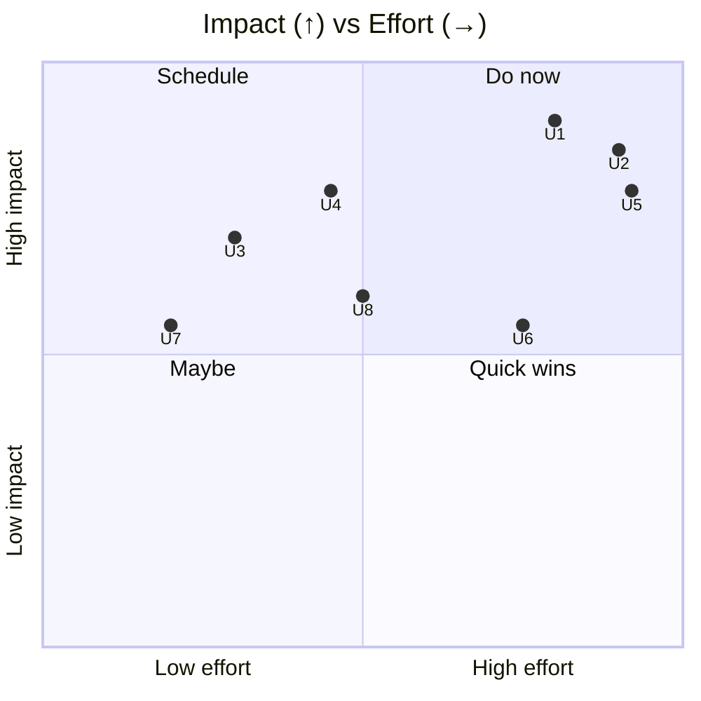
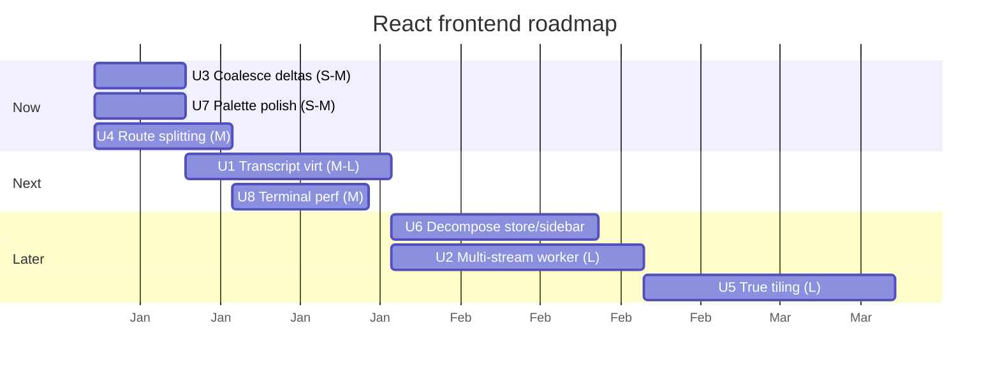

# 07 — Improvements: React Frontend & Design System

> **As-of:** `main` @ `4bac642a8` · **Companion to:** [analysis/07 — React Frontend](analysis/07-react-frontend) · **Roadmap:** [improvement/00](improvement/00-system-wide-roadmap)

Proposals for the renderer shell, the external-store state layer, the terminal, and the design system. Focus: kill large-history jank, let multiple workspaces stream live, and enable genuine split-view.

## North-star themes

1. **Smooth at any history size.** The transcript must stay 60 fps whether it's 10 or 10,000 messages.
2. **Many workspaces, all live.** Background workspaces shouldn't go dark; users should watch several run in parallel.
3. **True split view.** Move from single-active-workspace to an optional tiled layout.

---

## Improvement backlog

### U1 — 🚀 Transcript virtualization (large-history jank)

- **Problem:** `MessageWindow`/`MessageRenderer` render the whole active epoch; big workspaces jank on open/scroll, and re-render cost scales with history.
- **Proposal:** Window/virtualize the transcript (e.g. `@tanstack/react-virtual`), rendering only visible + overscan messages; pair with the streaming history read in improvement/05 (W1) so messages arrive in chunks.
- **Impact:** Constant-time rendering regardless of history; lower memory.
- **Effort:** **M–L** · touches: `features/Messages/MessageWindow`, `WorkspaceStore` aggregator.
- **Risks:** Virtualization must preserve scroll anchors, "jump to latest", and tool-card state; measure streaming-message mounts carefully.

### U2 — 🚀 Multi-workspace live streaming via a shared worker

- **Problem:** Only the active workspace streams live (`WorkspaceStore` keeps a single `onChat` subscription; background ones use snapshots). Switching context loses real-time progress.
- **Proposal:** Multiplex several workspaces' streams through one Web Worker (or the backend), so a tiling view (U5) shows multiple live agents. Keep the single-active fast path as default; enable multi only in split view.
- **Impact:** Real parallelism UX; no "did it finish?" context-switching.
- **Effort:** **L** · touches: `WorkspaceStore`, `WorkspaceConsumerManager`, a new worker, backend stream budget.
- **Risks:** Backend must allow multiple concurrent workspace streams; bound the count to avoid overload.

### U3 — 🚀 Batch/debounce stream deltas at the store edge

- **Problem:** Every `text-delta` triggers a store bump + re-render; fast providers flood the frame budget.
- **Proposal:** Coalesce deltas into rAF/16ms frames in the `StreamingMessageAggregator` (partner to R8 in improvement/03); never drop the final delta on `stream-end`.
- **Impact:** 60 fps during fast streams; lower CPU.
- **Effort:** **S–M** · touches: `WorkspaceStore` aggregator, `useSmoothStreamingText`.
- **Risks:** Ordering correctness and the terminal flush on stream end.

### U4 — 🚀 Route-level code-splitting (lazy Settings/Analytics/terminal)

- **Problem:** The app shell loads Settings/Analytics/terminal-window code eagerly; `vite manualChunks` only splits tokenizer today.
- **Proposal:** `React.lazy` + `Suspense` for the non-chat routes in `App.tsx`'s cascade; extend `manualChunks` to vendor buckets (Shiki/Mermaid/AI-SDK/Radix). Partner to A1 in improvement/01.
- **Impact:** Smaller initial JS; faster first paint.
- **Effort:** **M** · touches: `App.tsx`, `vite.config.ts`.
- **Risks:** Skeleton fallback flash; ensure happy-dom tests resolve lazy boundaries.

### U5 — ✨ True multi-workspace tiling / split view

- **Problem:** The shell is single-active-workspace (`WorkspaceShell` tiles _within_ one workspace: ChatPane + right sidebar); there's no side-by-side of two workspaces.
- **Proposal:** An optional split-view mode rendering multiple `AIView`s in a resizable grid (reuse `react-resizable-panels`, already a dep), backed by U2's multi-stream.
- **Impact:** Watch/compare parallel agents; flagship "multiplexer" UX.
- **Effort:** **L** · touches: `App.tsx`, `WorkspaceShell`, layout persistence.
- **Risks:** Mobile/narrow widths must fall back to stacked; per-pane state isolation.

### U6 — 🔧 Decompose `WorkspaceStore.ts` (4866L) + `ProjectSidebar.tsx` (3118L)

- **Problem:** The core store + the largest component are unwieldy; changes risk broad re-renders.
- **Proposal:** Split the store into per-slice modules (streaming, usage, todos, skills, tasks) composed in one facade; split `ProjectSidebar` into subcomponents (tree, drag-layer, sections).
- **Impact:** Smaller change-blast-radius; faster iteration.
- **Effort:** **M–L** · touches: `stores/WorkspaceStore.ts`, `components/ProjectSidebar/`.
- **Risks:** Preserve the fine-grained subscription model (React Compiler + leaf subscriptions).

### U7 — ✨ Faster, richer command palette

- **Problem:** `cmdk` + `CommandRegistryContext` is powerful but the surface is flat; no fuzzy recents or workspace-scoped actions.
- **Proposal:** Add fuzzy ranking, per-workspace scoped commands, recents, and a "run workflow" entry; keyboard-first.
- **Impact:** Power-user throughput; discoverability.
- **Effort:** **S–M** · touches: `CommandPalette`, `CommandRegistryContext`.
- **Risks:** Keep it keyboard-first; don't bloat.

### U8 — 🚀 Terminal: GPU/scroll perf + shared session

- **Problem:** `ghostty-web` renders PTY state; very long output can stutter; terminals are per-workspace with no shared session reuse.
- **Proposal:** Audit scroll-back limits + render batching; allow detaching/reattaching a terminal session to a different pane (or the pop-out window) without losing state.
- **Impact:** Smoother heavy output; flexible terminal management.
- **Effort:** **M** · touches: `src/browser/terminal`, `terminalWindowManager.ts`.
- **Risks:** Terminal protocol state transfer is subtle; keep a fallback to re-attach by replay.

## Prioritization

## Proposed sequencing

## Success metrics / KPIs

| Metric                       | Target     | Measure       |
| ---------------------------- | ---------- | ------------- |
| Transcript 60 fps (10k msgs) | sustained  | perf profile  |
| Initial JS (gzip)            | −30–50%    | bundle budget |
| Concurrent live workspaces   | 2–4 smooth | U2            |
| First-paint (renderer)       | < 500 ms   | perf profile  |

## Related

- [analysis/07 — React Frontend](analysis/07-react-frontend) (current state)
- [improvement/00 — System-wide roadmap](improvement/00-system-wide-roadmap)
- [improvement/01 — Architecture/Build](improvement/01-architecture-build) (U4 partner)
- [improvement/03 — AI Runtime](improvement/03-ai-agent-runtime) (U3 partner)
- [improvement/05 — Workspace/Persistence](improvement/05-workspace-persistence) (U1 history partner)
