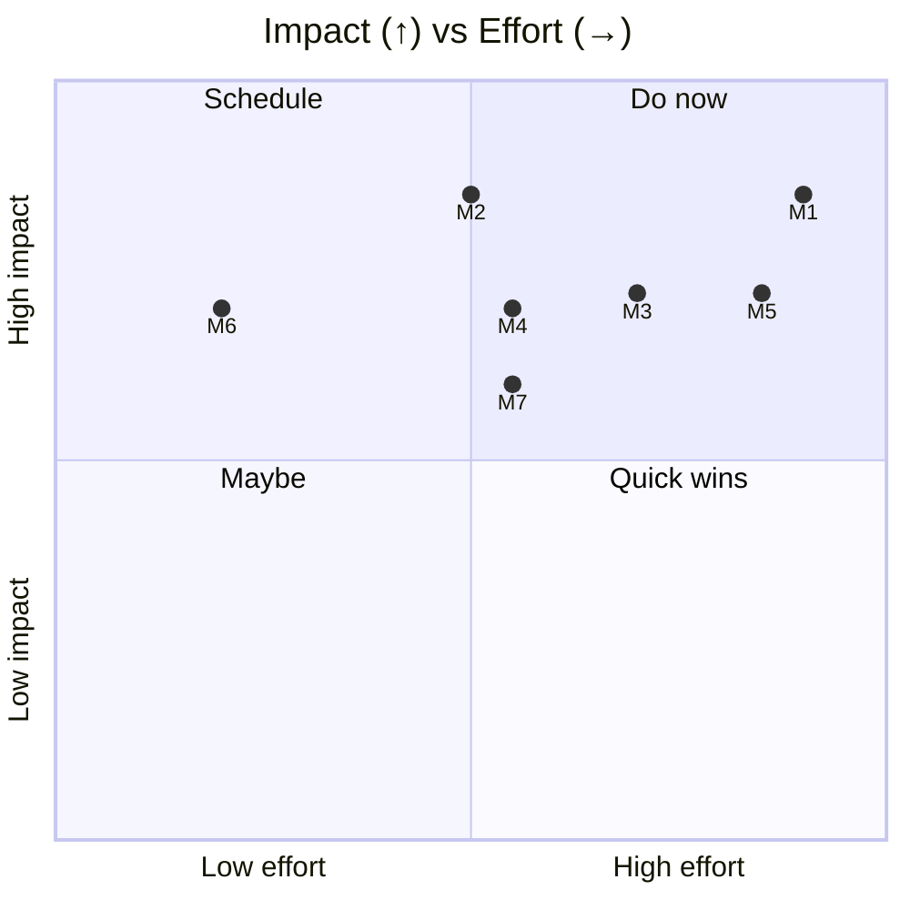
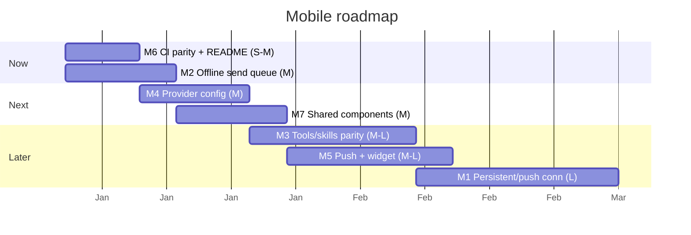

# 08 — Improvements: Mobile Application

> **As-of:** `main` @ `4bac642a8` · **Companion to:** [analysis/08 — Mobile](analysis/08-mobile) · **Roadmap:** [improvement/00](improvement/00-system-wide-roadmap)

Proposals for the Expo/RN client and its shared-contract seam with desktop. Focus: make mobile a first-class _remote control_ (persistent connection, push, offline queue) and close the parity gap.

## North-star themes

1. **Always-on, never lose a turn.** Persistent/push connection + offline send queue so a message sent on the train lands when you reconnect.
2. **Feature parity where it matters.** Tools/MCP/skills visibility + provider config, not just read-only chat.
3. **First-class engineering parity.** Mobile typecheck/lint in CI + a correct README.

---

## Improvement backlog

### M1 — 🚀 Persistent connection + push for background streaming

- **Problem:** `WorkspaceScreen` subscribes to `client.workspace.onChat` with an `AbortController`; when the app backgrounds, the stream drops and the user must reopen to see progress.
- **Proposal:** A background-keepalive (Expo background task / push) so the connection survives backgrounding; server-side, surface a `workspace.activity` notification when a stream completes so the app can re-fetch a snapshot. Honor platform background-execution limits.
- **Impact:** Users see their agents finish without babysitting the app.
- **Effort:** **L** · touches: `mobile/src/screens/WorkspaceScreen.tsx`, `mobile/app/_layout.tsx`, push service, `workspace` router.
- **Risks:** iOS/Android background limits; prefer a push-summary + snapshot-fetch over a long-lived socket.

### M2 — 🚀 Offline send queue

- **Problem:** `sendMessage` over RPCLink fails immediately on a flaky connection; the message is lost or requires manual retry.
- **Proposal:** A local outbox (SecureStore/persisted) that queues sends when offline and flushes in order on reconnect, deduping by client message id; show queued state in the UI.
- **Impact:** Reliable sends on mobile networks; "fire and forget" UX.
- **Effort:** **M** · touches: `mobile/src/screens/WorkspaceScreen.tsx`, a new outbox module, `WorkspaceChatContext`.
- **Risks:** Ordering vs server-side queueing; dedupe keys must be stable.

### M3 — ✨ Feature parity: tools/MCP/skills visibility

- **Problem:** Mobile surfaces chat + git review + secrets, but not the tool/MCP/skills/tool-card surfaces (analysis/08 parity matrix).
- **Proposal:** A read-only "Tools/Skills" view showing the active workspace's tools, MCP servers, and loaded skills (reusing the shared oRPC contract); optionally a minimal tool-card renderer for the transcript.
- **Impact:** Mobile users can audit/steer capability, not just read text.
- **Effort:** **M–L** · touches: new `mobile/app` routes, shared card components extracted from desktop.
- **Risks:** Don't try to port all ~40 tool cards; start with the common ones + a generic fallback.

### M4 — ✨ Provider config parity

- **Problem:** Providers are read-only on mobile (use whatever desktop configured); adding a key on the go isn't possible.
- **Proposal:** A mobile Providers screen (`config.saveConfig` is already in the shared contract) with secret entry via SecureStore; reuse the desktop redaction logic for display.
- **Impact:** True remote setup; fewer "go to your laptop" moments.
- **Effort:** **M** · touches: new `mobile/app/providers.tsx`, `AppConfigContext`.
- **Risks:** Secret entry on mobile UX/security — use SecureStore; never log keys.

### M5 — ✨ Task-completion push notifications + quick-action widget

- **Problem:** No notification when an agent finishes or needs input (`ask_user_question`).
- **Proposal:** Push on `stream-end`/`tool-call` needing input (partner to M1) + a home-screen quick-action ("new workspace" / "resume last").
- **Impact:** Lower time-to-respond; better engagement.
- **Effort:** **M–L** · touches: push service, Expo widgets/quick-actions.
- **Risks:** Notification permission friction; keep them opt-in and low-noise.

### M6 — 🔧 CI parity: mobile typecheck/lint + fix stale README

- **Problem:** `mobile/README.md` references dead transport details (`POST /ipc`, `WebSocket /ws?token=`, non-existent `src/api/client.ts`); mobile has no typecheck/lint job in `pr.yml`.
- **Proposal:** Add a `test-mobile`-adjacent CI job running `mobile` typecheck + eslint; rewrite the README to the real oRPC-over-`/orpc` SSE model.
- **Impact:** Catch mobile regressions at PR time; accurate onboarding docs.
- **Effort:** **S–M** · touches: `mobile/README.md`, `.github/workflows/pr.yml`, `mobile/package.json` scripts.
- **Risks:** Low; docs + a CI job.

### M7 — 🔧 Extract shared components (desktop ↔ mobile)

- **Problem:** Some UI/logic is duplicated (model catalog, slash commands, todos, git parsers); `mobile/tsconfig.json` already allows a curated `browser/utils` slice.
- **Proposal:** Promote genuinely shared presentational pieces to `src/common` (or a shared package) so both frontends use one implementation; start with model display + slash-command parsing.
- **Impact:** Less drift; one fix applies to both.
- **Effort:** **M** · touches: `src/common`, `mobile/tsconfig.json`, both UIs.
- **Risks:** RN vs DOM differences — keep the shared layer platform-agnostic (logic + plain types, not DOM/RN components).

## Prioritization

## Proposed sequencing

## Success metrics / KPIs

| Metric                       | Target                       | Measure             |
| ---------------------------- | ---------------------------- | ------------------- |
| Send reliability (flaky net) | 0 lost messages              | outbox replay tests |
| Background stream survival   | resume without manual reopen | M1                  |
| Feature parity items         | tools/providers shipped      | parity matrix       |
| Mobile CI coverage           | typecheck + lint green       | pr.yml job          |

## Related

- [analysis/08 — Mobile](analysis/08-mobile) (current state)
- [improvement/00 — System-wide roadmap](improvement/00-system-wide-roadmap)
- [improvement/02 — IPC/Config](improvement/02-ipc-config) (shared contract)
- [improvement/07 — React Frontend](improvement/07-react-frontend) (shared components)
- [improvement/09 — CI/Security](improvement/09-testing-ci-security) (mobile CI job)
