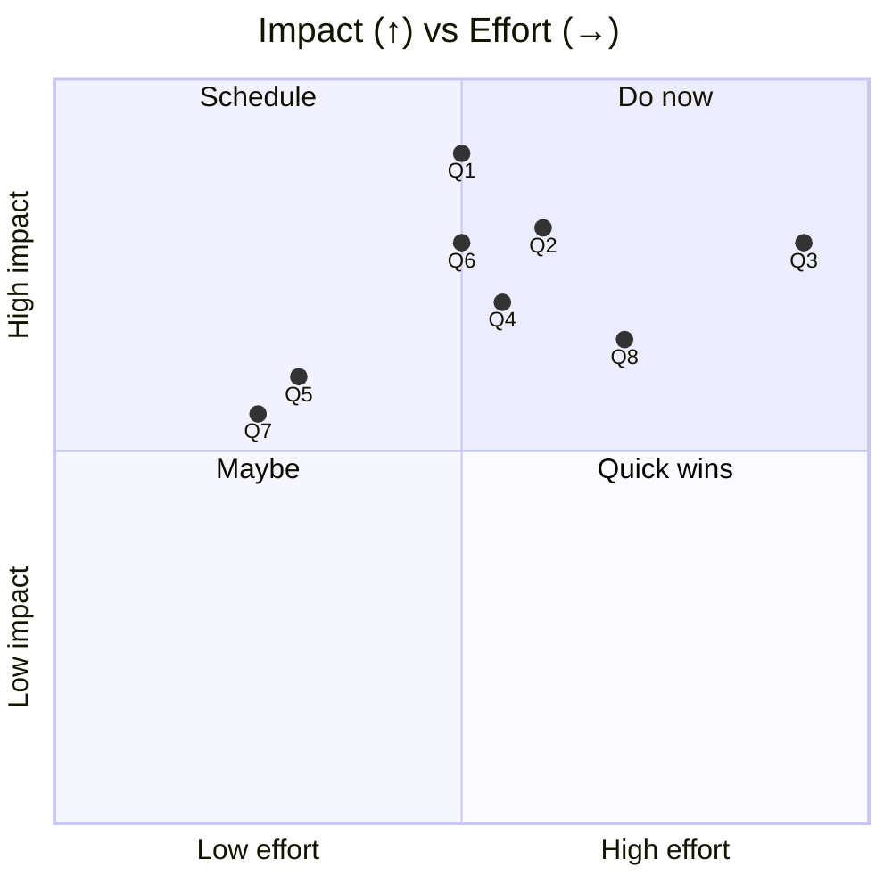
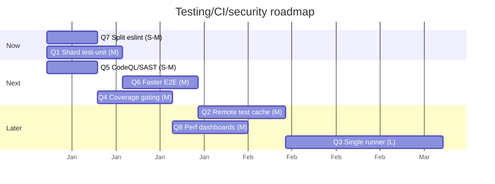

# 09 — Improvements: Testing, CI, Security & Telemetry

> **As-of:** `main` @ `4bac642a8` · **Companion to:** [analysis/09 — Testing, CI, Security](analysis/09-testing-ci-security) · **Roadmap:** [improvement/00](improvement/00-system-wide-roadmap)

Proposals for the quality/release/security/observability facets. Focus: make CI faster (parallelism + caching, single runner) and gate on coverage/SAST over time.

## North-star themes

1. **Fast, parallel CI.** Split the big `bun test src` run; cache aggressively; ship faster feedback.
2. **One runner, less drift.** Migrate Jest suites to `bun test` so there's a single test runtime.
3. **Guardrails that grow with the codebase.** Graduated coverage gating + SAST, added incrementally.

---

## Improvement backlog

### Q1 — 🚀 Shard `test-unit` across CI runners

- **Problem:** `test-unit` is a single `bun test src` (Makefile); ~661 co-located files run in one process/job, so CI wall-time grows with the suite.
- **Proposal:** Shard by top-level directory (`src/node`, `src/browser`, `src/common`, `mobile`) or via bun's `--shard`/test-grouping into a matrix; join with the existing `required` gate. Keep `tests/ui/storybook` as its own shard.
- **Impact:** CI wall-time cut roughly by shard count; faster PR feedback.
- **Effort:** **M** · touches: `Makefile` (`test-unit` → sharded targets), `.github/workflows/pr.yml` matrix.
- **Risks:** Shared setup cost per shard; balance shard count vs setup overhead.

### Q2 — 🚀 Remote/remote-cacheable test + build artifacts

- **Problem:** Each CI run rebuilds main + re-runs everything; no cross-run cache for bun/vite/esbuild outputs or test results.
- **Proposal:** Adopt a content-addressed cache (e.g. GitHub Actions cache keyed on source hash, or `act`/`turbo`-style task caching) for `build-main`, the renderer build, and test artifacts. Wire a remote cache for bun.
- **Impact:** Big wall-time wins on unchanged-code PRs.
- **Effort:** **M** · touches: `Makefile`, workflow caching steps, possibly `turbo`/task runner.
- **Risks:** Cache-key correctness is subtle; invalidate on lockfile/config changes.

### Q3 — 🔧 Migrate Jest suites → `bun test` (single runner)

- **Problem:** Two runners (`bun test` unit + Jest integration/UI) cause config drift (`jest.config.js`, `babel.config.js`'s custom `transformImportMetaForJest`) and two mental models.
- **Proposal:** Port integration/UI suites to `bun test` (it supports happy-dom-ish environments via setup); retire Jest + Babel. Keep `@storybook/test-runner` as-is (its own harness).
- **Impact:** One runtime, one config; faster cold start; less maintenance.
- **Effort:** **L** · touches: `jest.config.js`, `babel.config.js`, `tests/{ipc,ui,runtime}`, `tests/setup.ts`.
- **Risks:** Some Jest matchers/plugins need equivalents; do suite-by-suite with a compatibility shim.

### Q4 — ✨ Graduated coverage gating

- **Problem:** Coverage is informational-only (`codecov.yml` `informational: true`); nothing prevents a regression from merging.
- **Proposal:** Phase in: (1) per-package coverage **status checks** (non-blocking), then (2) **patch-only gating** (a PR can't lower coverage on changed lines beyond a threshold), then (3) optional project floors.
- **Impact:** Bounded coverage over time without a big-bang gate.
- **Effort:** **M** · touches: `codecov.yml`, `pr.yml`, `jest.config.js`/`bunfig.toml` coverage config.
- **Risks:** Flaky coverage on generated files; exclude `*.generated.ts`, `dist`, etc.

### Q5 — 🛡 Add CodeQL/SAST (and keep zizmor)

- **Problem:** No SAST workflow; Actions security relies on `actionlint` + `zizmor` (good, but no code scanning).
- **Proposal:** Add GitHub CodeQL (or Semgrep) for TS/JS, on `pr.yml` + weekly; non-blocking initially, then advisory gating.
- **Impact:** Catches injection/unsafe sinks earlier; complements the existing `SECURITY AUDIT` comment discipline.
- **Effort:** **S–M** · touches: `.github/workflows/` (new `codeql.yml`).
- **Risks:** False positives on intentional sinks (Shiki/Mermaid) — tune queries / mark safe.

### Q6 — 🚀 Faster E2E: shared fixture + selectivity

- **Problem:** Playwright Electron E2E is heavy (`fullyParallel:false`, 120s timeout, ~2 min startup); every PR runs all scenarios.
- **Proposal:** A shared Electron fixture (one build per run), `changes`-gated scenario selection, and a "smoke" subset that always runs vs a "full" set on merge. `mockAiPrompts.ts` already exists — extend it.
- **Impact:** Faster PR E2E; full coverage stays on merge.
- **Effort:** **M** · touches: `playwright.config.ts`, `tests/e2e/`, `pr.yml`.
- **Risks:** Must not let "smoke-only" hide regressions; run full nightly.

### Q7 — 🔧 Split `eslint.config.mjs` (849L) + document the `local` plugin

- **Problem:** The flat config + inline `local` plugin is one large file; a broken rule stalls all CI.
- **Proposal:** Extract the `local` plugin rules into `eslint-plugins/local/*` with per-rule tests; document each in a short README so contributors understand the architectural rules.
- **Impact:** Faster, safer rule changes; onboarding.
- **Effort:** **S–M** · touches: `eslint.config.mjs`, new plugin dir.
- **Risks:** Preserve exact rule behavior; cover with tests before moving.

### Q8 — ✨ Perf budgets & regression dashboards

- **Problem:** Perf (`tests/e2e/scenarios/perf.*`) runs on a cron but results aren't surfaced as a trend.
- **Proposal:** Publish perf-run results (TTI, bundle size, stream-to-first-token) to the local DuckDB analytics or a dashboard; alert on regression beyond a budget (partner to A6 bundle budget).
- **Impact:** Catches perf regressions visibly; data-driven prioritization.
- **Effort:** **M** · touches: `perf-profiles.yml`, a results publisher, dashboard.
- **Risks:** Perf variance; use statistical thresholds, not raw deltas.

## Prioritization

## Proposed sequencing

## Success metrics / KPIs

| Metric                    | Target              | Measure              |
| ------------------------- | ------------------- | -------------------- |
| `test-unit` CI wall-time  | −50% (sharded)      | pr.yml timing        |
| Rebuild on unchanged src  | cached (skip)       | cache hit rate       |
| E2E PR subset             | < 5 min             | pr.yml timing        |
| Coverage on changed lines | non-regression gate | codecov patch status |

## Related

- [analysis/09 — Testing, CI, Security](analysis/09-testing-ci-security) (current state)
- [improvement/00 — System-wide roadmap](improvement/00-system-wide-roadmap)
- [improvement/01 — Architecture/Build](improvement/01-architecture-build) (bundle-budget job)
- [improvement/08 — Mobile](improvement/08-mobile) (mobile CI parity)
