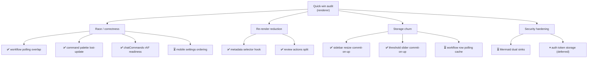
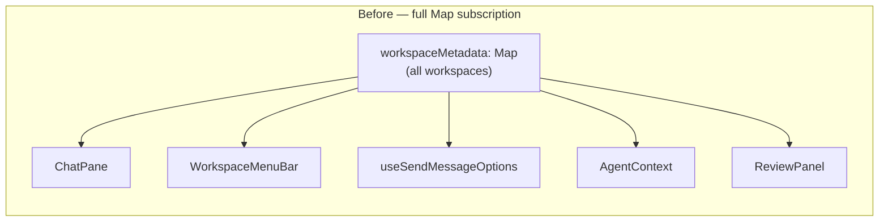
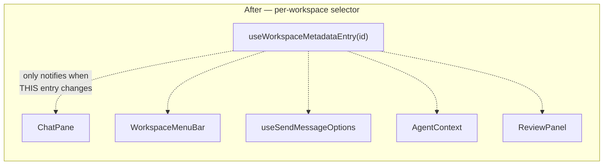
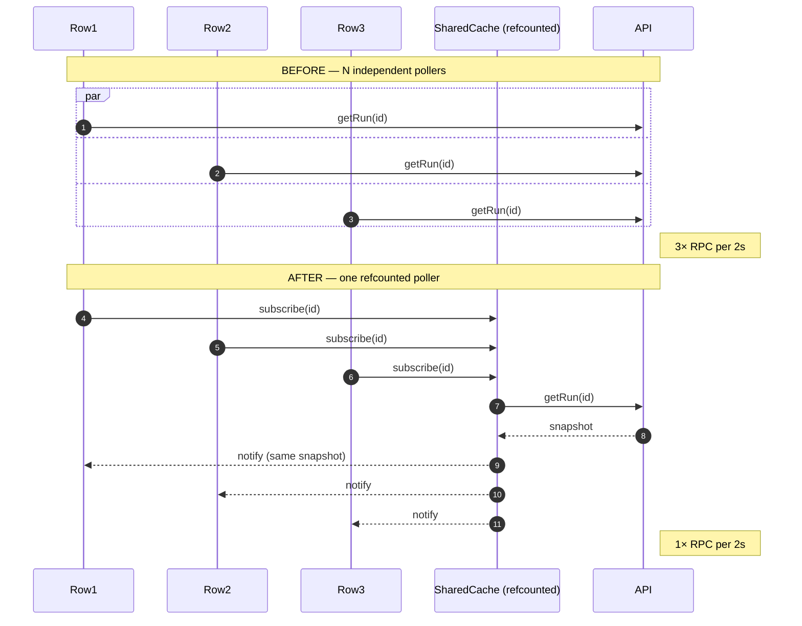
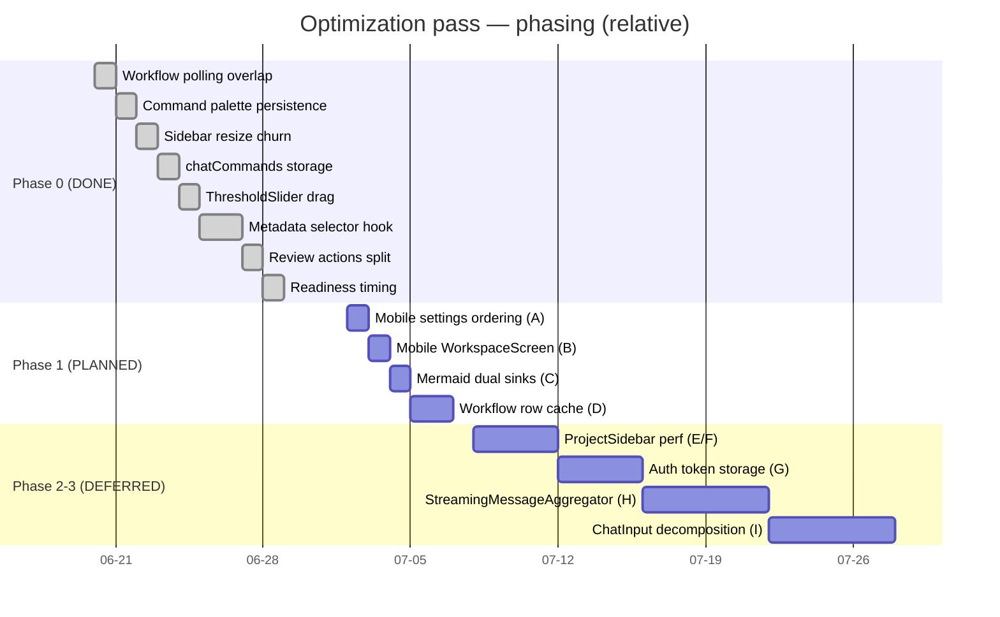
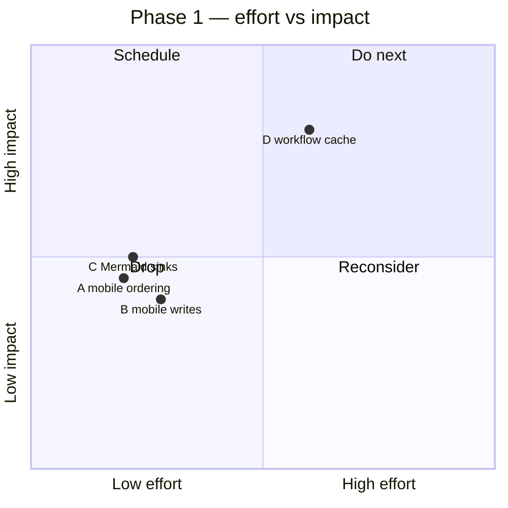

# Quick-Win Optimization Pass — Speed & Quality

> **Status:** 8 / 13 slices complete & validated · 4 quick wins planned · 4 large refactors deferred
> **Scope:** renderer speed (re-render reduction), correctness (race fixes), storage churn, security hardening
> **Principle:** smallest safe change per slice, validated in isolation (`bun test` + `make typecheck`) before moving on.

## TL;DR

An audit of the renderer surfaced a layered set of speed/quality wins. This document tracks the whole pass end-to-end. Eight slices are **done and validated** in the worktree (uncommitted). Four **quick wins remain** (mobile + Mermaid + workflow polling). Four **larger refactors** are explicitly deferred.



---

## 1. Why — Origin & motivation

The renderer is a React 18 + React Compiler app on an external-store pattern (`MapStore` → `WorkspaceStore`, ~22 fine-grained hooks). Two recurring patterns caused the bulk of the pain surfaced by the audit:

1. **Broad subscriptions.** Several hot components subscribed to a whole `Map` of workspace metadata (or the full review state) when they only needed one entry. Any metadata replacement re-rendered every consumer.
2. **Per-interaction churn.** Drag handles and polling loops wrote to `localStorage` / fired RPCs on every tick instead of committing once.

Both are invisible until load grows (large sidebar, deep workflow trees, fast dragging) — so they're high-ROI to fix early.

---

## 2. What & Where — Completed slices (Phase 0)

All eight are validated; diffs are in the worktree (uncommitted). +770 / −234 lines across 19 files.

| #  | Slice                          | Where (primary)                                              | Why                                                                                                              | Win                                    |
|----|--------------------------------|--------------------------------------------------------------|------------------------------------------------------------------------------------------------------------------|----------------------------------------|
| 1  | Workflow polling overlap       | `src/browser/hooks/useWorkflowRunById.ts`                    | `setInterval` started a refresh even if the prior RPC was in flight → overlapping requests + out-of-order state. | Chained `setTimeout` + in-flight guard |
| 2  | Command palette persistence    | `src/browser/contexts/CommandRegistryContext.tsx`            | Raw `localStorage` + stale-closure `recent` update lost entries when two `addRecent` calls fired before re-render. | `usePersistedState` + functional update |
| 3  | Sidebar resize churn           | `src/browser/hooks/useResizableSidebar.ts`                   | Persisted width to `localStorage` on every `mousemove` of a drag.                                                | Commit on drag-end                     |
| 4  | chatCommands storage           | `src/browser/utils/chatCommands.ts`                          | Raw `localStorage.getItem` bypassed the shared self-healing helpers.                                             | `readPersistedString`                  |
| 5  | ThresholdSlider drag           | `src/browser/features/RightSidebar/ThresholdSlider.tsx`      | Each drag tick wrote persisted state **and** mirrored to `api.workspace.setAutoCompactionThreshold`.             | Preview local, commit on pointer-up    |
| 6  | Metadata selector hook         | `src/browser/stores/WorkspaceStore.ts` + 5 consumers         | Hot leaves subscribed to the full metadata `Map`; any replacement re-rendered them even when their entry didn't change. | New `useWorkspaceMetadataEntry` (per-workspace `useSyncExternalStore`) |
| 7  | Review actions split           | `src/browser/hooks/useReviews.ts`, `WorkspaceShell.tsx`      | `WorkspaceShell` subscribed to full review state just to read `addReview`.                                       | New non-subscribing `useReviewActions` |
| 8  | Readiness timing               | `WorkspaceStore.ts`, `chatCommands.ts`                       | Workspace create/fork sent the start message on a `requestAnimationFrame` "is it ready?" guess.                  | `waitForActiveOnChatWorkspace(...)`    |

### Deep dive — metadata selector (slice 6)

The biggest single win. Before, any metadata `Map` replacement fanned out to every consumer:



After, each consumer subscribes to exactly its own entry via a per-workspace `MapStore` + `useSyncExternalStore`:



Validated with render-count tests proving an unrelated workspace update no longer re-renders the consumer, while a same-workspace update still does.

---

## 3. What & Where & When — Planned quick wins (Phase 1)

Execution order **A → B → C → D** (smallest correctness fixes first; the medium cache lands last). Mobile is in scope.

### A — Mobile settings persistence ordering · `small`

- **Where:** `mobile/src/hooks/useWorkspaceSettings.ts:222-253`
- **Why:** All four setters call `setXState(v)` then `await writeSetting(...)`. A rejected/out-of-order write leaves UI ahead of disk; reload "undoes" the choice.
- **What:** persist-then-`setState`, rollback on catch.
- **When:** slice 9 (first of Phase 1).

### B — Mobile WorkspaceScreen fire-and-forget writes · `small`

- **Where:** `mobile/src/screens/WorkspaceScreen.tsx:515-520` (`void setModel(...)`, `void setThinkingLevel(...)`) inside a corrective effect (`:495-533`).
- **Why:** fire-and-forget hides rejections; the effect is a derived-state side effect.
- **What:** `await` both with try/catch (full effect removal is out of scope).
- **When:** slice 10.

### C — Mermaid dual HTML sinks · `small`

- **Where:** `src/browser/features/Messages/Mermaid.tsx:367` (modal `innerHTML`) + `:447` (inline `dangerouslySetInnerHTML`).
- **Why:** Two distinct sinks double the XSS audit surface (both already sanitized — low risk).
- **What:** route modal SVG through the same React path; delete the `innerHTML` effect.
- **When:** slice 11.

### D — Workflow row polling consolidation · `medium`

- **Where:** `src/browser/hooks/useWorkflowRunById.ts:84-130` + `src/browser/features/Tools/WorkflowRunToolCall.tsx:674-680`.
- **Why:** Large active workflow trees spawn N independent 2 s pollers (one per active/expanded child row). Overlap is already fixed, but RPC count still scales with tree size.
- **What:** shared `(workspaceId,runId)` cache with one refcounted poller; all rows reading the same run collapse to one RPC per cycle.
- **When:** slice 12 (final Phase 1 item).



---

## 4. When — Timeline & phasing



### Effort & impact (Phase 1)



---

## 5. What — Deferred (Phases 2–3)

Explicitly out of scope for this pass (per scope decision).

| ID | Item                          | Where                                         | Complexity | Note                                                |
|----|-------------------------------|-----------------------------------------------|------------|-----------------------------------------------------|
| E  | Sidebar attention fanout      | `ProjectSidebar.tsx:197-269,1660-1680`        | S–M        | Highest-ROI perf item; bulk `subscribeKey` + parent `useState` bump. |
| F  | Sidebar tree-math hot path    | `ProjectSidebar.tsx:2115-2868`                | M          | Extract `ProjectWorkspacesTree`; rely on React Compiler. |
| G  | Auth token in renderer store  | `AuthTokenModal.tsx:34-58`                    | L          | Move to Electron main / secure store.               |
| H  | StreamingMessageAggregator    | `utils/messages/StreamingMessageAggregator.ts`| L          | ~3.7k lines; extract persisted agent-status adapter first. |
| I  | ChatInput decomposition       | `features/ChatInput/index.tsx`                | L          | ~3.5k-line monolith.                                |

---

## 6. How — Validation strategy (per slice)

- Each slice validated in isolation before moving on.
- Renderer/desktop: `bun test <changed files>` + `make typecheck`.
- Mobile (A/B): `make test-mobile` + `make typecheck`.
- No new tautological tests — each test asserts a behavioral branch (render-count delta, RPC collapse, rollback-on-failure), not prose.

---

## Appendix — File change manifest (Phase 0)

```
 src/browser/components/ChatPane/ChatPane.tsx                          (M)
 src/browser/components/WorkspaceMenuBar/WorkspaceMenuBar.tsx          (M)
 src/browser/components/WorkspaceShell/WorkspaceShell.tsx             (M)
 src/browser/components/WorkspaceShell/WorkspaceShell.test.tsx        (M)
 src/browser/contexts/AgentContext.tsx                                  (M)
 src/browser/contexts/AgentContext.test.tsx                            (M)
 src/browser/contexts/CommandRegistryContext.tsx                       (M)
 src/browser/contexts/CommandRegistryContext.test.tsx                  (A)
 src/browser/features/RightSidebar/CodeReview/ReviewPanel.tsx          (M)
 src/browser/features/RightSidebar/CodeReview/useReadMore.ts           (M)
 src/browser/features/RightSidebar/CodeReview/useReadMore.test.tsx     (A)
 src/browser/features/RightSidebar/CodeReview/ReviewAssistedStatsReporter.test.tsx (A)
 src/browser/features/RightSidebar/ThresholdSlider.tsx                 (M)
 src/browser/features/RightSidebar/ThresholdSlider.test.tsx            (A)
 src/browser/hooks/useResizableSidebar.ts                              (M)
 src/browser/hooks/useReviews.ts                                       (M)
 src/browser/hooks/useReviews.test.tsx                                 (A)
 src/browser/hooks/useSendMessageOptions.ts                            (M)
 src/browser/hooks/useWorkflowRunById.ts                               (M)
 src/browser/hooks/useWorkflowRunById.test.ts                          (M)
 src/browser/stores/WorkspaceStore.ts                                  (M)
 src/browser/stores/WorkspaceStore.test.ts                             (M)
 src/browser/utils/chatCommands.ts                                     (M)
 src/browser/utils/chatCommands.test.ts                                (M)
```

**Totals:** 19 modified, 5 added · +770 / −234 lines · all `make typecheck` clean.
