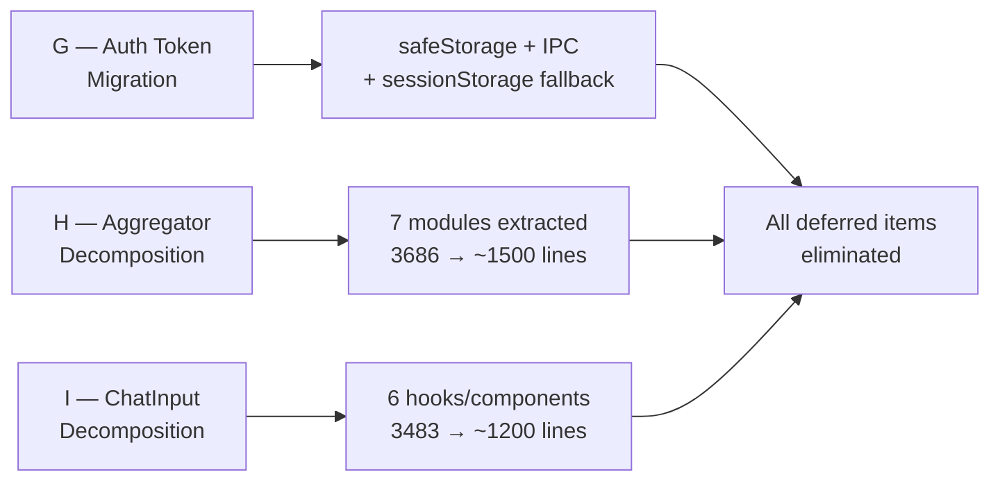
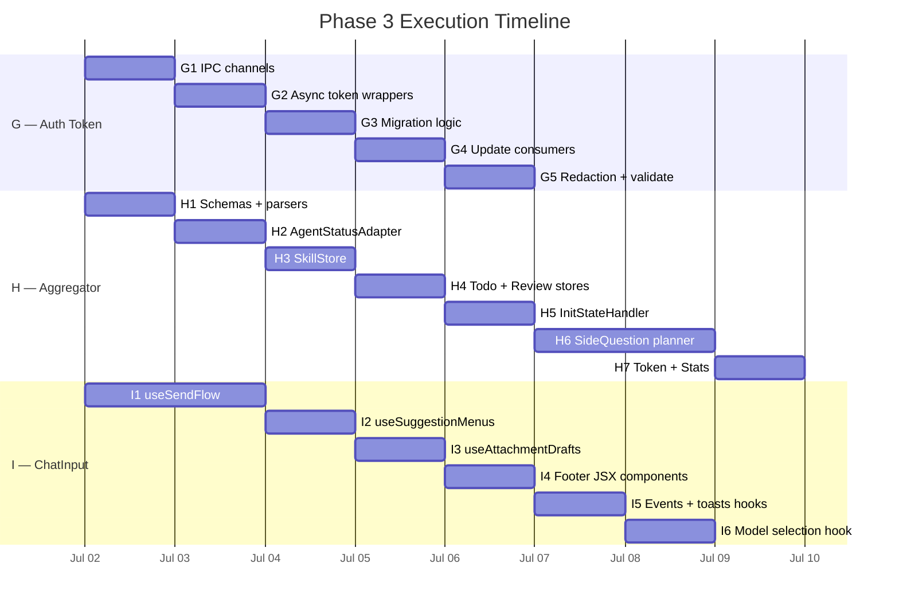
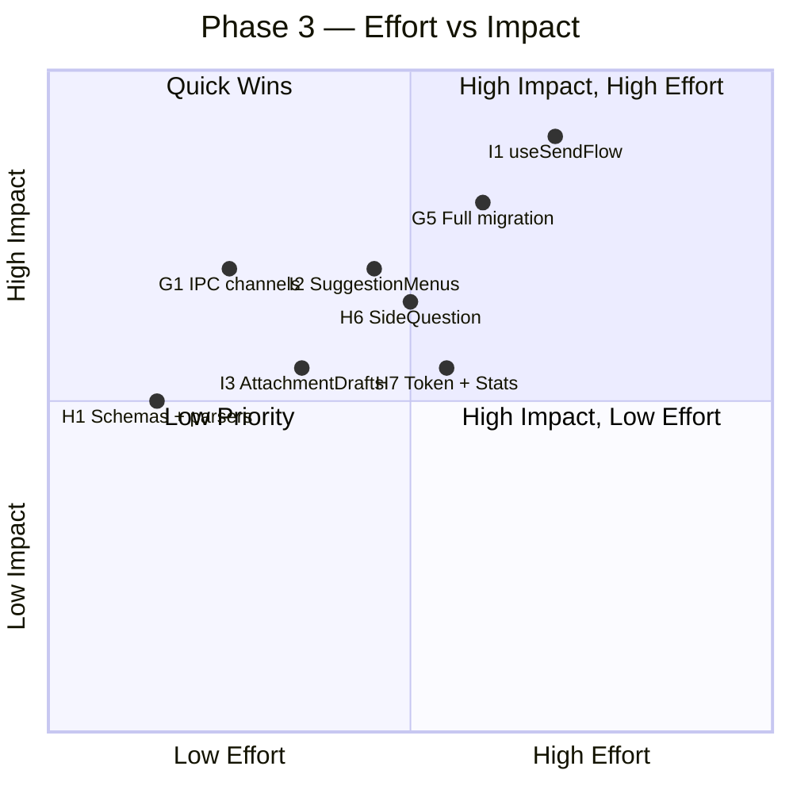
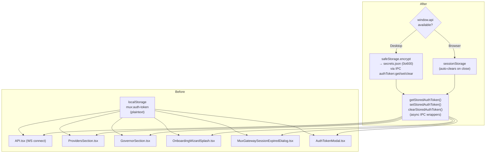
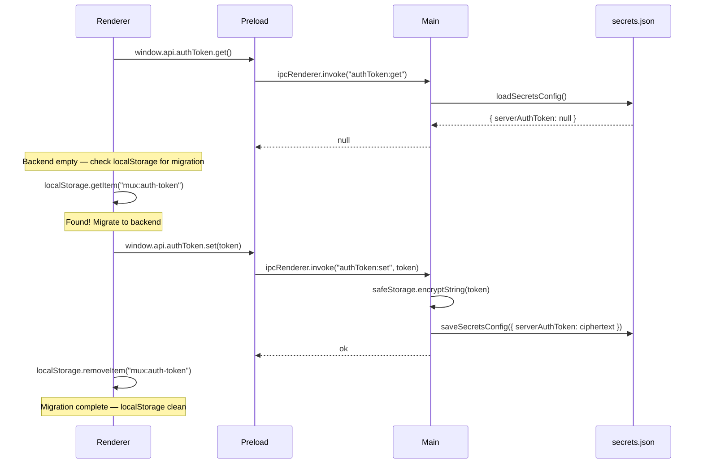
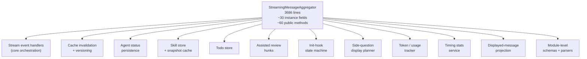
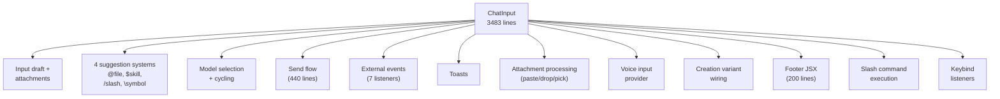
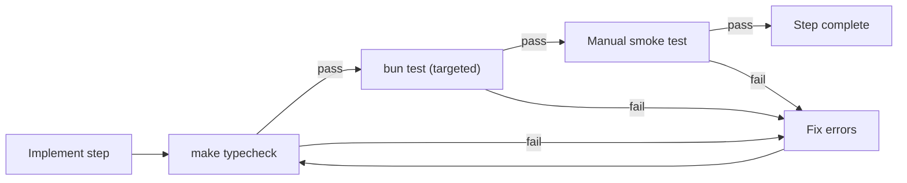

# Phase 3 — Complete Elimination

> **Status:** 0 / 3 items started · 14 execution steps planned
> **Prerequisite:** Phases 0–2 complete (8 + 4 + 2 slices, all validated)
> **Principle:** each step validated in isolation (`make typecheck` + targeted `bun test`) before advancing.

## TL;DR

Three large refactors remain from the original audit. This document specifies every step, acceptance criteria, and validation target. No item is deferred.

| ID | Item | Current State | Target | Steps |
|----|------|--------------|--------|-------|
| G | Auth token in renderer `localStorage` | Token stored plaintext in renderer | `safeStorage`-encrypted backend store + `sessionStorage` browser fallback | 5 |
| H | `StreamingMessageAggregator` (3686 lines) | Single class, 10+ concerns | 7 extracted modules + slim orchestration root | 7 |
| I | `ChatInput/index.tsx` (3483 lines) | God-component, 26 useState / 30 useRef | 6 extracted hooks/components + ~1200-line shell | 6 |



---

## Dependency Graph

G, H, and I are independent — they touch different files with no cross-dependencies.

```mermaid
flowchart TD
    subgraph G
        G1["G1: IPC channels"] --> G2["G2: Async token wrappers"]
        G2 --> G3["G3: One-time migration"]
        G3 --> G4["G4: Update 6 consumers"]
        G4 --> G5["G5: Redaction + validate"]
    end

    subgraph H
        H1["H1: Schemas + parsers<br/>(zero risk)"] --> H2["H2: AgentStatusAdapter"]
        H2 --> H3["H3: SkillStore"]
        H3 --> H4["H4: TodoStore +<br/>AssistedReviewHunkStore"]
        H4 --> H5["H5: InitStateHandler"]
        H5 --> H6["H6: SideQuestion<br/>DisplayPlanner"]
        H6 --> H7["H7: TokenTracker +<br/>StreamingStatsService"]
    end

    subgraph I
        I1["I1: useSendFlow<br/>(600 LoC)"] --> I2["I2: useSuggestionMenus<br/>(400 LoC)"]
        I2 --> I3["I3: useAttachmentDrafts<br/>(250 LoC)"]
        I3 --> I4["I4: ChatInputFooter +<br/>SendButton JSX"]
        I4 --> I5["I5: External events +<br/>toasts hooks"]
        I5 --> I6["I6: Model selection hook"]
    end
```



---

## Timeline



---

## Effort vs Impact



---

## G — Auth Token Migration

### Problem

Auth tokens are stored as plaintext strings in the renderer's `localStorage` (`mux:auth-token`), maximizing the XSS blast radius. Any future HTML/XSS bug in the renderer immediately exposes a long-lived auth token.

### Current State

```
Renderer localStorage:
  mux:auth-token = "<plaintext-token-string>"
```

### Target State

```
Desktop (Electron):
  safeStorage.encryptString(token) → ~/.mux/secrets.json (0o600)
  Renderer requests token via IPC (never touches localStorage)
  main.ts already injects Authorization header at MessagePort boundary

Browser (PWA / remote):
  sessionStorage (auto-clears on tab close — shorter XSS window)
  URL ?token= stripped immediately after first read
```

### Architecture



### Sequence: Token Migration on Startup



### Steps

#### G1 — IPC Channels

**What:** Add `authToken:get`, `authToken:set`, `authToken:clear` IPC handlers in `main.ts` and expose them in `preload.ts`.

**Where:**
- `src/desktop/main.ts` (~line 635, alongside existing `mux:get-is-rosetta` handler)
- `src/desktop/preload.ts` (~line 73, alongside existing `ipcRenderer.invoke` calls)

**How:**
- `main.ts`: use Electron `safeStorage.encryptString`/`decryptString` to encrypt/decrypt, persist ciphertext to `secrets.json` via `saveSecretsConfig`
- `preload.ts`: expose `window.api.authToken = { get, set, clear }`
- Wrap all handlers in try-catch per startup-resilience rules (never crash on init)

**Files touched:**
- `src/desktop/main.ts` (add 3 IPC handlers)
- `src/desktop/preload.ts` (add 3 invoke wrappers)
- `src/browser/types/global.d.ts` or equivalent (extend `window.api` type)

**Acceptance criteria:**
- [ ] `safeStorage` is available and used for encryption/decryption
- [ ] Token persisted to `secrets.json` with `0o600` permissions
- [ ] IPC handlers never throw on startup (wrapped in try-catch)
- [ ] `make typecheck` passes

---

#### G2 — Async Token Wrapper Functions

**What:** Convert `getStoredAuthToken`/`setStoredAuthToken`/`clearStoredAuthToken` from synchronous localStorage calls to async functions that use IPC when `window.api` is available, falling back to `sessionStorage` for browser mode.

**Where:** `src/browser/components/AuthTokenModal/AuthTokenModal.tsx:34-58`

**How:**
```typescript
// Returns string for browser mode (sync), Promise<string> for desktop (async IPC)
export async function getStoredAuthToken(): Promise<string | null> {
  if (typeof window !== "undefined" && window.api?.authToken) {
    return window.api.authToken.get();
  }
  // Browser fallback: sessionStorage (shorter XSS window than localStorage)
  return sessionStorage.getItem(AUTH_TOKEN_STORAGE_KEY);
}
```

- `AUTH_TOKEN_STORAGE_KEY` stays the same (`mux:auth-token`) but `localStorage` → `sessionStorage` for the browser path
- `setStoredAuthToken` and `clearStoredAuthToken` follow the same pattern

**Files touched:**
- `src/browser/components/AuthTokenModal/AuthTokenModal.tsx`

**Acceptance criteria:**
- [ ] Desktop path: calls `window.api.authToken.get/set/clear`
- [ ] Browser path: uses `sessionStorage` (not `localStorage`)
- [ ] All three functions are async
- [ ] `make typecheck` passes

---

#### G3 — One-Time Migration

**What:** On startup, if backend store is empty AND `localStorage` still has the old token, copy it to backend and clear `localStorage`.

**Where:** `src/browser/contexts/API.tsx` (in the initialization path, ~line 190-199)

**How:**
- After attempting `getStoredAuthToken()` and getting null:
  1. Check `localStorage.getItem(AUTH_TOKEN_STORAGE_KEY)`
  2. If found, call `setStoredAuthToken(token)` (writes to backend)
  3. Then `localStorage.removeItem(AUTH_TOKEN_STORAGE_KEY)`
- This is a one-shot migration — once `localStorage` is cleared, it never runs again

**Files touched:**
- `src/browser/contexts/API.tsx`

**Acceptance criteria:**
- [ ] Migration runs on startup only when backend is empty AND localStorage has token
- [ ] After migration, `localStorage.getItem("mux:auth-token")` returns null
- [ ] Token is readable via `getStoredAuthToken()` after migration
- [ ] No crash if localStorage has invalid data (self-healing per AGENTS.md)
- [ ] `make typecheck` passes

---

#### G4 — Update All Consumers

**What:** All 6 consumer files that call `getStoredAuthToken()` must handle the now-async return type.

**Where:**

| File | Lines | Current Usage |
|------|-------|---------------|
| `src/browser/contexts/API.tsx` | 190, 199, 320, 355, 419, 623 | Token lifecycle (read/write/clear) |
| `src/browser/features/SplashScreens/OnboardingWizardSplash.tsx` | 61 | Bearer header for OAuth start |
| `src/browser/components/MuxGatewaySessionExpiredDialog/MuxGatewaySessionExpiredDialog.tsx` | 11 | Bearer header for re-auth |
| `src/browser/features/Settings/Sections/ProvidersSection.tsx` | 115 | Bearer header for provider OAuth |
| `src/browser/features/Settings/Sections/GovernorSection.tsx` | 26 | Bearer header for governor enrollment |
| `src/browser/components/AuthTokenModal/AuthTokenModal.tsx` | 98, 218 | Manual submit + GitHub flow clear |

**How:**
- Add `await` before all `getStoredAuthToken()` calls (all callers are already in async contexts — `useCallback`, `useEffect`, event handlers)
- No behavior changes beyond the async conversion

**Acceptance criteria:**
- [ ] All `getStoredAuthToken()` calls are awaited
- [ ] All `setStoredAuthToken()` / `clearStoredAuthToken()` calls are awaited
- [ ] Desktop mode: token flows through IPC, never touches renderer storage
- [ ] Browser mode: token in `sessionStorage`, not `localStorage`
- [ ] `make typecheck` passes
- [ ] Manual test: auth token entry → connection → clear → reconnect cycle works

---

#### G5 — Redaction + Final Validation

**What:** Add the new backend token key to the secret-redaction set and run full validation.

**Where:**
- `src/node/services/tools/shared/configRedaction.ts:18` — add `serverAuthToken` to `APP_SECRET_KEYS`
- `src/node/orpc/router.ts` (~line 1533) — strip `serverAuthToken` from config serialized to renderer

**Acceptance criteria:**
- [ ] `serverAuthToken` added to `APP_SECRET_KEYS`
- [ ] `mux_config_read` tool output never leaks the token value
- [ ] `make typecheck` passes
- [ ] `make test` passes (existing tests)
- [ ] `bun test src/browser/contexts/API.test.tsx` passes
- [ ] No remaining `localStorage.getItem("mux:auth-token")` or `localStorage.setItem("mux:auth-token", ...)` in source (excluding migration code)

---

## H — StreamingMessageAggregator Decomposition

### Problem

A single 3686-line class owns stream parsing, message replay, throttling, cache invalidation, persistence, todos, skills, assisted review, init-hook state, token tracking, timing stats, side-question display planning, and displayed-message projection. This makes it hard to reason about, hard to test in isolation, and a magnet for race/storage bugs.

### Current Architecture



### Target Architecture

```mermaid
flowchart TD
    SMA["StreamingMessageAggregator<br/>~1500 lines<br/>(orchestration root)"]

    SMA --> A["Stream event handlers"]
    SMA --> B["Cache invalidation<br/>+ versioning"]
    SMA --> K["Displayed-message<br/>projection<br/>(composition root)"]

    SMA -.->. C["AgentStatusAdapter"]
    SMA -.->. D["SkillStore"]
    SMA -.->. E["TodoStore"]
    SMA -.->. F["AssistedReviewHunkStore"]
    SMA -.->. G["InitStateHandler"]
    H["SideQuestionDisplayPlanner<br/>(pure functions)"] -.->. K
    SMA -.->. I["TokenTracker"]
    SMA -.->. J["StreamingStatsService"]

    L["schemas.ts + parsers.ts<br/>(module-level)"] -.->. SMA

    style C stroke-dasharray: 5 5
    style D stroke-dasharray: 5 5
    style E stroke-dasharray: 5 5
    style F stroke-dasharray: 5 5
    style G stroke-dasharray: 5 5
    style H stroke-dasharray: 5 5
    style I stroke-dasharray: 5 5
    style J stroke-dasharray: 5 5
    style L stroke-dasharray: 5 5
```

### Key Assets

- **Existing test files mirror the seams:** `StreamingMessageAggregator.status.test.ts`, `.init.test.ts`, `.skills.test.ts`, `.sideQuestion.test.ts` — each concern already has its own test file
- **`WorkspaceChatEventAggregator` interface** in `applyWorkspaceChatEventToAggregator.ts:62-87` decouples the event-dispatch path from the concrete class
- **Already-extracted siblings** demonstrate the pattern: `displayedMessageBuilder.ts` (712 lines), `responseCompletionMetadata.ts` (119 lines), `StreamingTPSCalculator.ts` (61 lines)

### Internal State Map (30 instance fields, grouped)

| Concern | Fields | Lines |
|---------|--------|-------|
| Message store + cache | `messages`, `displayedMessageCache`, `messageVersions`, `cache` | 455-473 |
| Active streams | `activeStreams`, `backgroundHandoffCompletion` | 456-458 |
| Recency + pagination | `recencyTimestamp`, `lastResponseCompletedAt`, `establishedOldestHistorySequence` | 477-483 |
| Tokens + usage | `deltaHistory`, `activeStreamUsage` | 486-490 |
| Todos | `currentTodos` | 503 |
| Agent status | `agentStatus`, `lastStatusUrl`, `workspaceId` | 507-538 |
| Assisted review | `assistedReviewHunks` | 517 |
| Skills | `loadedSkills`, `loadedSkillsCache`, `skillLoadErrors`, `skillLoadErrorsCache` | 522-529 |
| Display toggle | `showAllMessages` | 536 |
| Init-hook state | `initState`, `replayInitVisiblePrefix`, `replayInitVisiblePrefixIndex`, `appliedReplayInitEvents`, `initOutputThrottleTimer` | 541-564 |
| Pending-stream lifecycle | `pendingStreamStartTime`, `streamLifecycle`, `lastAbortReason`, `runtimeStatus`, `pendingCompactionRequest`, `pendingStreamModel`, `optimisticPendingStreamStart` | 571-597 |
| Completed-stream timing | `lastCompletedStreamStats`, `interruptingMessageId`, `sessionTimingStats` | 601-618 |
| Workspace metadata | `createdAt`, `unarchivedAt` | 634-636 |
| Public callbacks | `onNavigateToWorkspace`, `onResponseComplete` | 640-645 |

### Steps

#### H1 — Extract Schemas + Parsers (zero risk)

**What:** Move all module-level code (lines 1-452) into extracted modules under `src/browser/utils/messages/aggregator/`.

**Extract:**
- `aggregator/schemas.ts` — Zod schemas (`AgentSkillSnapshotMetadataSchema`, stream schemas, lines 87-137)
- `aggregator/parsers.ts` — Pure parse functions (`parseTodoWriteInput`, `parseStatusSetSuccessResult`, `parseNotifySuccessResult`, `parseAgentSkillReadToolResult`, `parseLegacyNotifyRouting`, lines 139-174)
- `aggregator/constants.ts` — `MAX_DISPLAYED_MESSAGES`, `ALWAYS_KEEP_MESSAGE_TYPES`, `INIT_HOOK_MAX_LINES` (lines 194-206)
- `aggregator/skillHelpers.ts` — Agent-skill-snapshot helpers (`extractAgentSkillSnapshotBody`, `getAgentSkillSnapshotKey`, `maybeCollectAgentSkillSnapshot`, `deriveInlineSkillSnapshotDisplayState`, lines 254-435)

**Acceptance criteria:**
- [ ] No class state referenced by extracted code (pure module-level)
- [ ] `StreamingMessageAggregator.ts` imports from new modules instead of defining inline
- [ ] All existing aggregator tests pass unchanged
- [ ] `make typecheck` passes

---

#### H2 — Extract AgentStatusAdapter

**What:** Extract agent-status persistence (load/save/clear/get) into a dedicated class.

**State moved:** `agentStatus` (L507), `lastStatusUrl` (L532)
**Methods moved:** `loadPersistedAgentStatus` (L682), `savePersistedAgentStatus` (L696), `clearPersistedAgentStatus` (L708), `getAgentStatus` (L850)

**Coupling points (4):**
- Written by `processToolResult` (status_set branch, L2582)
- Written by `handleMuxMessage` (L2957)
- Restored by `cleanupStreamState` (L1018)
- Reconstructed by `loadHistoricalMessages` (L1165, L1195)

**Pattern:** `StreamingMessageAggregator` holds `private statusAdapter = new AgentStatusAdapter(this.workspaceId)` and delegates the 4 coupling points to adapter methods.

**Test:** `StreamingMessageAggregator.status.test.ts` (~520 lines) already covers this concern — should pass unchanged.

**Acceptance criteria:**
- [ ] `AgentStatusAdapter` is a separate file under `aggregator/`
- [ ] localStorage persistence isolated in adapter
- [ ] `StreamingMessageAggregator.status.test.ts` passes unchanged
- [ ] `make typecheck` passes

---

#### H3 — Extract SkillStore

**What:** Extract loaded-skills tracking, skill-error tracking, and agent-skill-snapshot caching.

**State moved:** `loadedSkills` (L522), `loadedSkillsCache` (L524), `skillLoadErrors` (L528), `skillLoadErrorsCache` (L529)
**Methods moved:** `getLoadedSkills`, `getSkillLoadErrors`, `trackLoadedSkill`, `trackSkillLoadError`, `maybeTrackLoadedSkillFromAgentSkillSnapshot`, `handleAgentSkillReadResult` (L2404-2479)

**Test:** `StreamingMessageAggregator.skills.test.ts` (~790 lines) covers this.

**Acceptance criteria:**
- [ ] `SkillStore` is a separate file
- [ ] Skill-snapshot module helpers from H1's `skillHelpers.ts` used by SkillStore
- [ ] `StreamingMessageAggregator.skills.test.ts` passes unchanged
- [ ] `make typecheck` passes

---

#### H4 — Extract TodoStore + AssistedReviewHunkStore

**What:** Extract todo tracking and assisted-review-hunk tracking.

**TodoStore — state moved:** `currentTodos` (L503)
**TodoStore — methods:** `getCurrentTodos`, `todosEqual` + `todo_write`/`propose_plan` branches of `processToolResult` (L2505-2577)

**AssistedReviewHunkStore — state moved:** `assistedReviewHunks` (L517)
**AssistedReviewHunkStore — methods:** `getAssistedReviewHunks` + `review_pane_update` branch of `processToolResult` (L2532-2570)

**Test:** Todo cases in `StreamingMessageAggregator.test.ts` (8 cases), review-pane-update case in same file.

**Acceptance criteria:**
- [ ] Both stores are separate files
- [ ] `processToolResult` delegates to store methods
- [ ] Existing todo + review tests pass unchanged
- [ ] `make typecheck` passes

---

#### H5 — Extract InitStateHandler

**What:** Extract the init-hook state machine (nearly zero external coupling).

**State moved:** `initState` (L541), `replayInitVisiblePrefix` (L554), `replayInitVisiblePrefixIndex` (L555), `appliedReplayInitEvents` (L560), `initOutputThrottleTimer` (L563)
**Methods moved:** `handleInitMessage` (L2809), `flushPendingInitOutput` (L1874), `clearReplayInitVisiblePrefix`, `shouldSkipVisibleReplayInitOutput`, `shouldSkipReplayInitEvent` (L2754-2793)

**Only external coupling:** `getDisplayedMessages` (L3577-3595) needs `getInitState()` to prepend init row.

**Test:** `StreamingMessageAggregator.init.test.ts` (~250 lines).

**Acceptance criteria:**
- [ ] `InitStateHandler` is a separate file
- [ ] `getDisplayedMessages` calls `initHandler.getState()` for init row
- [ ] `StreamingMessageAggregator.init.test.ts` passes unchanged
- [ ] `make typecheck` passes

---

#### H6 — Extract SideQuestionDisplayPlanner

**What:** Extract pure side-question (`/btw`) display-plan functions.

**Methods moved:** `buildSideQuestionDisplayPlan` (L3058), `compareSideQuestionInterrupts` (L3044), `getInterruptedSideQuestionBranch` (L3157), `applySideQuestionBranch` (L3169), `splitMessagePartsAtTextLengths` (L3203), `buildInterruptedMessageDisplay` (L3305), `isRenderableSideQuestionAnswer` (L3040)

**These reference `this` only for `buildDisplayedMessagesForMessage` (a thin wrapper around already-extracted `displayedMessageBuilder.ts`).**

**Test:** `StreamingMessageAggregator.sideQuestion.test.ts` (~780 lines).

**Acceptance criteria:**
- [ ] `SideQuestionDisplayPlanner` is a separate file with pure functions
- [ ] No class instance state referenced
- [ ] `StreamingMessageAggregator.sideQuestion.test.ts` passes unchanged
- [ ] `make typecheck` passes

---

#### H7 — Extract TokenTracker + StreamingStatsService

**What:** Extract token/usage tracking and timing-stats computation.

**TokenTracker — state:** `deltaHistory` (L486), `activeStreamUsage` (L490)
**TokenTracker — methods:** `trackDelta`, `getStreamingTokenCount`, `getStreamingTPS`, `clearTokenState`, `handleUsageDelta`, usage getters (L3606-3685)

**StreamingStatsService — state:** `sessionTimingStats` (L618), `lastCompletedStreamStats` (L601)
**StreamingStatsService — methods:** timing getters, `clearSessionTimingStats`, timing portion of `cleanupStreamState`

**Test:** Usage-delta cases in `StreamingMessageAggregator.test.ts` (10 cases).

**Acceptance criteria:**
- [ ] `TokenTracker` and `StreamingStatsService` are separate files
- [ ] Already-extracted `StreamingTPSCalculator.ts` integrated
- [ ] Usage-delta tests pass unchanged
- [ ] `make typecheck` passes

---

## I — ChatInput Decomposition

### Problem

A single 3483-line component with 26 `useState`, 30 `useRef`, 27 `useEffect`, and 32 `useCallback` handles input drafts, attachments, 4 parallel suggestion systems, model selection, voice input, slash commands, send flow, external events, toasts, and the full footer JSX. It has no direct unit tests.

### Current Architecture



### Target Architecture

```mermaid
flowchart TD
    CI["ChatInput<br/>~1200 lines<br/>(orchestration shell)"]

    CI --> S10["Footer JSX<br/>+ SendButton"]
    CI --> S9["Creation variant<br/>wiring (delegates to<br/>useCreationWorkspace)"]
    CI --> R["Render orchestration"]

    CI -.->. H1["useSendFlow"]
    CI -.->. H2["useSuggestionMenus"]
    CI -.->. H3["useAttachmentDrafts"]
    CI -.->. H4["ChatInputFooter<br/>+ SendButton"]
    CI -.->. H5["useChatInputExternalEvents<br/>+ useChatInputToasts"]
    CI -.->. H6["useWorkspaceModelSelection"]

    style H1 stroke-dasharray: 5 5
    style H2 stroke-dasharray: 5 5
    style H3 stroke-dasharray: 5 5
    style H4 stroke-dasharray: 5 5
    style H5 stroke-dasharray: 5 5
    style H6 stroke-dasharray: 5 5
```

### Steps

#### I1 — Extract useSendFlow (~600 LoC)

**What:** Extract the send-flow logic — the single largest function cluster.

**Extract:**
- `executeParsedCommand` (lines 2112-2249, ~115 lines) — slash command execution with destructive-command confirmation
- `handleSend` (lines 2411-2850, ~440 lines) — creation + workspace branches, model-one-shot, PDF preflight, compaction regen, optimistic clear, telemetry, error restore
- Boundary-edit confirmation state (lines 2852-2866)

**Returns:**
```typescript
{
  handleSend: () => Promise<void>;
  executeParsedCommand: (text: string) => Promise<void>;
  boundaryEditConfirmation: ...;
  setBoundaryEditConfirmation: ...;
  hasAttemptedCreateSend: boolean;
  handleSendRef: React.MutableRefObject<...>;
}
```

**Value:** `handleSend` is finally testable in isolation. Currently zero tests exist for it.

**Acceptance criteria:**
- [ ] `useSendFlow` is a separate file under `src/browser/features/ChatInput/`
- [ ] No behavioral changes — same send/create/compaction flow
- [ ] `index.tsx` imports and consumes the hook
- [ ] `make typecheck` passes
- [ ] Manual test: send message, create workspace, edit boundary, slash command all work

---

#### I2 — Extract useSuggestionMenus (~400 LoC)

**What:** Collapse the 4 parallel suggestion systems into one hook.

**Each system currently has:** `showX` + `xSuggestions` + `lastXQueryRef` + debounce/request-id refs + a `useEffect`/`useLayoutEffect` + a `handleXSelect` callback.

**Systems:**
- At-mention (@file): lines 387-408, 1340-1459, 2301-2355
- Skill ($skill): lines 1461-1507, 2357-2375
- Slash command: lines 1509-1532, 2377-2393
- Symbol (\symbol): lines 1534-1555, 2395-2409

**Returns:**
```typescript
{
  atMention: { show, suggestions, handlers };
  skill: { show, suggestions, handlers };
  command: { show, suggestions, handlers };
  symbol: { show, suggestions, handlers };
  ghostHint: string | null;
  suppressKeys: Set<string>;
}
```

**Acceptance criteria:**
- [ ] `useSuggestionMenus` is a separate file
- [ ] All 4 suggestion systems work identically
- [ ] `CommandSuggestions.test.tsx` passes unchanged
- [ ] `make typecheck` passes

---

#### I3 — Extract useAttachmentDrafts (~250 LoC)

**What:** Extract attachment draft persistence + paste/drop/pick processing.

**Extract:**
- `persistAttachments`, size-quota toasts (lines 442-496)
- `processAttachmentFilesForComposer`, `handlePaste`, `handleAttachFiles`, `handleDragOver`, `handleDrop`, `showResizeToast` (lines 1967-2110)
- Attachment state: `attachments`, `processingAttachmentCount`

**Acceptance criteria:**
- [ ] `useAttachmentDrafts` is a separate file
- [ ] Paste, drop, attach-file, resize-quota all work identically
- [ ] `draftAttachmentsStorage.test.ts` passes unchanged
- [ ] `make typecheck` passes

---

#### I4 — Extract ChatInputFooter + SendButton (~200 LoC)

**What:** Extract the JSX footer block into presentational components.

**Extract from render (lines 3256-3454):**
- `<ChatInputFooter>` — wraps the entire footer row
- `<ModelSelectorGroup>` — ModelSelector + tooltip (lines 3270-3309)
- `<SendButton>` — send button + dispatch-mode menu + context menu (lines 3368-3451), encapsulates `useContextMenuPosition`, click-outside, dispatch modes

**Acceptance criteria:**
- [ ] `ChatInputFooter.tsx`, `ModelSelectorGroup.tsx`, `SendButton.tsx` are separate files
- [ ] Footer renders identically
- [ ] Send button dispatch menu, context menu all work
- [ ] `make typecheck` passes

---

#### I5 — Extract useChatInputExternalEvents + useChatInputToasts (~250 LoC)

**What:** Extract window event listeners and toast state management.

**Events (lines 1736-1908):** `UPDATE_CHAT_INPUT`, `CLEAR_CHAT_INPUT`, `OPEN_MODEL_SELECTOR`, `THINKING_LEVEL_TOAST`, `GOAL_CHILD_BUDGET_TOAST`, `ANALYTICS_REBUILD_TOAST`, `TOGGLE_VOICE_INPUT`

**Toast state (lines 410-438):** `toast`, `pendingError`, `pushToast`

**Acceptance criteria:**
- [ ] `useChatInputExternalEvents` and `useChatInputToasts` are separate files
- [ ] All 7 events handled identically
- [ ] Toasts fire and dismiss correctly
- [ ] `ChatInputToast.test.tsx` and `ChatInputToasts.test.ts` pass unchanged
- [ ] `make typecheck` passes

---

#### I6 — Extract useWorkspaceModelSelection (~200 LoC)

**What:** Extract model selection logic.

**Extract:**
- `setPreferredModel` (lines 668-887, ~90 lines) — agent-AI-defaults persistence, gateway/budget guards
- `cycleToNextModel` — model cycling
- Agent-AI-defaults sync effect (lines 1122-1172)

**Acceptance criteria:**
- [ ] `useWorkspaceModelSelection` is a separate file
- [ ] Model selection, cycling, and persistence all work identically
- [ ] `make typecheck` passes

---

## File Manifest

### G — Auth Token Migration (5 steps)

| Action | File |
|--------|------|
| Modify | `src/desktop/main.ts` |
| Modify | `src/desktop/preload.ts` |
| Modify | `src/browser/components/AuthTokenModal/AuthTokenModal.tsx` |
| Modify | `src/browser/contexts/API.tsx` |
| Modify | `src/browser/features/SplashScreens/OnboardingWizardSplash.tsx` |
| Modify | `src/browser/components/MuxGatewaySessionExpiredDialog/MuxGatewaySessionExpiredDialog.tsx` |
| Modify | `src/browser/features/Settings/Sections/ProvidersSection.tsx` |
| Modify | `src/browser/features/Settings/Sections/GovernorSection.tsx` |
| Modify | `src/node/services/tools/shared/configRedaction.ts` |
| Modify | `src/node/orpc/router.ts` |

### H — Aggregator Decomposition (7 steps)

| Action | File |
|--------|------|
| Create | `src/browser/utils/messages/aggregator/schemas.ts` |
| Create | `src/browser/utils/messages/aggregator/parsers.ts` |
| Create | `src/browser/utils/messages/aggregator/constants.ts` |
| Create | `src/browser/utils/messages/aggregator/skillHelpers.ts` |
| Create | `src/browser/utils/messages/aggregator/AgentStatusAdapter.ts` |
| Create | `src/browser/utils/messages/aggregator/SkillStore.ts` |
| Create | `src/browser/utils/messages/aggregator/TodoStore.ts` |
| Create | `src/browser/utils/messages/aggregator/AssistedReviewHunkStore.ts` |
| Create | `src/browser/utils/messages/aggregator/InitStateHandler.ts` |
| Create | `src/browser/utils/messages/aggregator/SideQuestionDisplayPlanner.ts` |
| Create | `src/browser/utils/messages/aggregator/TokenTracker.ts` |
| Create | `src/browser/utils/messages/aggregator/StreamingStatsService.ts` |
| Modify | `src/browser/utils/messages/StreamingMessageAggregator.ts` |

### I — ChatInput Decomposition (6 steps)

| Action | File |
|--------|------|
| Create | `src/browser/features/ChatInput/useSendFlow.ts` |
| Create | `src/browser/features/ChatInput/useSuggestionMenus.ts` |
| Create | `src/browser/features/ChatInput/useAttachmentDrafts.ts` |
| Create | `src/browser/features/ChatInput/ChatInputFooter.tsx` |
| Create | `src/browser/features/ChatInput/ModelSelectorGroup.tsx` |
| Create | `src/browser/features/ChatInput/SendButton.tsx` |
| Create | `src/browser/features/ChatInput/useChatInputExternalEvents.ts` |
| Create | `src/browser/features/ChatInput/useChatInputToasts.ts` |
| Create | `src/browser/features/ChatInput/useWorkspaceModelSelection.ts` |
| Modify | `src/browser/features/ChatInput/index.tsx` |

---

## Validation Strategy

Every step follows the same validation protocol:

1. **`make typecheck`** — must pass with zero errors
2. **Targeted tests** — existing per-concern test files must pass unchanged
3. **Manual smoke test** (where applicable) — core user flow still works

No step advances until the current step passes all three.



### Global Final Validation (after all 14 steps)

```bash
make typecheck
make test
make test-mobile
make lint
```
