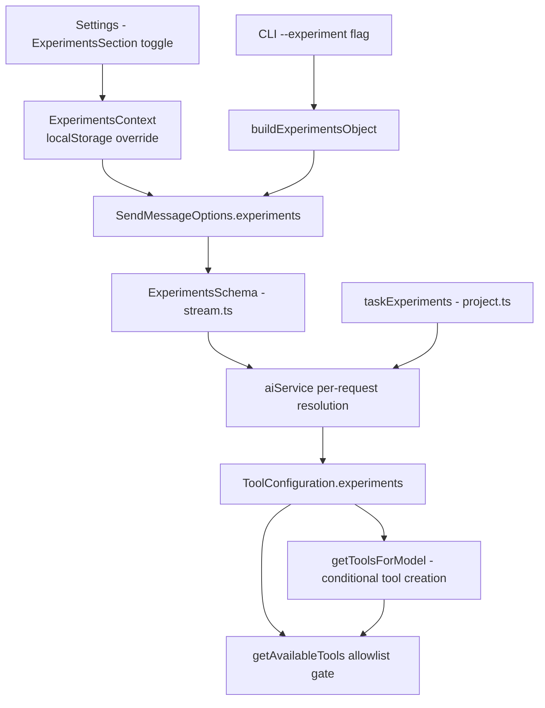
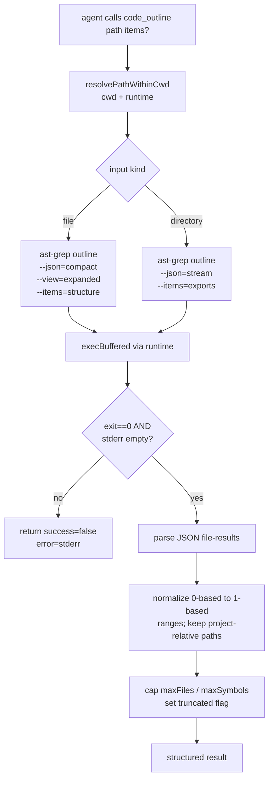
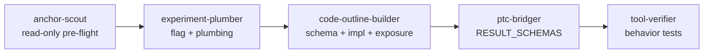

# ast-grep `outline` integration as an experimental agent tool

Status: Draft · Scope: Experimental MVP · Runtime: local/worktree/devcontainer only (SSH deferred)

## Stakeholders

- [ ] Product Lead:
- [ ] Engineering DRI:
- [ ] Runtime/tool orchestration reviewer:
- [ ] PTC (Programmatic Tool Calling) reviewer:

## Goal

Add a read-only, experiment-gated agent tool `code_outline` that exposes
[`ast-grep outline`](https://ast-grep.github.io) structural summaries to agents,
filling the gap between text search (`grep`) and full file reads (`file_read`).

## Background

- Mux has strong text/path search primitives but no structural code-navigation layer.
- `ast-grep outline` (v0.44.0, installed at `/opt/homebrew/bin/ast-grep`) emits stable
  JSON with symbol names, types, signatures, ranges, and export/public flags.
- The repo has a mature, registry-driven experiment system spanning Settings,
  renderer send options, shared schemas, AIService resolution, task/workflow
  inheritance, tool gating, and CLI overrides — so no bespoke gating is needed.

### Empirically validated CLI behavior

| Case | Command | Result |
|---|---|---|
| File outline | `ast-grep outline --json=pretty --view=expanded --items=structure <f>` | rich per-symbol + nested member signatures |
| Directory exports | `ast-grep outline --json=stream --items=exports <dir>` | one file-result per line, exported symbols only |
| Unsupported file | `ast-grep outline --json=compact docs/README.md` | `[{ path, language, items: [] }]` (graceful empty) |
| Missing path | `ast-grep outline --json=compact <missing>` | stderr `ERROR: ... No such file`, stdout `[]`, non-zero exit |

Key implication: **the wrapper must treat non-zero exit / stderr as authoritative**,
not parse stdout JSON alone. Lines/columns are **0-based** and must be normalized.

## Goals & Non-Goals

**Goals**

- Narrow read-only `code_outline` tool (file + directory outline).
- Experiment-gated, default off, user-overridable, visible in Settings.
- Local/worktree/devcontainer runtime support.
- PTC bridgeability from day one (`mux.code_outline(...)`).

**Non-Goals**

- Structural edits / refactors / AST-based replace.
- `@mention` symbol references; review-pane integration.
- Replacing `grep` / path autocomplete.
- SSH support; cross-file semantic analysis.

## Architecture

### Experiment plumbing flow



### Tool execution flow



### Tool input / result shape

```
code_outline(
  path: string,                         // file | directory, cwd-restricted
  items?: "structure" | "exports",      // default: dir->exports, file->structure
  maxFiles?: number,                    // directory cap
  maxSymbols?: number,                  // per-file cap
  symbolTypes?: string[],               // filter: interface|class|function|...
) -> {
  success: boolean,
  path: string,
  kind: "file" | "directory",
  files: [{
    path: string, language: string,
    entries: [{
      name: string, symbolType: string, signature: string,
      exported?: boolean, public?: boolean,
      range: { start: {line, column}, end: {line, column} },  // 1-based
      children?: Entry[]
    }]
  }],
  truncated?: boolean,
  error?: string,
}
```

## Phased Plan

### Phase execution order

```mermaid
gantt
  title Execution sequence (each phase gates the next)
  dateFormat X
  axisFormat %s
  section Pre-flight
  Verify anchors (anchor-scout)  :p0, 0, 1
  section Experiment infra
  Register experiment            :p1, after p0, 1
  Thread flag through plumbing   :p2, after p1, 1
  section Tool
  Define schema + gate           :p3, after p2, 1
  Implement tool + normalize     :p4, after p3, 1
  Wire exposure in tools.ts      :p5, after p4, 1
  Add PTC bridgeability          :p6, after p5, 1
  section Validation
  Automated tests                :p7, after p6, 1
  Dogfood + finalize             :p8, after p7, 1
```



### Subagent orchestration

Execution is delegated to five ZCode custom subagents (defined in `~/.zcode/agents/`,
loaded by ZCode on next run). Each owns a coherent concern and hands off via its
report. They use ZCode tool names (Read/Edit/Bash/...) to operate; the code they
generate targets the Mux runtime and uses Mux tool names (file_read, bash, code_outline).



| Phase(s) | Owner subagent | Role |
|---|---|---|
| 0 (pre-flight) | `@anchor-scout` | Read-only verification of every file:line anchor before edits begin |
| 1 + 2 | `@experiment-plumber` | Register experiment + thread flag through all plumbing |
| 3 + 4 + 5 | `@code-outline-builder` | Schema, implementation, exposure wiring (kept coherent in one agent) |
| 6 | `@ptc-bridger` | `BridgeableToolName` + `RESULT_SCHEMAS` only |
| 7 | `@tool-verifier` | Behavior-focused tests; deliberately separate from the builder |
| 8 | _(parent session, manual)_ | Dogfooding is interactive, not a subagent |

Spawn sequence is strictly sequential (each phase depends on the prior's output);
`anchor-scout` is read-only and the only one safe to run in isolation first.

---

### Phase 0 — Pre-flight anchor verification

**Owner:** `@anchor-scout` · **Output:** confirmed `file:line` map for every anchor in Phases 1–6.

**Steps**

- [ ] Verify each `file:line` reference in this RFC still matches current HEAD (lines drift).
- [ ] Flag any moved/renamed symbols (e.g. `EXPERIMENT_IDS`, `getAvailableTools`, `BridgeableToolName`).

**Acceptance criteria**

- [ ] Every anchor confirmed or corrected before any implementation subagent runs.

---

### Phase 1 — Register the experiment

**Owner:** `@experiment-plumber`

**Steps**

- [ ] Add `AST_GREP_OUTLINE: "ast-grep-outline"` to `EXPERIMENT_IDS`
      (`src/common/constants/experiments.ts:8-23`).
- [ ] Register in `EXPERIMENTS` with `enabledByDefault: false`,
      `userOverridable: true`, `showInSettings: true`
      (`src/common/constants/experiments.ts:54`).

**Acceptance criteria**

- [ ] `EXPERIMENTS` is exhaustive (TS `Record<ExperimentId, ...>` compiles).
- [ ] Settings -> Experiments shows the toggle without custom UI.
- [ ] Toggle off by default; flipping it persists via `experiment:ast-grep-outline`.

---

### Phase 2 — Thread the flag through all plumbing

**Owner:** `@experiment-plumber`

**Steps**

- [ ] `ExperimentsSchema` (`src/common/orpc/schemas/stream.ts:704`): add `astGrepOutline?: boolean`.
- [ ] `taskExperiments` (`src/common/schemas/project.ts:170`): add field.
- [ ] `WorkflowTaskExperiments` (`src/node/services/workflows/WorkflowTaskServiceAdapter.ts:31`): add field.
- [ ] `ToolConfiguration.experiments` (`src/common/utils/tools/tools.ts:261`): add field.
- [ ] `aiService.ts:1368-1379`: resolve `astGrepOutline` per-request and pass into
      `toolsForModelConfig.experiments`.
- [ ] `useSendMessageOptions.ts` + `sendOptions.ts`: thread override.
- [ ] `buildSendMessageOptions.ts:7-12`: add field.
- [ ] CLI `buildExperimentsObject` in `src/cli/run.ts:280` and `src/cli/workflow.ts:219`.

**Acceptance criteria**

- [ ] `typecheck` passes across all touched surfaces.
- [ ] Enabling via CLI (`--experiment ast-grep-outline`) reaches AIService.
- [ ] Persisted task restart inherits the flag via `taskExperiments`.
- [ ] Workflow-spawned children inherit via `WorkflowTaskExperiments`.

---

### Phase 3 — Tool definition + availability gate

**Owner:** `@code-outline-builder`

**Steps**

- [ ] Define `code_outline` input schema in `toolDefinitions.ts` (`.nullish()` optionals).
- [ ] Add result type to shared tool result types.
- [ ] Add `enableAstGrepOutline?: boolean` to `getAvailableTools(...)` options
      (`src/common/utils/tools/toolDefinitions.ts:2941`).
- [ ] Conditionally include `"code_outline"` in the allowlist (`:2996-3015` pattern).

**Acceptance criteria**

- [ ] Tool absent from `getAvailableTools` output when flag off.
- [ ] Tool present when flag on.
- [ ] Input schema follows `.nullish()` convention for optionals.

---

### Phase 4 — Tool implementation

**Owner:** `@code-outline-builder`

**Steps**

- [ ] Create `src/node/services/tools/code_outline.ts` mirroring `file_read.ts`.
- [ ] Reuse `resolvePathWithinCwd(...)` (cwd + runtime) from `fileCommon.ts`.
- [ ] Invoke via `execBuffered(...)` (`src/node/utils/runtime/helpers.ts:37`).
- [ ] File mode default: `--json=compact --view=expanded --items=structure`.
- [ ] Directory mode default: `--json=stream --items=exports`.
- [ ] Honor caller `items` override; honor `maxFiles` / `maxSymbols` / `symbolTypes`.
- [ ] Normalize 0-based -> 1-based line/column ranges.
- [ ] Treat non-zero exit / non-empty stderr as authoritative error.
- [ ] Return graceful empty `items` for unsupported languages (no hard error).
- [ ] Bound output; set `truncated` when caps applied.

**Acceptance criteria**

- [ ] File outline returns nested entries with non-empty signatures (`--view=expanded`).
- [ ] Directory outline returns one entry per file with exported symbols.
- [ ] Markdown/non-code files return `items: []`, `success: true`.
- [ ] Missing path returns `success: false` with stderr message.
- [ ] Ranges are 1-based and point at correct lines.

---

### Phase 5 — Wire exposure in `tools.ts`

**Owner:** `@code-outline-builder`

**Steps**

- [ ] Register `code_outline` in `runtimeTools` only when
      `config.experiments?.astGrepOutline` (`src/common/utils/tools/tools.ts:564-597` pattern).
- [ ] Pass `enableAstGrepOutline` to `getAvailableTools(...)` at `:727-730`.

**Acceptance criteria**

- [ ] With experiment off, `code_outline` is neither created nor allowed.
- [ ] With experiment on, tool is available to eligible models.

---

### Phase 6 — PTC bridgeability

**Owner:** `@ptc-bridger`

**Steps**

- [ ] Add `code_outline` to `BridgeableToolName`
      (`src/common/utils/tools/toolDefinitions.ts:2851`).
- [ ] Add result zod schema to `RESULT_SCHEMAS` (`:2881`).
      (Type-level enforcement guarantees the schema exists.)

**Acceptance criteria**

- [ ] `mux.code_outline(...)` is callable from `code_execution`.
- [ ] `RESULT_SCHEMAS` typecheck enforces schema presence.

---

### Phase 7 — Tests

**Owner:** `@tool-verifier`

**Steps**

- [ ] Unit: result normalization (0->1-based range conversion).
- [ ] Unit: stderr-as-error even when stdout is `[]`.
- [ ] Unit: empty items for unsupported file (markdown).
- [ ] Unit: binary-missing failure message.
- [ ] Unit: truncation behavior under `maxFiles` / `maxSymbols`.
- [ ] Integration: experiment off -> tool absent; on -> present.
- [ ] Integration: CLI flag propagation; task/workflow inheritance.
- [ ] (Avoid tautological tests per AGENTS.md — assert behavior, not prose.)

**Acceptance criteria**

- [ ] `make typecheck` + `make lint` clean.
- [ ] Targeted `make test` green.

---

### Phase 8 — Dogfood + finalize

**Owner:** parent session (manual)

**Steps**

- [ ] Enable experiment locally; run outlines against this repo.
- [ ] Confirm `code_outline` appears in agent toolset and PTC.
- [ ] Update `src/node/builtinAgents/explore.md` guidance to prefer `code_outline`
      for structural breadth before `file_read`.
- [ ] Collect token/latency signal; tune caps.

**Acceptance criteria**

- [ ] Agent picks `code_outline` before `file_read` for "outline this directory".
- [ ] No regressions in startup time (lazy/gated registration).

## Risk matrix

| Risk | Likelihood | Impact | Mitigation |
|---|---|---|---|
| `ast-grep` binary missing in a runtime | Med | Med | Clear tool error; local-only MVP; bundle later |
| Output shape churn in `ast-grep` | Low | Med | Pin to 0.44.0 behavior; treat as external |
| SSH unavailable | Accepted | Low | Out of MVP scope (user-confirmed) |
| Large-directory payload blowups | Med | Med | `maxFiles`/`maxSymbols` caps + `truncated` flag |
| Stdout `[]` masking real errors | Med | High | Check exit status + stderr authoritatively |
| Experiment plumbing miss causes silent disable | Low | High | Phase 2 acceptance: end-to-end CLI->AIService test |

## Open questions / follow-ups (post-MVP)

- Bundling/distributing `ast-grep` for all runtimes (including SSH).
- Extending to `@mention` symbol references and review-pane pinning.
- Generic structural search (`ast-grep run`) beyond outline.
- Surfacing `code_outline` via the ORPC API for desktop/CLI parity.
